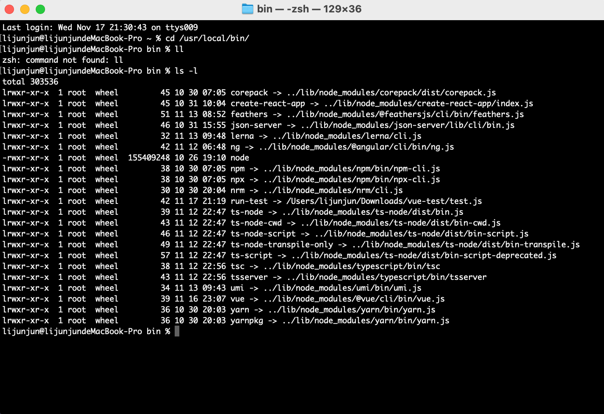
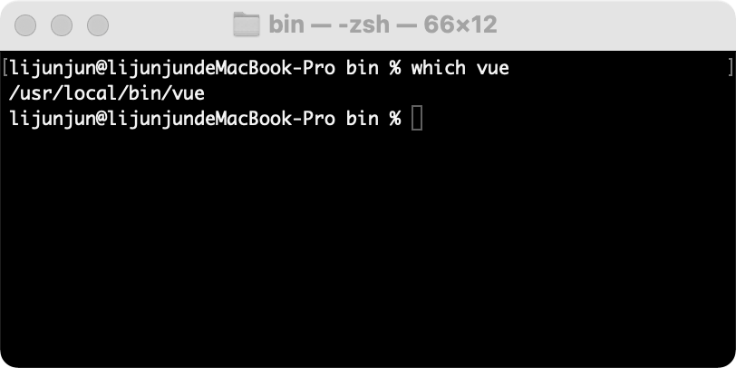
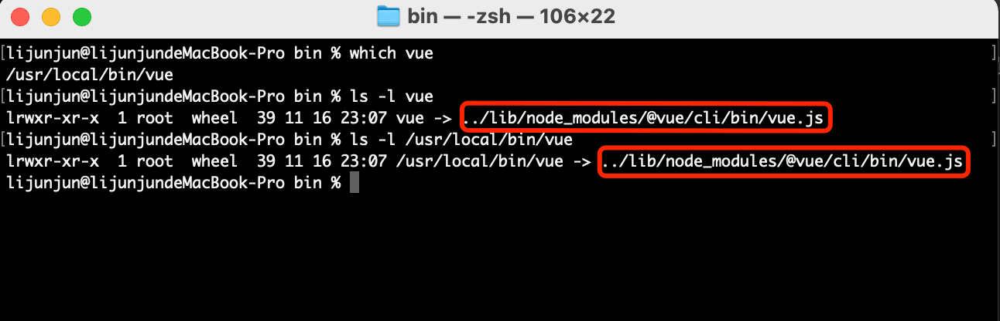
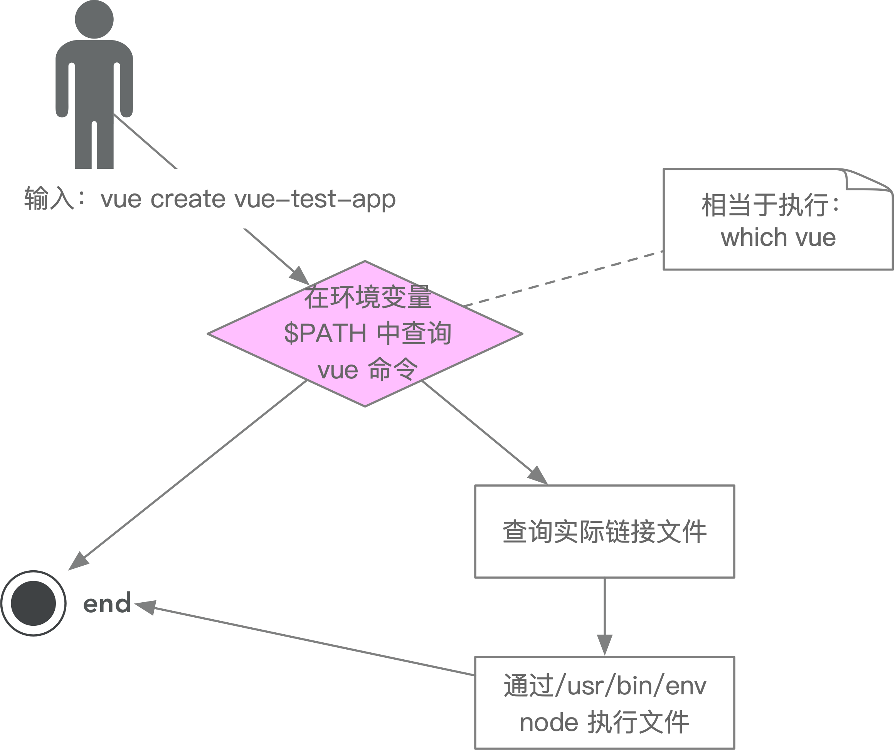

# 03-脚手架的实现原理

如果你能回答以下 4 个问题，就掌握了脚手架的实现原理：

## 为什么全局安装`@vue/cli`后会添加的命令为`vue`？

- 找到 vue 脚手架的目录

```shell
# 通过以下命令，可以查询指令的路径
➜  / which vue
/usr/local/bin/vue
# 来到bin目录下，可以发现这些都是我们安装的全局依赖
➜  / cd /usr/local/bin/
# 通过 ll 命令
➜  bin ll
# 首字母 l 表示软链接，link的意思，可以看到它实际指向了 ../lib/node_modules/@vue/cli/bin/vue.js 这才是 vue 指令的真身
lrwxr-xr-x  1 lijunjun  admin    39B  3 22 13:32 vue -> ../lib/node_modules/@vue/cli/bin/vue.js
```

[](./img/03.png)


- 打开其 package.json

`vue`：软链接的名称

`bin/vue.js`：绑定的路径

```json
{
  "bin": {
    "vue": "bin/vue.js"
  }
}
```

> 总结：由于 `package.json` bin属性里边的key叫 `vue`，所以有 `vue` 这个命令

## 全局安装`@vue/cli`发生了什么

1. npm 会下载全局包到本地

2. 它会解析包里`package.json`里面的配置，找到`bin`属性，增加一个软链接，指向当前目录下的`bin/vue.js`

## 执行`vue`命令时发生了什么？

1. 在环境变量找到 vue 这个命令，看一下是否注册了，也就是说，执行`vue`和执行`/usr/local/bin/vue`是等价的

```shell
# 操作系统先通过`which vue`找到并执行这个文件
➜  / which vue
/usr/local/bin/vue
```

2. 这个命令，是一个软链接，指向了一个`vue.js`文件

## 为什么`vue`指向一个`js`文件，我们却可以直接通过`vue`命令去执行它？

1. 系统先通过 `which vue` 找到路径

[](./img/04.png)

2. 执行 `vue` 和执行 `/usr/local/bin/vue` 的效果是一样的，他们都指向了一个文件

所以我们执行的，其实都是 `../lib/node_modules/@vue/cli/bin/vue.js` 这一个文件

[](./img/05.png)

3. 现在问题来了，我们自己编写一个js文件，为什么就无法运行呢？

4. 我们创建一个 test.js 文件

```shell
➜  vue-test vim test.js
➜  vue-test cat test.js
console.log("hello word");
# 给他执行的权限
➜  vue-test chmod 777 ./test.js
➜  vue-test ls -l
-rwxrwxrwx  1 lijunjun  staff    27B  7 24 17:53 test.js
# -rwxrwxrwx 最后一位x代表该文件可以被执行
# 但是依然不能执行
# 因为js必须通过一个解释器(node)才能运行
➜  vue-test ./test.js
./test.js: line 1: syntax error near unexpected token `"hello word"'
./test.js: line 1: `console.log("hello word");'
# 使用 node ./test.js 即可把我们的js运行起来
# 但是使用 vue 命令的时候却没有使用类似 `node vue` 来执行
# 这是为啥呢？
```

5. 我们修改一下 test.js

`/usr/bin/env node`：就可以把 node 运行起来

`/usr/bin/env`：查找环境变量

`#!/usr/bin/env node` 告诉操作系统，查找环境变量的 node 来执行这个文件

```shell
➜  vue-test cat test.js
#!/usr/bin/env node
console.log("hello word");
# 现在运行这几条命令是等价的
➜  vue-test /usr/bin/env node test.js
hello word
➜  vue-test ./test.js
hello word
➜  vue-test node ./test.js
hello word
```

## 自定义命令

自定义一个 run-test 的命令，来运行我们的 test.js

> 思路：只要在 node 的根目录 `/usr/local/bin` 目录下面，创建一个软链接，然后指向 `test.js` 即可

```shell
# 查询所有的环境变量
➜  vue-test echo $PATH
/Library/Frameworks/Python.framework/Versions/3.9/bin:/opt/local/bin:/opt/local/sbin:/usr/local/bin:/usr/bin:/bin:/usr/sbin:/sbin:/usr/local/go/bin:/Library/Apple/usr/bin

# 查看当前目录路径
➜  vue-test pwd
/Users/lijunjun/Desktop/vue-test

# 创建软链接
➜  bin ln -s /Users/lijunjun/Desktop/vue-test/test.js run-test

# 查看是否创建成功
➜  bin ll
lrwxr-xr-x  1 lijunjun  admin    40B  7 24 19:00 run-test -> /Users/lijunjun/Desktop/vue-test/test.js

# 回到node的安装路径
➜  vue-test cd /usr/local/bin

# 在任何路径下面都可以执行了
➜  / run-test
hello word
```

## 脚手架实现原理(进阶)

### 为什么说脚手架本质是操作系统的客户端？它和我们在 PC 上安装的应用/软件有什么区别？

因为脚手架是通过 node 来执行的 js 文件，node 本质上也是一个客户端

### 如何为 node 脚手架命令创建别名？(给刚刚的 run-test 新建一个名字)

```shell
➜  / which run-test
/usr/local/bin/run-test
# 注意要回到bin目录才能找到 run-test 这个可执行文件
➜  / cd /usr/local/bin/
# 其实软链接是可以嵌套的
➜  bin ln -s run-test run-test2222
# 查询 run-test2222 指令出处
➜  bin which run-test2222
/usr/local/bin/run-test2222
# run-test2222其本质，还是指向了
➜  bin ll
lrwxr-xr-x  1 lijunjun  admin    40B  7 24 19:00 run-test -> /Users/lijunjun/Desktop/vue-test/test.js
lrwxr-xr-x  1 lijunjun  admin     8B  7 24 23:24 run-test2222 -> run-test

# 删除指令
➜  bin rm -rf run-test
```

### 脚手架执行的过程

[](./img/02.png)
