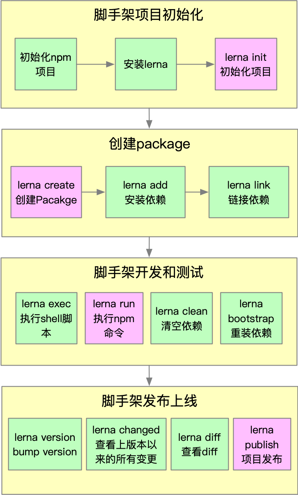

# 05-Lerna 简介

## 原生脚手架开发痛点分析

- 痛点一：重复操作

  - 多 Package 本地 link

  - 多 Package 依赖安装

  - 多 Package 单元测试

  - 多 Package 代码提交

  - 多 Package 代码发布

- 痛点二：版本一致性

  - 发布时版本一致性

  - 发布后相互依赖版本升级

> package 越多，管理复杂度越高，由此可见在大型项目中使用 Lerna 的必要性

## [Lerna 简介](https://lerna.js.org/)

```
Lerna is a tool that optimizes the workflow around managing multi-package repositories with git and npm.
```

Lerna 是一个优化基于 git+npm 的多 package 项目的管理工具

### 优势

- 大幅减少重复操作

- 提升操作的标准化

```
Lerna 是架构优化的产物，它揭示了一个架构真理：项目复杂度提升后，就需要对项目进行架构优化。架构优化的主要目标往往都是以效能为核心。
```

### 案例

使用 Lerna 管理的大型项目：

babel: https://github.com/babel/babel
vue-cli: https://github.com/vuejs/vue-cli
create-react-app: https://github.com/facebook/create-react-app

## lerna 开发脚手架流程（划重点）

[](./img/06.png)

## 基于 Lerna 创建项目(命令基础介绍)

- 安装 Lerna

```shell
npm install -g lerna
```

- 创建项目

```shell
git init ljj-cli && cd ljj-cli
```

- 初始化 Lerna 项目

```shell
lerna init
```

- 创建 Package

```shell
lerna create @ljj-cli/core packages
```

- 安装依赖

```shell
lerna add mocha packages/core --dev
```

- 删除依赖

```shell
lerna clean
```