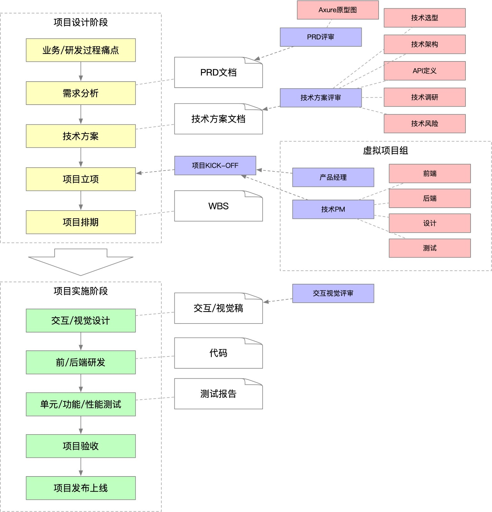
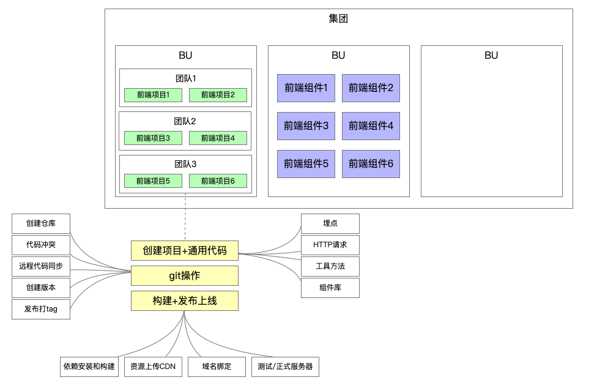

# 脚手架需求分析

## 做项目的流程

## 脚手架需求分析

### 痛点分析：

- 创建项目/组件时，存在大量重复拷贝代码：快速复用已有沉淀

- 协同开发时，由于 git 操作不规范，导致分支混乱，操作耗时：制定标准的 git 操作规范并集成到脚手架

- 发布上线耗时，而且容易出现各种错误：制定标准的上线流程和规范并集成到脚手架

### 需求分析：

- 通用的研发脚手架

- 通用的项目/组件创建能力

  - 模板支持定制，定制后能够快速生效

  - 模板支持快速接入，极低的接入成本

- 通用的项目/组件发布能力

  - 发布过程自动完成标准的 git 操作

  - 发布成功后自动删除开发分支并创建 tag

  - 发布后自动完成云构建、OSS 上传、CDN 上传、域名绑定

  - 发布过程支持测试/正式两种模式
