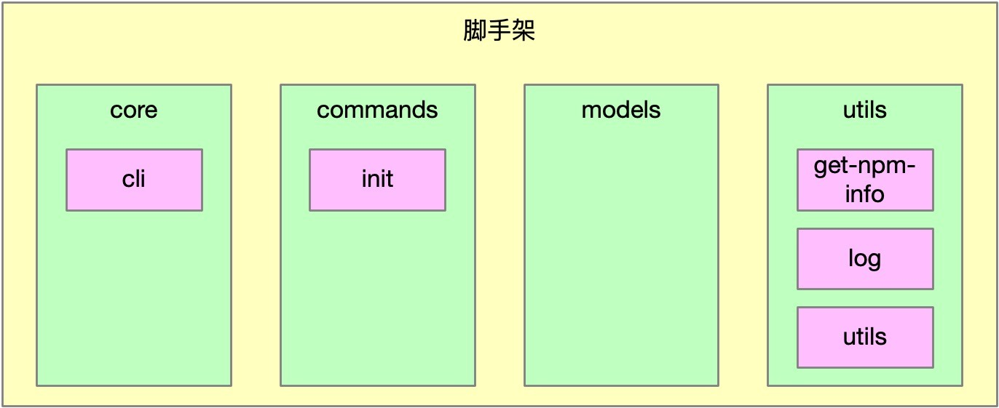
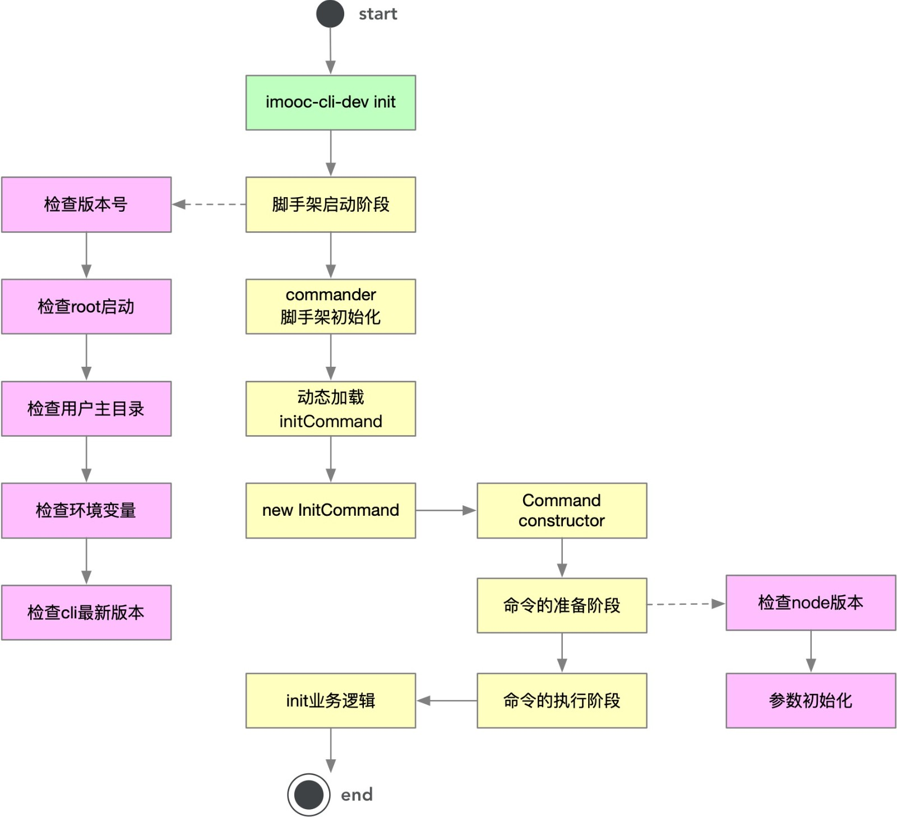

# 高性能脚手架架构设计

## 痛点分析

当前脚手架架构如下图：

这样的架构设计已经可以满足一般脚手架需求，但是有以下两个问题：

1. cli 安装速度慢：所有 package 都集成在 cli 里，因此当命令较多时，会减慢 cli 的安装速度

2. 灵活性差：init 命令只能使用 @imooc-cli-dev/init 包，对于集团公司而言，每个 bu 的 init 命令可能都各不相同，可能需要实现 init 命令动态化，如：

   - 团队 A 使用 @imooc-cli-dev/init 作为初始化模块

   - 团队 B 使用自己开发的 @imooc-cli-dev/my-init 作为初始化模块

   - 团队 C 使用自己开发的 @imooc-cli-dev/your-init 作为初始化模块

这时对我们的架构设计就提出挑战，要求我们能够动态加载 init 模块，这将增加架构的复杂度，但大大提升脚手架的可扩展性，将脚手架框架和业务逻辑解耦

## 脚手架架构优化

