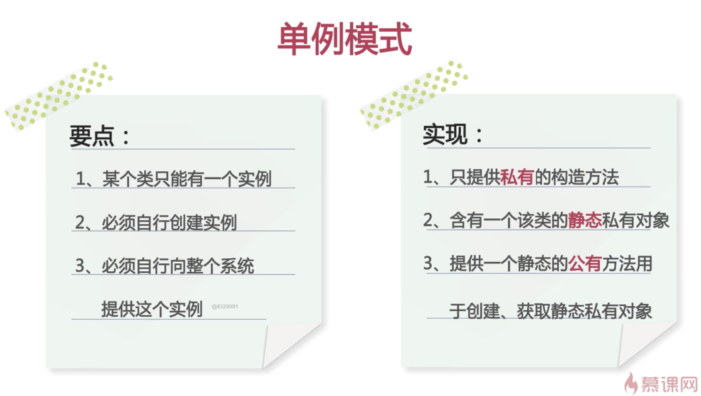

# Java 单例模式

## 单例模式概念

### 目的

使得类的一个对象成为该类系统中的唯一实例

### 定义

一个类有且仅有一个实例, 并且自行实例化向整个系统提供

[](https://imgchr.com/i/BVN9V1)

### 饿汉式

```java
// 单例模式
// 饿汉式:创建对象实例的时候直接初始化 空间换时间
public class SingletonOne {
  // 1.创建类中私有构造
  private SingletonOne() {

  }

  // 2.创建该类型的私有静态实例
  private static SingletonOne instance = new SingletonOne();

  // 3.创建公有静态方法返回静态实例对象
  public static SingletonOne getInstance() {
    return instance;
  }
}


class Test {
  public static void main(String[] args) {
    SingletonOne one = SingletonOne.getInstance();
    SingletonOne two = SingletonOne.getInstance();
    System.out.println(one);
    System.out.println(two);
  }
}

```

### 懒汉式

```java

// 单例模式 懒汉式 时间换空间
public class SingletonTwo {
  // 1.创建私有构造方法
  private SingletonTwo() {
  }
  // 2.创建静态的该类实例对象
  private static SingletonTwo instance = null;

  // 3.创建开放的静态方法提供实例对象
  public static SingletonTwo initInstance() {
    if (instance == null) {
      instance = new SingletonTwo();
    }
    return instance;
  }
}

class Test1 {
  public static void main(String[] args) {
    SingletonTwo one = SingletonTwo.initInstance();
    SingletonTwo two = SingletonTwo.initInstance();
    System.out.println(one);
    System.out.println(two);
  }
}
```

## 饿汉式 PK 懒汉式

1. 加载速度的区分

   - 饿汉式在类加载时就创建实例，第一次加载速度快；(空间换时间)

   - 懒汉式第一次使用时才进行实例化，第一次加载速度慢(时间换空间)

2. 饿汉式线程安全；懒汉式存在线程风险。(线程暂时没学)

```js
// 解决方案：
// 1. 同步锁
// 2. 静态内部类
// 3. 双重校验锁
// 4. 枚举
```

## 总结

### 优点

1. 在内存中只有一个对象,节省内存空间
2. 避免频繁的创建销毁对象,提高性能
3. 避免对共享资源的多重占用

### 缺点

1. 扩展比较困难
2. 如果实例化后的对象长期不利用,系统将默认为垃圾进行回收,造成对象状态丢失

### 适用场景

1. 创建对象时暂用资源过多，但同时有需要用到该类对象
2. 对系统内资源要求统一读写，如读写配置信息
3. 当多个实例存在可能引起程序逻辑错误，如号码生成器
