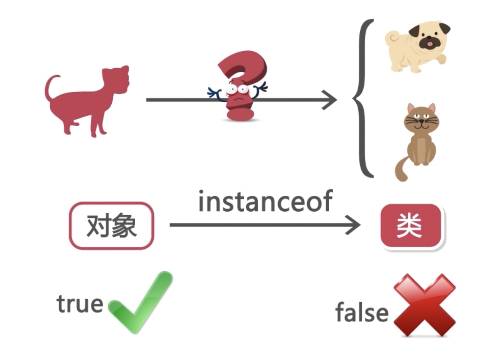

# Java 多态(polymorphism)

## 什么是多态

- 生活中

如按下键盘的 F1, 在不同的应用下面会有不同的反应, 这就是多态

- 程序设计中

意味着允许不同类的对象对同意消息做出不同的响应

## 多态的必要条件

1. 满足继承关系
2. 父类引用指向子类对象

## 向上转型、向下转型

### 向上转型(Upcast)：将子类型转换为父类型

- 向上转型又称为`隐式转型`、`自动转型`，小类转换大类

- 对于向上的类型转换，不需要显示置顶，所以不需要加上前面的小括号和父类类型名称

### 向下转型(Downcast)：将父类型转换为子类型

- 将一个指向子类对象的父类引用赋值给一个子类引用

- 向下转型又称为强制类型转换，是大类型转换到小类型

- 父类型的引用必须指向转型的子类对象，即指向谁才能转换成谁。不然也会编译出错

- 向下转型需要通过`instanceof`运算符，避免类型转换的安全性问题，提高代码健壮性

### 示例

```java
public class Test {
  public static void main(String[] args) {
    Animal animal = new Animal();
    // 向上转型不需要显示指定
    // Animal cat = (Animal)(new Cat());
    Animal cat = new Cat();
    Animal dog = new Dog();
    // 此时cat无法调用自己的方法了,只能调用重写的方法
    cat.eat(); // 1. 调用本身重写的方法
    cat.say(); // 2. 调用父类派生的方法
    Cat.run(); // 3. 静态方法无法被重写

    // 向下转型(强制类型转换)
    // 子类引用父类对象,必须进行强转
    if (cat instanceof Cat) {
      Cat temp1 = (Cat) cat;
      temp1.eat();
      temp1.playBall();
    }
  }
}
```

### 注意一下

1. 父类引用指向子类实例时(即向上转型的时候)，可以调用子类重写父类的方法、以及直接继承的方法，无法调用子类特有的方法

2. 静态方法(static)属于特殊情况，静态方法`只能继承`，不能重写。调用的时候用谁的引用，则调用谁的版本。

## instanceof 运算符



1. A instanceof B 语句表示左边对象引用类型是否可满足右边类型实例特征
2. 判断对象是否是类的实例
3. 可以提高向下转型的安全性

## 向上转型的有什么用处？直接创建子类对象不是更方便？

如果需要设置方法实现对各各子类 eat 方法的调用

- 父类 Person

```java
public class Person {
  public void eat() {
    System.out.println("是个人就要吃饭");
  }
}
```

- 子类

```java
public class Chinese extends Person {
  public void eat() {
    System.out.println("中国人爱吃饺子");
  }
}

public class French extends Person {
  public void eat() {
    System.out.println("法国人爱喝香槟");
  }
}

public class Russian extends Person {
  public void eat() {
    System.out.println("俄罗斯人爱吃牛排");
  }
}
```

- PersonTest 运行

```java
public class PersonTest {
  // 调用方案1: 向上转型(父类应用指向子类实例)
  // 有点：如果增加一个“英国人”不需要用方法重载调用了
  public void eatTest(Person person) {
    person.eat();
  }

  // 调用方法2: 方法重载
  // public void eatTest(Chinese ch) {
  //   ch.eat();
  // }
  //
  // public void eatTest(Russian ch) {
  //   ch.eat();
  // }
  //
  // public void eatTest(French ch) {
  //   ch.eat();
  // }

  public static void main(String[] args) {
    PersonTest personTest = new PersonTest();
    personTest.eatTest(new Chinese());
    personTest.eatTest(new Russian());
    personTest.eatTest(new French());
  }
}
```

由上述代码 demo 可以清晰看出, 以后无论增加多少**人的类**, eatTest 都不需要重载了

## 为什么需要向下转型，直接实例化子类不是更简单？

向下转型一般是为了重新获得因为向上转型而丢失的子类特性而存在，因此，统筹在向下转型前需要先进行向上转型，向下转型通常也会结合`instanceof运算符`一起使用

```java
public class Chinese extends Person {
  public void eat() {
    System.out.println("中国人爱吃饺子");
  }
  public void TaiChi() {
    System.out.println("中国人打太极拳养生");
  }
}

public class French extends Person {
  public void eat() {
    System.out.println("法国人爱喝香槟");
  }
  public void fencing() {
    System.out.println("法国人酷爱击剑");
  }
}

public class Russian extends Person {
  public void eat() {
    System.out.println("俄罗斯人爱吃牛排");
  }
  public void wrestling() {
    System.out.println("俄罗斯人摔跤很棒");
  }
}
```

此时如需在测试类 eatTest 方法中，修改 eatTest ，实现针对传入不同的参数分别调用各自独立方法，则可以参考如下代码

```java
public class PersonTest {
  public void eatTest(Person person) {
    if(person instanceof Chinese) {
      ((Chinese)person).TaiJiQuan();
    } else if (person instanceof Russian) {
      ((Russian) person).Wrestling();
    } else if (person instanceof French) {
      ((French) person).Fencing();
    }
    person.eat();
  }
  public static void main(String[] args) {
    PersonTest personTest = new PersonTest();
    personTest.eatTest(new Chinese());
  }
}
```

由此可见，借由向下转型，可以在灵活应用多态的基础上，同时兼顾子类的独有性，相较于直接创建子类实例，提高了代码加灵活性。

## abstract 抽象类

当一个类加上**abstract**关键字之后, 这个类就不能使用 new 来实例化了, 否则就会报错

但是可以通过向上转型, 指向子类实例

## abstract 抽象方法

如果在父类方法前面加上 abstract 关键字, 则这个函数不能增加方法体, 子类必须重写该方法, 否则会报错

```java
class Animal {
  // 抽象类没有方法体
  public abstract void eat();
}
```

## 抽象类&抽象方法使用规则

1. abstract 定义抽象类
2. 抽象类不能直接实例化, 只能被继承, 可以通过向上转型完成对象实例
3. abstract 定义抽象方法, 不需要具体实现
4. 包含抽象方法的类一定是抽象类
5. 但是抽象类可以没有抽象方法
6. 类里面有抽象方法, 这个类的子类必须`重写`抽象方法, 或者把这个子类也变成抽象类, 否则会报错
7. static, final, private 关键字不能与 abstract 共存
