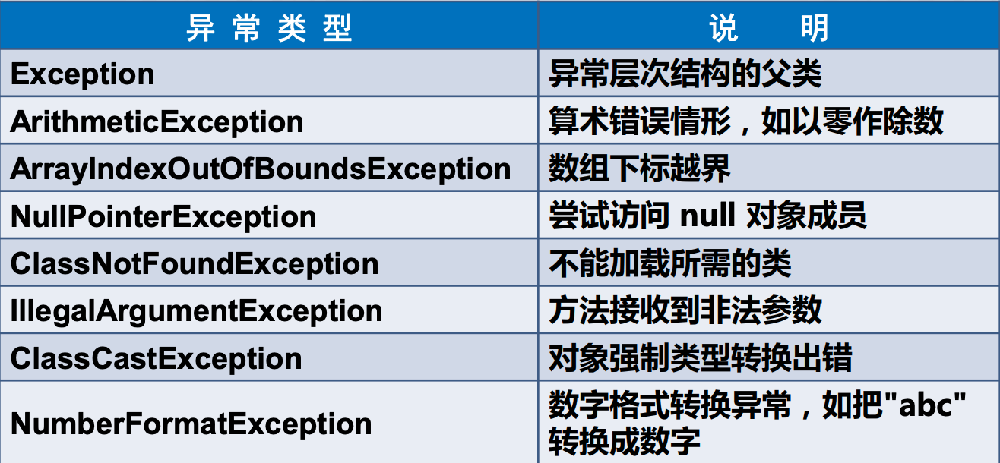

# Java 异常

## 异常分类

程序开发中不可避免会产生或者遇到异常，了解并合理的处理异常是一名优秀开发者的必备技能．下面将结合 Java 常见异常的说明、出现条件以及示例演示进行总结，帮助大家更好的认识他们。

### 常见异常类型



### ArithmeticException(数学运算异常)

1. 异常说明：数学运算异常

2. 出现条件：涉及到数学运算的地方可能出现失误，比如程序中出现了除以零这样的运算。

3. 示例演示：

[](https://img3.mukewang.com/5eb60feb0001fa4e05000120.jpg)

4. 运行结果：

[](https://img1.mukewang.com/5eb60ffc0001524d05000038.jpg)

### NumberFormatException(数字格式化异常)

1. 异常说明：数字格式化异常

2. 出现条件：涉及到类型转换时，比如不符合转换格式的字符串被转换成数字。

3. 示例演示：

[](https://img2.mukewang.com/5eb6103e0001d1a005000112.jpg)

4. 运行结果：

[](https://img3.mukewang.com/5eb610470001e31005000065.jpg)

### ArrayIndexOutOfBoundsException(数组下标越界异常)

1. 异常说明：数组下标越界异常

2. 出现条件：涉及到使用超出数组下标范围的下标。

3. 示例演示：

[](https://img4.mukewang.com/5eb610610001d27d05000124.jpg)

4. 运行结果：

[](https://img4.mukewang.com/5eb6106800011b2405000132.jpg)

### NullPointerException(空指针异常)

1. 异常说明：空指针异常

2. 出现条件：当使用了未经初始化的对象或者是不存在的对象时

3. 示例演示：

[](https://img2.mukewang.com/5eb6107c0001d48105000112.jpg)

4. 运行结果：

[](https://img2.mukewang.com/5eb610830001825405000050.jpg)

### ClassCastException(类型转换异常)

1. 异常说明：类型转换异常

2. 出现条件：如进行向下转型时，转换对象无法完成正常转换。

3. 示例演示：

[](https://img2.mukewang.com/5eb6118800010dbe05000388.jpg)

4. 运行结果：

[](https://img2.mukewang.com/5eb6118e0001def505000031.jpg)

### ArrayStoreException(数组中包含不兼容的值的异常)

1. 异常说明：数组中包含不兼容的值的异常

2. 出现条件：数组中实际传入的数据与预定不符，譬如子类数组经过向上转型后，传入父类对象。

3. 示例演示：

[](https://img2.mukewang.com/5eb611940001d2f505000424.jpg)

4. 运行结果：

[](https://img4.mukewang.com/5eb6119b00014e7905000044.jpg)

### InputMismatchException(输入格式错误的异常)

1. 异常说明：输入格式错误的异常

2. 出现条件：接收数据与预期格式不符时。

3. 示例演示：

[](https://img3.mukewang.com/5eb611a200019bca05000122.jpg)

4. 运行结果：

[](https://img.mukewang.com/5eb611aa00011ce105000153.jpg)

### FileNotFoundException(文件未找到异常)

1. 异常说明：文件未找到异常

2. 出现条件：操作文件内容时发现文件不存在。

3. 示例演示：

[](https://img4.mukewang.com/5eb611b40001539a05000238.jpg)

4. 运行结果：

[](https://img1.mukewang.com/5eb611ba0001087305000102.jpg)

[](https://imgchr.com/i/BJbCYn)

```java
public class Test {
  public static void main(String[] args) {
    System.exit(10); // 终止代码执行, 如果在catch中, 也会终止catch, finally的执行
    // try块后可接零个或多个catch块
    // 如果没有catch, 则必须要有一个finally块
    // 不允许单独使用
    try {
      System.out.println(12/0);
    } catch (Exception e) {
      e.printStackTrace(); // 可以捕获错误出错的位置, 出现位置很随机
      System.out.println(e);
    } finally {
      // 无论程序是否出现异常, 这块代码都会执行, 强制执行
      System.out.println("无论程序是否出现异常, 这块代码都会执行");
    }
  }
}
```

> 在 try 中写 return 要注意, finally 始终都会执行, 不建议在其中加入 return

## throw 抛出异常

如果一个方法可能会出现异常, 但没有能力处理这种异常, 可以在方法声明处用`throw`语句来声明抛出异常

1. 通过 try...catch 包含 throw 语句--自己抛自己处理

```java
public class TestErr {
  public static void main(String[] args) {
    TestErr.testAge();
  }
  public static void testAge() {
    int age = 11;
    if (age < 18 || age > 80) {
      try {
        throw new Exception("18岁以下,80岁以上不能住");
      } catch (Exception e) {
        e.printStackTrace();
      }
    } else {
      System.out.println("欢迎您");
    }
  }
}

```

2. 在方法声明处增加`throws Exception`异常类型

```java
public class TestErr {
  public static void main(String[] args) {
    // 方法调用处, 处理异常
    try {
      TestErr.testAge();
    } catch (Exception e) {
      e.printStackTrace();
    }
  }
  // 通过 throws Exception 声明异常类型
  // 此时可以抛出与throw对象相同的类型或者其父类
  public static void testAge() throws Exception {
    int age = 11;
    if (age < 18 || age > 80) {
      // 在方法定义的时候, 抛出异常, 调用的时候处理
      throw new Exception("18岁以下,80岁以上不能住");
    } else {
      System.out.println("欢迎您");
    }
  }
}
```

## throw 和 throws 的区别

Java 语言通过异常处理机制来解决运行期间产生的异常。良好的异常处理设计，可以降低错误的程序代码或系统错误所造成的不可预期的损失，增强程序的灵活性、可读性和健壮性。

当在设计中，我们希望有针对性的产生、抛出异常，由上级调用者视情况处理时，就需要使用 throw、throws 了。本节中，我们会针对它们进行梳理，帮助大家更好的理解和应用。

### throw

- 语法

throw 异常对象；或 throw new 异常类型(参数列表);

- 说明

  1. 一般是在代码块的内部，当程序出现某种逻辑错误时，由程序员主动抛出某种特定类型的异常。

  2. 语句定义在方法体内，只能抛出一个异常对象。

  3. 抛出的异常可以在方法内，自行通过 try…catch…finally 进行处理，也可以借由 throws 通知方法调用者，应用时再进行处理。

  4. 通过 throw 抛出的异常是一定会产生的。

  5. 如 throw 抛出的是 CheckedException 对象，且未进行任何处理，会编译报错；如抛出的是 UncheckedException 对象，则默认不会产生错误提醒。当然，更推荐大家进行处理操作，以避免后续不必要的失误。
  6. 方法中，throw 和 return 都会触发方法中断操作，因此在未加入判断的情况下，不可同时出现。

- 如下图所示：错误提示为：Unreachable code

[](https://img3.mukewang.com/5eb61b44000130a705000135.jpg)

- 当加入 if 判断后，如下图，错误提示消失。

[](https://img.mukewang.com/5eb61b510001b63a05000149.jpg)

### throws

- 语法

throws 异常类型列表

- 说明

  1. 表示通知方法调用者，使用该方法时，可能会发生哪些异常，需要进行相关处理。

  2. 语句设置在方法参数列表后，throws 后可以跟着多个异常类型名，表示抛出的异常，之间用逗号隔开。

  3. 表现一种产生异常的可能性，但不一定会发生。

- 如下代码所示，getResult 方法中，针对输入数据可能不是 5 的倍数的情况，通过 throw 抛出异常，并设定异常描述信息，所抛出的异常由方法内部自行 try…catch 处理。

```java
public class Main {

  public static void main(String[] args) {
    getResult();
  }

  public static void getResult() {
    Scanner input = new Scanner(System.in);
    // throw 抛出的Exception类型的异常, 在方法内部自行进行捕获并处理
    try {
      System.out.println("请输入一个5的倍数");
      int temp = input.nextInt();
      if (temp % 5 != 0) {
        throw new Exception("没有输入5的倍数");
      } else {
        System.out.println("输入正确");
      }
    } catch (Exception e) {
      System.out.println("异常信息已通知管理员");
      e.printStackTrace();
    }
  }
}
```

- 修订代码，如下代码所示，getResult 方法中并不自行处理，而通过 throws 向上级调用者抛出，由调用者自行决定处理方式。

```java
public class Main {
  public static void main(String[] args) {
    try {
      getResult();
    } catch (Exception e) {
      e.printStackTrace();
    }
  }
  // throw 抛出Exception类型的一次, 在方法声明处标注, 由调用者处理
  // throws Exception: 如果不写这个会报错
  // 或者换成 `throw new ArithmeticException("没有输入5的倍数");` 来抛出异常
  public static void getResult() throws Exception {
    Scanner input = new Scanner(System.in);
    System.out.println("请输入一个5的倍数");
    int temp = input.nextInt();
    if (temp % 5 != 0) {
      throw new Exception("没有输入5的倍数");
      // throw new ArithmeticException("没有输入5的倍数");
    } else {
      System.out.println("正确");
    }
  }
}
```

## 自定义异常

1. 自定义异常属于检查异常还是非检查异常？

这要看在定义自定义异常类时所继承的父类，如果父类属于检查异常，则自定义异常也就是检查异常，反之亦然。

2. 通过 throw new Exception(描述信息);也能输出自己定义的错误信息，跟自定义异常类是一样的么？

不一样的，通过 throw new Exception(描述信息);完成的是实例化 Exception 类型对象，并针对其异常描述信息进行赋值的操作，这种操作比较适合进行临时或者应用频率不高的异常处理情况；而通过自定义异常类，完成的是通过继承自某种已存在异常类型，创建一个独特的，结合业务产生的类型，并设置其异常描述信息，这种操作更加适合该异常将在项目中相对频繁出现并应用的场景。

3. toString() 和 printStackTrace() 在异常处理中的区别是什么？

e.toString(): 获得异常类型和描述信息，当直接输出对象 e 时，默认调用 e.toString()方法。

e.getMessage(): 获得异常描述信息

e.printStackTrace(): 打印出异常产生的堆栈信息，包括种类、描述信息、出错位置等

```java
public class Main {
  public static void main(String[] args) {
    try {
      int one = 12;
      Scanner input = new Scanner(System.in);
      System.out.println("请输入一个整数");
      int two = input.nextInt();
      System.out.println(one / two);
    } catch (Exception e) {
      // 捕获错误
      System.out.println(e.toString());
      System.out.println(e.getMessage());
      e.printStackTrace();
    }
  }
}
```

- 自定义异常代码示例

```java
package com.company;

public class GameAgeException extends Exception {
  public GameAgeException() {
    super("小学生禁止玩游戏");
  }
}
```

```java
package com.company;

import java.util.Scanner;

public class GameAgeExceptionTest {
  public static void main(String[] args) {
    try {
      ageCheck();
    } catch (Exception e) {
      e.printStackTrace();
    }
  }

  public static void ageCheck() throws GameAgeException {
    Scanner input = new Scanner(System.in);
    System.out.println("请输入玩家年龄");
    int age = input.nextInt();
    if (age < 18) {
      throw new GameAgeException();
    } else {
      System.out.println("欢迎进入冒险家的世界");
    }
  }
}
```

## 异常链

1. 异常链的存在目的是什么？

随着项目开发的规模越来越大，越往底层，可能抛出的异常类型也会越来越多。如果在上层想要处理这些异常，就需要挨个的写很多 catch 语句块来捕捉异常，这样是很麻烦的；如果我们对底层抛出的异常捕获后，抛出一个新的统一的异常，的确可以避免这个问题。但是直接抛出一个新的异常，又可能会造成最原始的异常信息丢失，不利于排查问题。因此，如果采用异常链，在保有底层异常信息的基础上，将多层次异常以链路方式进行封装，对后续追查定位 BUG 是非常有利的。

2. 异常链传递过程中，使用 Throw 的带参构造方法和 initCause 有什么区别呢？

通常，我们可以借用在异常的根类 Throw 中提供的带参构造方法 Throwable(String message, Throwable cause)以及初始化方法 initCause(Throwable cause) 实现异常链信息的传递。这两个方法的区别就在于 initCause 方法相对更加灵活，可以在异常对象构造完成后单独进行异常信息赋值，在对于异常信息传递的作用而言，两者无区别。

3. 如果在程序中设置 3 个自定义异常，并且通过异常链的方式逐层传递异常信息，最后打印输出的时候，异常信息是按什么顺序展示呢？

信息展示时，以最终调用执行的方法为主体，逐步展示其包含的异常信息，直至最底层方法的异常信息。以下面示例为例：

代码示例:

```java
package com.company;

class ExceptionOne extends Exception {
  public ExceptionOne() {
    super("1号异常");
  }
}

class ExceptionTwo extends Exception {
  public ExceptionTwo() {
    super("2号异常");
  }
}

class ExceptionThree extends Exception {
  public ExceptionThree() {
    super("3号异常");
  }
}

public class Test {
  public static void main(String[] args) {
    try {
      Test test = new Test();
      test.checkThree();
    } catch (Exception e) {
      e.printStackTrace();
    }
    // 抛出异常
    // com.company.ExceptionThree: 3号异常
    //   at com.company.Test.checkThree(Test.java:49)
    //   at com.company.Test.main(Test.java:25)
    // Caused by: com.company.ExceptionTwo: 2号异常
    //   at com.company.Test.checkTwo(Test.java:39)
    //   at com.company.Test.checkThree(Test.java:47)
    //   ... 1 more
    // Caused by: com.company.ExceptionOne: 1号异常
    //   at com.company.Test.checkOne(Test.java:32)
    //   at com.company.Test.checkTwo(Test.java:37)
    //   ... 2 more
  }

  public void checkOne() throws ExceptionOne {
    throw new ExceptionOne();
  }

  public void checkTwo() throws ExceptionTwo {
    try {
      checkOne();
    } catch (ExceptionOne e) {
      ExceptionTwo ex = new ExceptionTwo();
      ex.initCause(e);
      throw ex;
    }
  }

  public void checkThree() throws ExceptionThree {
    try {
      checkTwo();
    } catch (ExceptionTwo e) {
      ExceptionThree ex = new ExceptionThree();
      ex.initCause(e);
      throw ex;
    }
  }
}

```
