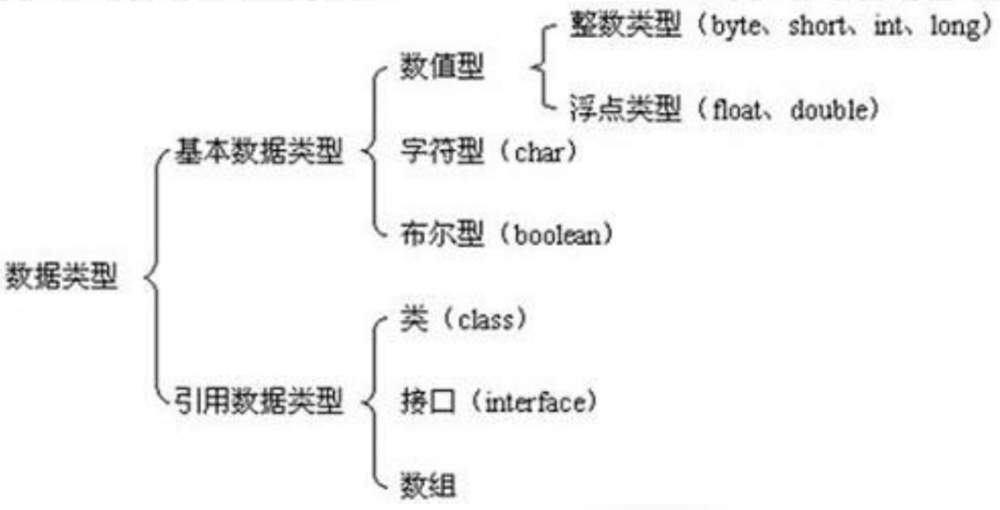

# Java 包装类

## java 中的数据类型

java 中的基本数据类型如下。但是**基本数据**类型，不具备对象的特性，所以需要`基本数据`



## 包装类与基本数据类型

| 基本类型 | 对应的包装类 |
| :------: | :----------: |
|   byte   |     Byte     |
|  short   |    Short     |
|   int    |   Integer    |
|   long   |     Long     |
|  float   |    Float     |
|  double  |    Double    |
|   char   |  Character   |
| boolean  |   Boolean    |

## 装箱、拆箱的基本操作

- 装箱是指：基本数据类型转换为`包装类`
- 拆箱是指：`包装类`转换为基本数据类型

```java
public class WrapDemo1 {
  public static void main(String[] args) {
    // 装箱: 把基本数据类型转换为包装类
    // 1. 自动装箱
    int int1 = 10;
    Integer int2 = int1;
    // 2. 手动装箱
    Integer int3 = new Integer(int1);

    System.out.println("int1: " + int1);
    System.out.println("int2: " + int2);
    System.out.println("int3: " + int3);

    // 拆箱: 包装类转换成基本数据类型
    // 1. 自动拆箱
    int int4 = int2;
    // 2. 手动拆箱
    int int5 = int3.intValue();
    double do6 = int3.intValue();

    System.out.println("int4: " + int4);
    System.out.println("int5: " + int5);
    System.out.println("do6: " + do6);
  }
}
```

## 包装类的比较

- 拆箱后的数字,是基本数据类型，如果是字符，比较的是 ASCII 的值

```java
public class WrapDemo2 {
  public static void main(String[] args) {
    int a = new Integer(65);
    int b = 65;
    char c = new Character('A');
    System.out.println(a == b); // true
    System.out.println(b == c); // true
  }
}
```

- 装修后如果使用 == 比较对象的内存地址，除了`Double`、`Float`之外，如果数据值在`-128~127`之间，则相同

```java
public class WrapDemo2 {
  public static void main(String[] args) {
    Integer a1 = 127;
    Integer b1 = 127;
    System.out.println(a1 == b1); // true
    Integer a2 = 128;
    Integer b2 = 128;
    System.out.println(a2 == b2); // true
  }
}
```

- 调用`equals`进行比较时，当类型相同，且数值相同时，返回 true
- 当比对方为基本数据类型的时候，会先进行装箱

```java
public class WrapDemo2 {
  public static void main(String[] args) {
    Integer a = 12;
    int b = 12;
    Character c = 12;
    // b会先进行装箱操作在比较
    System.out.println(a.equals(b));
    // 对象比较肯定返回false
    System.out.println(a.equals(c));
  }
}
```

## 包装类常见的问题

https://class.imooc.com/lesson/2067#mid=49121
