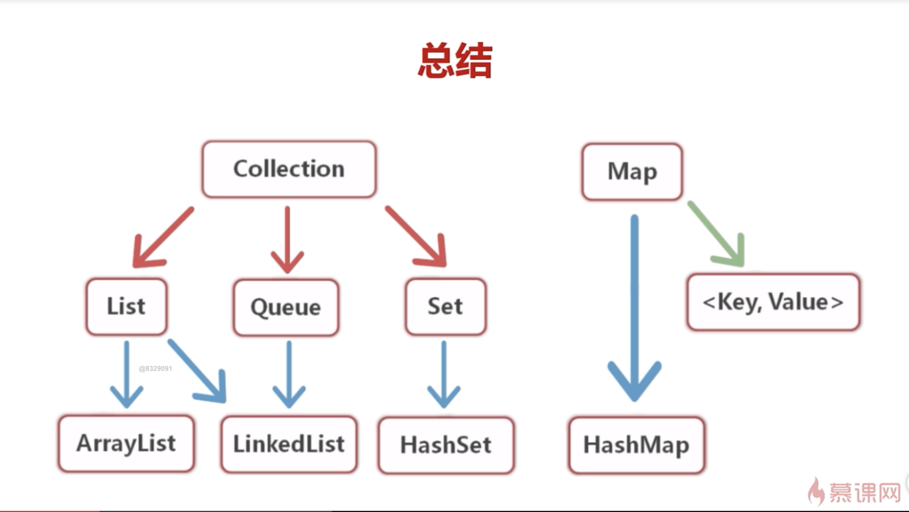

# 集合

Java 中的集合是工具类, 可以储存任意数量的具有相同属性的对象

## 与数组的区别

数组储存固定长度的数据, 集合的长度可以动态改变

## 应该场景

1. 无法预测存储数据的数量

2. 同时存储具有一对一关系的数据

3. 需要进行数据的增删

4. 数据重复的问题(集合提供了不允许有重复数据的方法)

## 总结

- ArrayList

1. 底层由数组实现

2. 元素有序且可以重复, 和 js 的数组类似

3. 可以动态增长, 以满足程序的需求

4. 元素值可以为 null

- HashSet

1. 元素无序并且不可以重复

2. 只允许有一个 null

3. 迭代器接口要掌握

- HashMap

1. 键值不允许重复

2. 允许使用 null 值和 null 键

3. HashMap 中的 Entry 对象是无序排列的

- Iterator(迭代器)

Iterator 接口以统一的方式对各元素进行遍历
