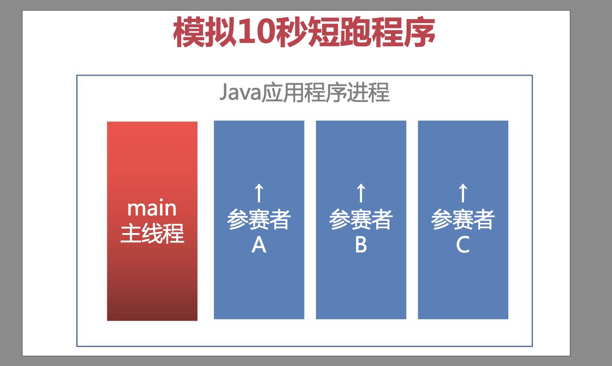

# Java 进程

## 什么是进程

`进程`是指：程序运行后在内存中的一个实例。当一个程序执行进入内存时，击变成一个进程。

## 什么是线程

`线程`是指：进程当中的一个“任务”，一个`进程`中最少包含一个`主线程`，主线程消亡，代表进程结束

## 创建线程的三种方式

- 继承 Thread 类创建线程

- 实现 Runnable 接口创建线程

- Callable 接口创建线程

## 模拟 10 秒短跑程序，创建三个进程



### 继承 Thread 类

```java
package com.imooc.thread;
import java.util.Random;
public class ThreadSample1 {
    // 继承Thread类创建线程
    class Runner extends Thread {
        // 必须实现run方法
        @Override
        public void run() {
            Integer speed = new Random().nextInt(10);
            for (int i = 1; i <= 10; i++) {
                try {
                    // 让进程休眠
                    Thread.sleep(1000);
                } catch (InterruptedException e) {
                    throw new RuntimeException(e);
                }
                System.out.println("第" + i + "秒：" + this.getName() + "已跑到" + (i * speed) + "米(" + speed + "米/秒)");
            }
        }
    }

    public void start() {
        Runner thread1 = new Runner();
        thread1.setName("参赛者1");
        Runner thread2 = new Runner();
        thread2.setName("参赛者2");
        Runner thread3 = new Runner();
        thread3.setName("参赛者3");

        // 启动线程
        thread1.start();
        thread2.start();
        thread3.start();
    }

    public static void main(String[] args) {
        new ThreadSample1().start();
    }
}

```

### 实现 Runnable 接口

```java
package com.imooc.thread;

import java.util.Random;

public class ThreadSample2 {
    class Runner implements Runnable {
        @Override
        public void run() {
            Integer speed = new Random().nextInt(10);
            for (int i = 1; i <= 10; i++) {
                try {
                    Thread.sleep(1000);
                } catch (InterruptedException e) {
                    throw new RuntimeException(e);
                }
                System.out.println("第" + i + "秒：" + Thread.currentThread().getName() + "已跑到" + (i * speed) + "米(" + speed + "米/秒)");
            }
        }
    }

    public void start() {
        Thread threadA = new Thread(new Runner());
        threadA.setName("参赛者A");
        Thread threadB = new Thread(new Runner());
        threadB.setName("参赛者B");
        Thread threadC = new Thread(new Runner());
        threadC.setName("参赛者C");

        threadA.start();
        threadB.start();
        threadC.start();
    }

    public static void main(String[] args) {
        new ThreadSample2().start();
    }
}

```

### 实现 Callable 接口

```java
package com.imooc.thread;

import java.util.Random;
import java.util.concurrent.*;

public class ThreadSample3 {
    // Callable接口允许线程返回
    class Runner implements Callable<Integer> {
        public String name;
        @Override
        public Integer call() throws Exception {
            Integer speed = new Random().nextInt(10);
            Integer result = 0;
            for (int i = 1; i <= 10; i++) {
                Thread.sleep(1000);
                result = i * speed;
                System.out.println("第" + i + "秒：" + this.name + "已跑到" + (i * speed) + "米(" + speed + "米/秒)");
            }
            return result;
        }
    }

    public void start() throws ExecutionException, InterruptedException {
        // 创建线程池
        ExecutorService executorService = Executors.newFixedThreadPool(3);
        Runner threadA = new Runner();
        threadA.name = "A线程";
        Runner threadB = new Runner();
        threadB.name = "B线程";
        Runner threadC = new Runner();
        threadC.name = "C线程";
        // 利用Future对象获取每一个线程执行后的结果
        Future<Integer> r1 = executorService.submit(threadA);
        Future<Integer> r2 = executorService.submit(threadB);
        Future<Integer> r3 = executorService.submit(threadC);
        // 关闭线程池
        executorService.shutdown();
        // 使用get方法获取线程返回的结果
        System.out.println(threadA.name + "累计跑了" + r1.get() + "米");
        System.out.println(threadB.name + "累计跑了" + r2.get() + "米");
        System.out.println(threadC.name + "累计跑了" + r3.get() + "米");
    }

    public static void main(String[] args) throws ExecutionException, InterruptedException {
        new ThreadSample3().start();
    }
}
```

### 总结

- 继承 Thread，Java 只允许单继承，不推荐使用
- 实现 Runnable 接口，Java 编程友好，但是无法返回执行后的数据
- 实现 Callable 接口，可以返回多线程执行结果，编程稍显复杂

## 初识线程同步

```java
package com.imooc.thread;
public class SyncSample {
    class Printer {
        // synchronized方法 - 对this当前对象上锁
        public synchronized void print() {
            try {
                Thread.sleep(500);
                System.out.print("1");
                Thread.sleep(500);
                System.out.print("2");
                Thread.sleep(500);
                System.out.print("3");
                Thread.sleep(500);
                System.out.print("4");
                System.out.println();
            } catch (Exception e) {
                e.printStackTrace();
            }
        }
    }
    class PrintTask implements Runnable {
        public Printer printer;

        @Override
        public void run() {
            printer.print();
        }
    }
    public void start() {
        Printer printer = new Printer();
        for (int i = 0; i < 10; i++) {
            PrintTask task = new PrintTask();
            task.printer = printer;
            Thread thread = new Thread(task);
            thread.start();
        }
    }
    public static void main(String[] args) {
        SyncSample sample = new SyncSample();
        sample.start();
    }
}

```

## 初始线程池

### Runnable 接口的弊端

- Runnable 新建线程，性能差

- 线程缺乏统一的管理，可以无限制新建线程，相互竞争，严重时会造成死机或内存溢出

### ThreadPool 线程池

- 重用存在的线程，减少线程对象的创建、消亡的开销

- 线程总数可控，提高资源利用率

- 提供额外功能，如定时执行、定期执行、监控等

### JUC(java.util.concurrent)支持的线程池种类

1. FixedThreadPool - 定长线程池

```java
package com.imooc.thread.pool;

import java.util.Objects;
import java.util.concurrent.Callable;
import java.util.concurrent.ExecutorService;
import java.util.concurrent.Executors;
import java.util.concurrent.Future;

public class ThreadPoolSample1 {
    public static void main(String[] args) {
        // 创建一个"定长线程池"
        // 特点: 固定线程总数, 空闲线程用于执行任务, 如果没有空闲线程, 其余线程处于等待状态
        ExecutorService threadPool = Executors.newFixedThreadPool(10);
        for (int i = 1; i <= 100; i++) {
            final int index = i;
            // 匿名类
            threadPool.execute(new Runnable() {
                @Override
                public void run() {
                    System.out.println(Thread.currentThread().getName() + ": " + index);
                }
            });

            // 如果需要在线程里计算值再返回, 使用submit方法执行Callable对象, 利用Future对象接收返回值
            // Future<Object> res = threadPool.submit(new Callable<Object>() {
            //     @Override
            //     public Object call() throws Exception {
            //         return null;
            //     }
            // });
        }
        // 线程池需要手动关闭
        threadPool.shutdown();
    }
}
```

2. CachedThreadPool - 可缓存线程池

```java
package com.imooc.thread.pool;

import java.util.concurrent.ExecutorService;
import java.util.concurrent.Executors;

public class ThreadPoolSample2 {
    public static void main(String[] args) {
        // 创建一个"可缓存线程池"
        // 特点: 无限大, 如果线程池中没有可用的线程则创建, 有空闲的线程则利用起来
        ExecutorService threadPool = Executors.newCachedThreadPool();
        for (int i = 1; i <= 1000; i++) {
            final int index = i;
            threadPool.execute(new Runnable() {
                @Override
                public void run() {
                    System.out.println(Thread.currentThread().getName() + ": " + index);
                }
            });
        }
        threadPool.shutdown();
    }
}
```

3. SingleThreadExecutor - 单线程池

```java
package com.imooc.thread.pool;

import java.util.concurrent.ExecutorService;
import java.util.concurrent.Executors;

public class ThreadPoolSample3 {
    public static void main(String[] args) {
        // 单线程线程池
        // 特点：只有一个线程在跑，使用较少
        ExecutorService threadPool =  Executors.newSingleThreadExecutor();
        for (int i = 1; i <= 100; i++) {
            final int index = i;
            threadPool.execute(new Runnable() {
                @Override
                public void run() {
                    System.out.println(Thread.currentThread().getName() + ": " + index);
                }
            });
        }
    }
}

```

4. ScheduledThreadPool - 调度线程池

```java
package com.imooc.thread.pool;

import java.util.concurrent.Executors;
import java.util.concurrent.ScheduledExecutorService;
import java.util.concurrent.TimeUnit;

public class ThreadPoolSample4 {
    public static void main(String[] args) {
        ScheduledExecutorService scheduleThreadPool = Executors.newScheduledThreadPool(5);
        scheduleThreadPool.scheduleAtFixedRate(new Runnable() {
            @Override
            public void run() {
                System.out.println("延迟十秒执行,每三秒执行一次");
            }
        }, 10, 3, TimeUnit.SECONDS);
    }
}
```
