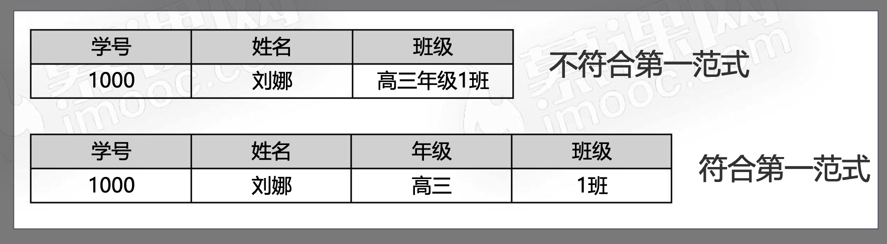
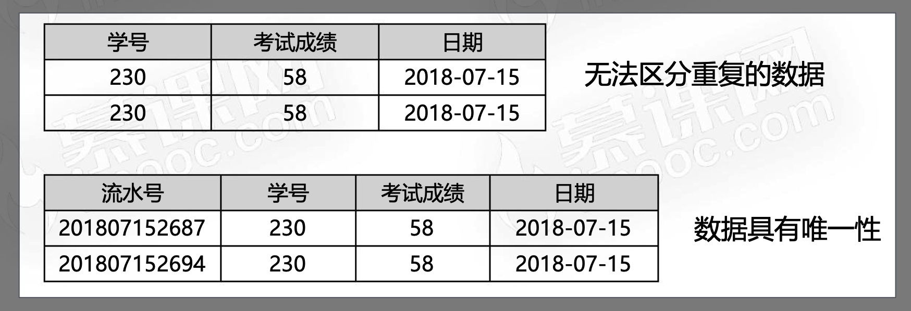
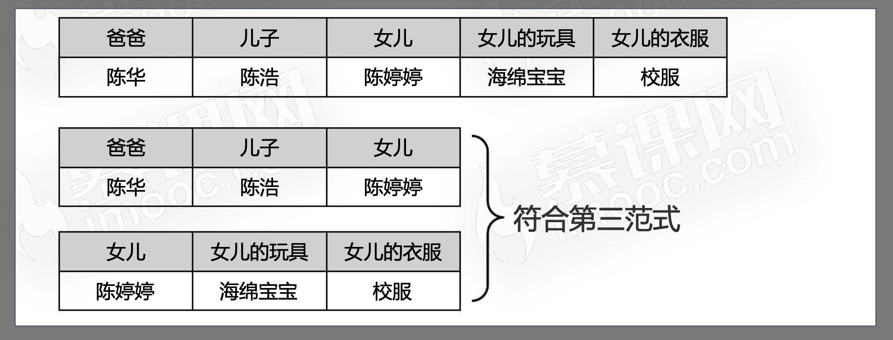
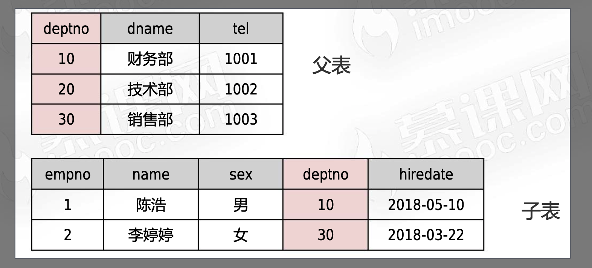

# 数据表的相关操作

## SQL 语言的分类

1. DML-数据操作语言

   - 添加
   - 修改
   - 删除
   - 查询

2. DCL-数据控制语言

   - 创建用户
   - 权限分配
   - 事物管理

3. DDL-数据定于语言
   - 逻辑库
   - 数据表
   - 视图
   - 索引

#### 逻辑空间的操作

> 都属于 DDL 语句

```sql
# 显示所有的逻辑空间
show databases;
# 创建逻辑空间
create database demo;
# 删除逻辑空间
drop database demo;
```

#### 数据表的操作

```sql
USE test;
CREATE TABLE student (
  # INT：整数
  # UNSIGNED：无负数
  # PRIMARY KEY：主键
  id INT UNSIGNED PRIMARY KEY,
  # VARCHAR：不固定长度字符串，最大不超过20字符
  # NOT NULL：约束，不允许为null
  name VARCHAR ( 20 ) NOT NULL,
  # CHAR：固定长度的字符串
  sex CHAR ( 1 ) NOT NULL,
  birthday DATE NOT NULL,
  tel CHAR ( 11 ) NOT NULL,
  # 最后一个不能加逗号，切记
  remark VARCHAR ( 200 )
);

# 插入一条学生的数据
insert into student values( 1, "李强", "男", "1997-12-31", "13186959580", "desc" );

# 显示逻辑空间的所有表
show tables;

# 显示表的信息
desc students;

# 显示建表语句
show create table student;

# 删除表
drop table student;
```

## 数据类型

### 数据类型：数字

| 类型      | 大小   | 说明           |
| --------- | ------ | -------------- |
| tinyint   | 1 字节 | 小整数         |
| smallint  | 2 字节 | 普通整数       |
| mediumint | 3 字节 | 普通整数       |
| int       | 4 字节 | 较大整数       |
| bigint    | 8 字节 | 大整数         |
| float     | 4 字节 | 单精度浮点数   |
| double    | 8 字节 | 双精度浮点数   |
| decimal   | ---    | decimal(10, 2) |

### 数据类型：字符串

| 类型       | 大小              | 说明             |
| ---------- | ----------------- | ---------------- |
| char       | 1-255 字符        | 固定长度字符串   |
| varchar    | 1-65535 字符      | 不固定长度字符串 |
| text       | 1-65535 字符串    | 不确定长度字符串 |
| mediumtext | 1-1 千 6 百万字符 | 不确定长度字符串 |
| longtext   | 1-42 亿字符       | 不确定长度字符串 |

### 数据类型：日期

| 类型      | 大小   | 说明     |
| --------- | ------ | -------- |
| date      | 3 字节 | 日期     |
| time      | 3 字节 | 时间     |
| year      | 1 字节 | 年份     |
| datetime  | 8 字节 | 日期时间 |
| timestamp | 4 字节 | 时间戳   |

## 修改表结构

```sql
# 使用test逻辑库
use test;

# add：增加字段
alter table student
add address varchar(200) not null,
add home_tel char(11) not null;

# modify：修改字段类型和约束
alter table student
modify address varchar(20) not null;

# change：修改字段名称
alter table student
change address home_address varchar(200) not null;

# drop：删除字段名称
alter table student
drop home_address,
drop home_tel;
```

## 数据库的范式

> 构造数据库必须遵守一定的规则，这种规则就是范式
> 目前关系型数据库有 6 中范式，一般遵守第三范式即可

- 第一范式：原子性
  - 第一范式是数据库的基本要求，不满足这一点就不是`关系型数据库`
  - 数据表的每一列都是不可分割的基本数据，同一列不能有多个值，也不能存在重复的属性，如下图



- 第二范式：唯一性
  - 数据表中的每一条记录必须是唯一的。通常每条数据中，有一个唯一标识，称之为`主键`



- 第三范式：关联性
  - 每列都与主键有直接关系，不存在传递依赖
  - 数据可以拆分，保存到不同的数据表彼此保持关联



## 字段约束

| 约束名称 |   关键字    |           描述            |
| :------: | :---------: | :-----------------------: |
| 主键约束 | primary key | 字段值唯一，且不能为 null |
| 非空约束 |  not null   |     字段值不能为 null     |
| 唯一约束 |   unique    | 字段值唯一，且可以为 null |
| 外键约束 | foreign key |   保持关联数据的逻辑性    |

### 主键约束

- 主键约束要求字段唯一，且不能为 null
- 主键建议使用数字类型，加快数据库检索速度
- 如果主键是数字，可以使用`auto_increment`关键字设置自动增长

```sql
create table t_teacher(
	id int primary key auto_increment,
  ...
);
```

### 非空约束

- 非空约束要求字段不能为`null`
- `null`是没有值，而不是""空字符串

```sql
create table t_teacher(
  id int primary key auto_increment,
  name varchar(20) not null,
  -- 使用`default`来定义默认值
  married boolean not null default false
);
```

### 唯一约束

- 唯一约束要求字段如果不为 null，那么在全表必须唯一
- 使用`unique`关键字

```sql
create table t_teacher(
  id int primary key auto_increment,
  tel char(11) not null unique
);
```

### 外键约束(少用)

- 外检约束用来保证关联数据的逻辑关系



```sql
-- 父表
create table t_dept(
  deptNo int unsigned primary key,
  deptName varchar(20) not null,
  deptTel varchar(20) not null
);
-- 子表
create table t_employee(
  employeeNo int unsigned primary key,
  eName varchar(20) not null,
  sex ENUM("男","女") not null,
  hiredate date not null,
  -- 注意这里要添加这个外键
  deptNo int unsigned,
  foreign key (deptNo) references t_dept(deptNo)
)
```
