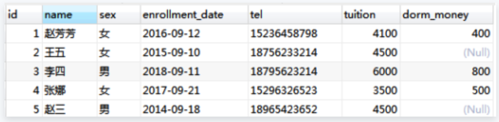

# 数据库的查询

## 基本查询

```sql
-- 基本查询
select * from t_emp;
-- 查询指定字段
select ename,empno from t_emp;
-- 给字段起别名
select empno,ename,sal*12 as "income" from t_emp;

-- 分页查询: limit
-- 从第0条开始，每页10条
select * from t_emp limit 0, 10;

-- 排序: order by
-- asc: 升序排列
-- desc: 降序排列
select * from t_emp order by sal asc;
select * from t_emp order by sal desc;

-- 多个字段排序 + 分页
select empno,ename,job,mgr,hiredate,sal
from t_emp
order by sal desc,hiredate asc
limit 0,5;
```

## 条件查询

### 基本语法

```sql
select * from t_emp
-- 使用where关键字
-- or表示或
-- and表示且
where (deptno=10 or deptno=20) and sal>=2000;

-- 多条件查询
select ename,sal,comm,hiredate from t_emp
-- comm如果为null,使用0替代
where (sal+ifnull(comm,0))*12 >= 15000
-- datediff: 查询两个天数的差异,
-- now(): 当前日期
and datediff(now(),hiredate)/365>=40;

-- 运算符
select * from t_emp
where deptno in(10,20)
-- in等价于: (deptno=10 or deptno=20)
and job!="SALESMAN"
and hiredate<"1985-01-01";
```

### 示例



1. 查询小白和小灰的学生信息

```sql
select * from student where name="小白" or name="小灰";
```

2. 查询未缴纳宿舍费用的学生姓名

```sql
select name from student where dorm_money is null;
```

3. 查询总学费在 4000 至 4500 的学生信息(包含 4000，4500)，使用`比较运算符`

```sql
select * from student where tuition+ifnull(dorm_money,0)>=4000 and tuition+ifnull(dorm_money,0)<=4500;
-- 注意between关键字，需要使用and连接
select * from student where tuition+ifnull(dorm_money,0) between 4000 and 4500;
```

4. 查询总学费为除去 4000 和 4500 之外的学生信息
   - 使用`not`关键字表示取反
   - `in`指定针对某个列的多个可能值

```sql
select * from student where not tuition+ifnull(dorm_money,0) in (4000,4500);
```

5. 查询总学费为除去 4000 和 4500 之外的学生信息，并且把总学费显示出来升序排列

```sql
select
*,tuition+ifnull(dorm_money,0) as "sum"
from student
where not tuition+ifnull(dorm_money,0) in (4000,4500)
order by sum;
```

6. 查询性别为女且姓名以赵或王开头的学生信息

```sql
select * from student where (name like "赵%" or name like "王%") and sex="女";
```

