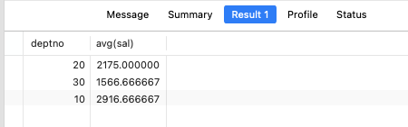
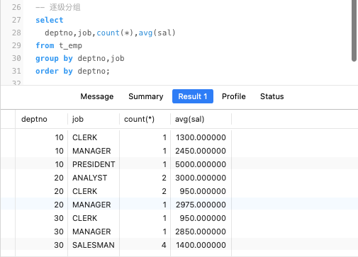
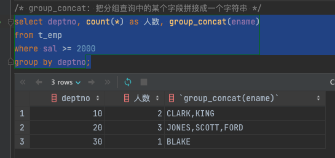
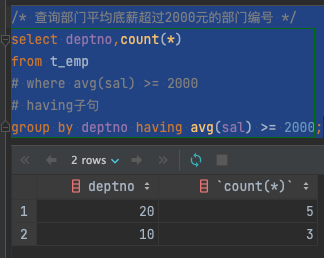
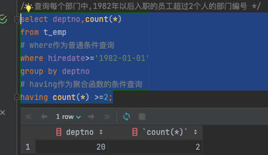

# 数据库的高级查询

## 聚合函数

**聚合函数**可以对数据求和、求最大值和最小值、平均值等

> 注意：聚合函数不能放在 where 语句中，因为 sql 是先执行 where 字句查询到结果在执行聚合函数的

### 示例

#### avg

> AVG 函数用于获取非空值的平均值

```sql
-- 求公司员工的平均月收入是多少
-- round：保留两位小数
-- avg：返回数值列的平均值
select round(avg(sal+ifnull(comm,0)),2) as "员工平均收入" from t_emp;
```

#### sum

> SUM 函数用于求和，只能用于数字类型，组付出统计结果为 0，日期类型统计结果是毫秒数相加

```sql
select sum(sal) as "聚合函数SUM求和"
from t_emp
where deptno in(10,20);
```

#### max、min

> MAX 用于获取非空值的最大值，MIN 则相反

查询 10 和 20 部门中，月收入最高的员工

```sql
-- 查询数字
select
-- 多个聚合函数可以拼接在一起查询使用
max(sal+IFNULL(comm,0)) as "10,20部门中月收入最高的员工",sum(sal) as "聚合函数SUM求和"
from t_emp
where deptno in(10,20);

-- 查询员工姓名最长的字符
select max(length(ename)) from t_emp;
```

#### count

> COUNT(\*)用于获取包含空值的记录数
> COUNT(列名)用于获得包含非空值的记录数

```sql
select
-- *：表示查询所有
-- comm：传表字段，查询有多少个字段有值
count(*), count(comm)
from t_emp;
```

## 分组查询

### 为什么要分组？

- 默认情况下**汇总函数**是对全表范围内的数据做统计
- **group by**子句是通过一定的规则将一个数据集划分成若干个小的区域，然后针对每个小区域分别进行数据汇总处理

### 示例

#### 基本分组

```sql
-- 这个sq用于计算每一个部门的平均底薪，在根据部门(deptno)进行分组
-- 根据deptno进行分组
-- round对数据进行四舍五入
select deptno,round(avg(sal))
from t_emp group by deptno;
```



#### 逐级分组

```sql
-- 查询每个部门里，每种职位的人员数量和平均底薪
select
  -- 根据部门和职位分组
  -- 使用count聚合函数查询总数
  -- 使用avg函数查询平均值
  deptno,job,count(*),avg(sal)
from t_emp
-- 根据deptno、job进行分组展示
group by deptno,job
order by deptno;
```



#### with rollup 关键字

> 用于对分组的结果集，再次做汇总计算

```sql
select
  deptno,count(*),avg(sal),max(sal),min(sal)
from t_emp
group by deptno
-- 对已经分组的数据，再次进行计算
with rollup;
```


#### group_concat

> group_concat 函数可以把分组查询中的某个字段拼接成一个字符串

```sql
select deptno,group_concat(ename),count(*)
from t_emp
where sal>=2000
group by deptno;
```



#### having

> having 作为聚合函数的条件查询，having 后面接聚合函数

```sql
/* 查询部门平均底薪超过2000元的部门编号 */
select deptno,count(*)
from t_emp
-- where avg(sal) >= 2000
-- having子句
group by deptno having avg(sal) >= 2000;
```



```sql
/* 查询每个部门中,1982年以后入职的员工超过2个人的部门编号 */
select deptno,count(*)
from t_emp
# where作为普通条件查询
where hiredate>='1982-01-01'
group by deptno
# having作为聚合函数的条件查询
having count(*) >=2;
```



## 连接查询

> 从多张表中提取数据，必须指定关联条件。如果不定义关联条件就会出现无条件连接，两张数据表的数据会交叉连接，产生`笛卡尔积`

- 表连接分为两种：内连接和外连接
- 内连接：结果集中只保留符合连接条件的记录
- 外连接：不管符不符合连接条件，记录都要保留在结果集中

### 内连接

- 内连接是最常见的一种连接，用于查询多张关系表符合连接条件的记录
- 内连接会查找两张数据表中交集的部分
- 内连接的多种语法形式

```sql
select * from 表1 join 表2 on 连接条件;
select * from 表1 join 表2 where 连接条件;
select * from 表1, 表2 where 连接条件;
```

#### 基本语法

```sql
select
  e.ename, d.deptno
from t_emp e
  # 使用on规定连接条件
  join t_dept d on e.deptno = d.deptno;

```

#### 内连接练习 1

> 查询每个员工的工号、姓名、部门名称、底薪、职位、工资等级?
> 内连接数据表不一定需要有同名字段，只要字段之间符合逻辑关系即可

```sql
# 需要连接三张表: 员工表、部门表、薪资等级表
select e.empno as '工号',
       e.ename as '姓名',
       d.dname as '部门名称',
       e.sal   as '底薪',
       e.job   as '职位',
       s.grade as '工资等级'
from t_emp e
         join t_dept d on e.deptno = d.deptno
         join t_salgrade s on e.sal between s.losal and s.hisal
order by s.grade, e.sal;
```

#### 内连接练习 2

> 查询与 SCOTT 相同部门的员工都有谁

```sql
# 虽然子查询非常符合我们的思考逻辑，但是其效率非常低
select ename
from t_emp
where deptno = (select deptno from t_emp where ename = 'SCOTT')
  and ename != 'SCOTT';

# 使用表连接查询
select e2.ename
from t_emp e1
         join t_emp e2 on e1.deptno = e2.deptno
where e1.ename = 'SCOTT';
```

#### 内连接练习 3

> 查询底薪超过公司平均底薪的员工信息

```sql
# 使用子查询
select ename, sal, empno
from t_emp
where sal > (select avg(sal) from t_emp);

# 可以把查询的结果集当做表连接
select e1.ename, e1.sal, e1.empno
from t_emp e1
         join (select avg(sal) as sal from t_emp) as e2
where e1.sal > e2.sal;
```

#### 内连接练习 4

> 查询 RESEARCH 部门的人数、最高底薪、最低底薪、平均底薪、平均工龄？

```sql
# 使用子查询
select count(*)                                      as 部门人数,
       max(e.sal)                                    as 最高底薪,
       min(e.sal)                                    as 最低底薪,
       avg(e.sal)                                    as 平均底薪,
       floor(avg(datediff(now(), e.hiredate) / 365)) as 平均工龄
from t_emp e
where deptno = (select d.deptno from t_dept d where d.dname = "RESEARCH");

# datediff: 用于计算两个时间差,返回天数
# now(): 获取当前日期
# floor: 向下取整
select count(*)                                      as 部门人数,
       max(e.sal)                                    as 最高底薪,
       min(e.sal)                                    as 最低底薪,
       avg(e.sal)                                    as 平均底薪,
       floor(avg(datediff(now(), e.hiredate) / 365)) as 平均工龄
from t_emp e
         join t_dept d on e.deptno = d.deptno
where d.dname = "RESEARCH";
```

#### 内连接练习 5

> 查询每种职业的最高工资、最低工资、平均工资、最高工资等级和最低工资等级？

```sql
select e.job,
       max(e.sal + ifnull(e.comm, 0)),
       min(e.sal + ifnull(e.comm, 0)),
       avg(e.sal + ifnull(e.comm, 0)),
       max(s.grade),
       min(s.grade)
from t_emp e
         join t_salgrade s on (e.sal + ifnull(e.comm, 0))
    between s.losal and s.hisal
group by e.job;
```

#### 内连接练习 6

> 查询每个底薪超过部门平均底薪的员工信息

```sql
select e.ename, e.deptno, e.sal, t.avg
from t_emp e
         join (select e.deptno, avg(e.sal) avg from t_emp e group by e.deptno) t
              on e.deptno = t.deptno
where e.sal > t.avg
order by e.deptno;
```

### 外连接

- 外连接与内连接的区别在于，除了符合条件的记录外，结果集中还会保留不符合条件的记录
- 左外连接就是保留左表所有的记录，与右表做连接。如果右表有符合条件的记录就与左表连接。如果右表没有符合条件的记录，就用 NULL 与左表连接。右外连接也是如此。

#### 外连接练习 1

> 查询每个部门的名称和部门人数？

```sql
select d.dname, count(e.deptno)
from t_dept d
         left join t_emp e on d.deptno = e.deptno
group by d.deptno;
```

#### 外连接练习 2

> 查询每个部门的名称和部门人数，如果没有部门的员工，部门名称用 NULL 代替

```sql
(
    select d.dname, count(e.deptno)
    from t_dept d
             left join t_emp e on d.deptno = e.deptno
    group by d.deptno
)
union
(
    select d.dname, count(*)
    from t_dept d
             right join t_emp e on d.deptno = e.deptno
    group by d.deptno
);
```

#### 外连接练习 3

> 查询每名员工的编号、姓名、部门、月薪、工资等级、工龄、上司编号、上司姓名上司部门？

```sql
select e.empno                                  as 员工编号,
       e.ename                                  as 员工姓名,
       d.dname                                  as 部门名称,
       e.sal + ifnull(e.comm, 0)                as 月薪,
       s.grade                                  as 工资等级,
       floor(datediff(now(), e.hiredate) / 365) as 工龄,
       t.empno                                  as 上司编号,
       t.ename                                  as 上司姓名,
       t.dname                                  as 上司部门
from t_emp e
         left join t_dept d on e.deptno = d.deptno
         left join t_salgrade s on e.sal between s.losal and s.hisal
         left join (select e1.empno, e1.ename, d1.dname
                    from t_emp e1
                             join t_dept d1 on e1.deptno = d1.deptno) t on e.mgr = t.empno;
```