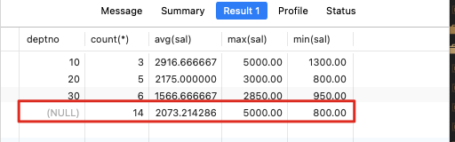

# 数据库的高级查询

## 聚合函数

**聚合函数**可以对数据求和、求最大值和最小值、平均值等

> 注意：聚合函数不能放在 where 语句中，因为 sql 是先执行 where 字句查询到结果在执行聚合函数的

### 示例

#### avg

> AVG函数用于获取非空值的平均值

```sql
-- 求公司员工的平均月收入是多少
-- round：保留两位小数
-- avg：返回数值列的平均值
select round(avg(sal+ifnull(comm,0)),2) as "员工平均收入" from t_emp;
```

#### sum

> SUM 函数用于求和，只能用于数字类型，组付出统计结果为 0，日期类型统计结果是毫秒数相加

```sql
select sum(sal) as "聚合函数SUM求和"
from t_emp
where deptno in(10,20);
```

#### max、min

> MAX用于获取非空值的最大值，MIN则相反

查询 10 和 20 部门中，月收入最高的员工

```sql
-- 查询数字
select
-- 多个聚合函数可以拼接在一起查询使用
max(sal+IFNULL(comm,0)) as "10,20部门中月收入最高的员工",sum(sal) as "聚合函数SUM求和"
from t_emp
where deptno in(10,20);

-- 查询员工姓名最长的字符
select max(length(ename)) from t_emp;
```

#### count

> COUNT(*)用于获取包含空值的记录数
> COUNT(列名)用于获得包含非空值的记录数

```sql
select
-- *：表示查询所有
-- comm：传表字段，查询有多少个字段有值
count(*), count(comm)
from t_emp;
```

## 分组查询

### 为什么要分组？

- 默认情况下**汇总函数**是对全表范围内的数据做统计
- **group by**子句是通过一定的规则将一个数据集划分成若干个小的区域，然后针对每个小区域分别进行数据汇总处理

### 示例

#### 基本分组

```sql
-- 这个sq用于计算每一个部门的平均底薪，在根据部门(deptno)进行分组
-- 根据deptno进行分组
-- round对数据进行四舍五入
select deptno,round(avg(sal))
from t_emp group by deptno;
```


#### 逐级分组

```sql
-- 查询每个部门里，每种职位的人员数量和平均底薪
select
  -- 根据部门和职位分组
  -- 使用count聚合函数查询总数
  -- 使用avg函数查询平均值
  deptno,job,count(*),avg(sal)
from t_emp
-- 根据deptno、job进行分组展示
group by deptno,job
order by deptno;
```


#### with rollup关键字

> 用于对分组的结果集，再次做汇总计算

```sql
select
  deptno,count(*),avg(sal),max(sal),min(sal)
from t_emp
group by deptno
-- 对已经分组的数据，再次进行计算
with rollup;
```



#### group_concat

> group_concat函数可以把分组查询中的某个字段拼接成一个字符串

```sql
select deptno,group_concat(ename),count(*)
from t_emp
where sal>=2000
group by deptno;
```


#### having

> having作为聚合函数的条件查询，having后面接聚合函数

```sql
/* 查询部门平均底薪超过2000元的部门编号 */
select deptno,count(*)
from t_emp
-- where avg(sal) >= 2000
-- having子句
group by deptno having avg(sal) >= 2000;
```


```sql
/* 查询每个部门中,1982年以后入职的员工超过2个人的部门编号 */
select deptno,count(*)
from t_emp
# where作为普通条件查询
where hiredate>='1982-01-01'
group by deptno
# having作为聚合函数的条件查询
having count(*) >=2;
```


