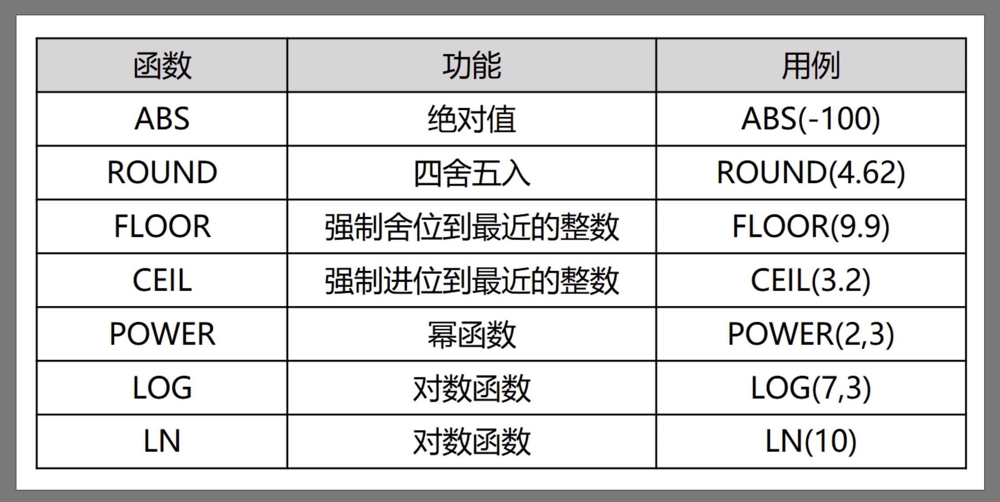
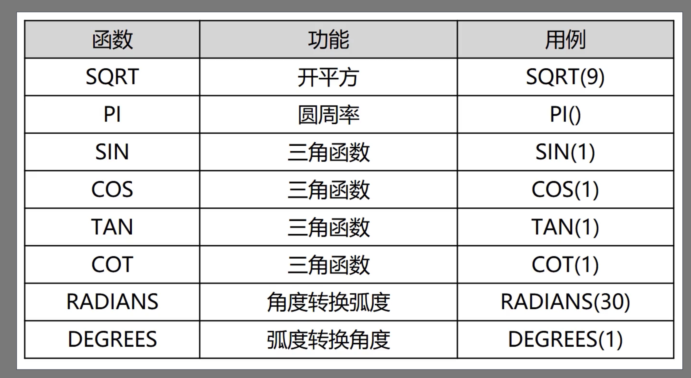
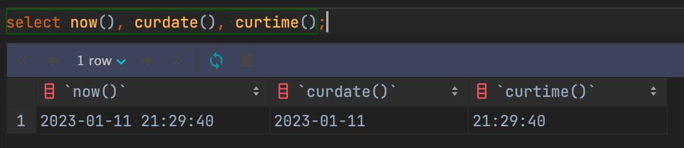
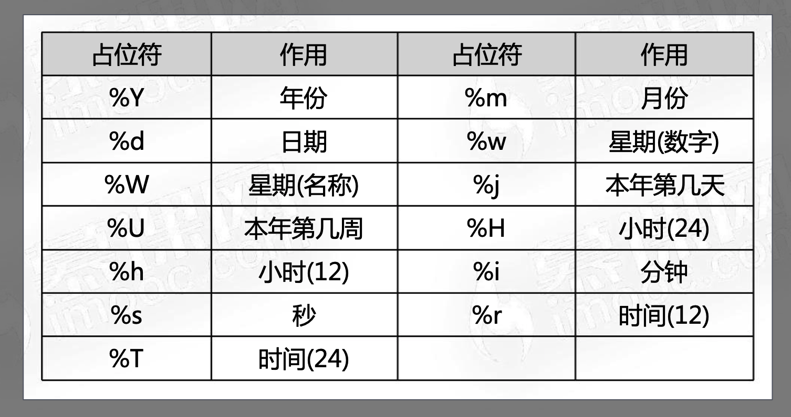
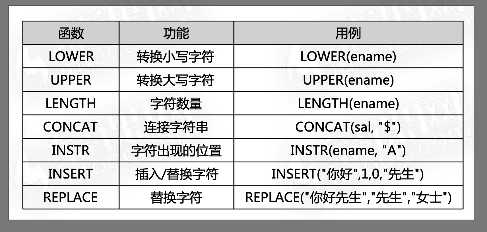
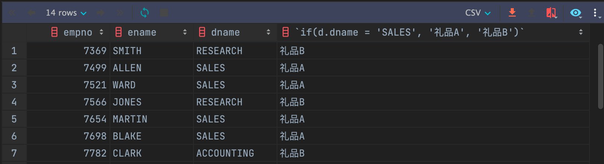
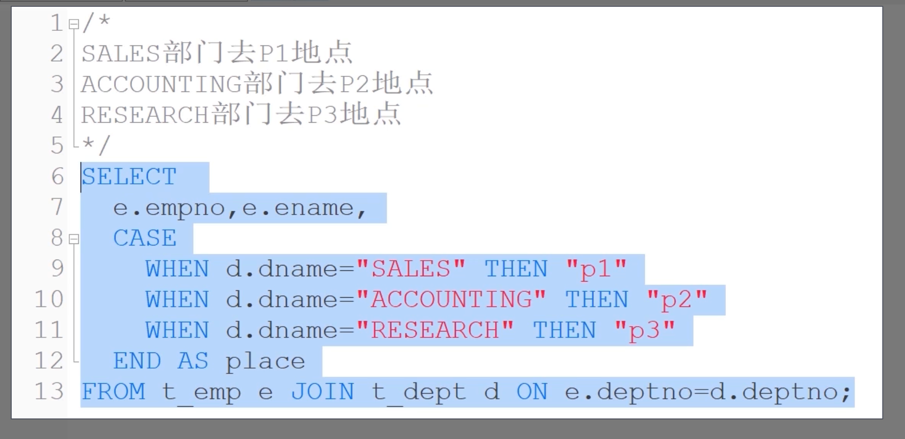

# MySQL 基本函数的使用

## 数字函数





## 日期函数

### 获取系统时间函数

- now()函数获取系统日期和时间，格式：yyyy-MM-dd hh:mm:ss
- curdate()获取当前系统日期，格式：yyyy-MM-dd
- curtime()获取当前系统日期，格式：hh:mm:ss



### 日期格式化函数

- date_format('1997-12-31 19:00:02', '%Y')，返回1997



## 字符函数




## 条件函数

```sql
# 中秋节公司发放礼品，SALES部门发放礼品A，其余部门发放礼品B， 打印每名员工获得的礼品。
select e.empno,
       e.ename,
       d.dname,
       if(d.dname = 'SALES', '礼品A', '礼品B')
from t_emp e
         join t_dept d on e.deptno = d.deptno;
```



