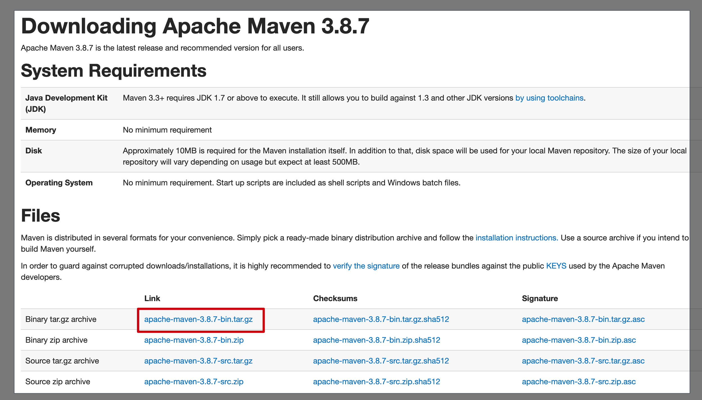
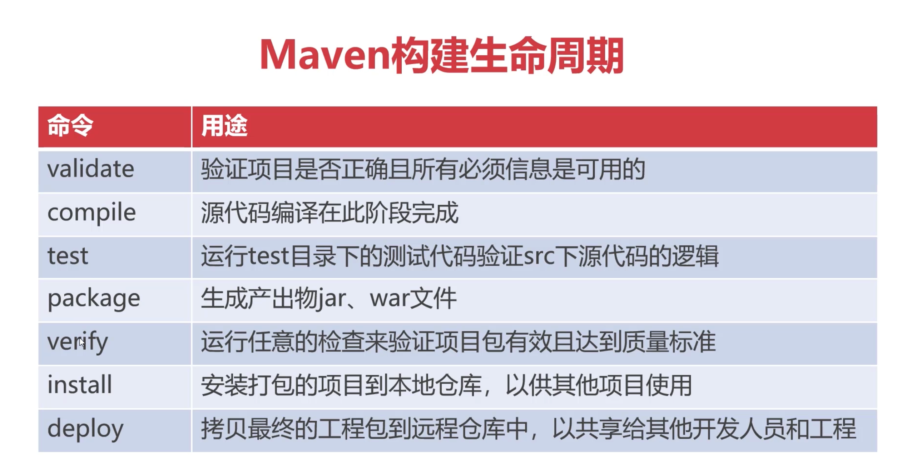

# Maven

- 项目设置遵循统一的规则，保证不同开发环境的兼容性
- 强大的依赖管理，项目依赖组件自动下载、自动更新
- 可扩展的插件机制，使用简单，功能丰富

## Mac 安装 maven

1. 下载 maven：https://maven.apache.org/download.cgi



2. 解压，移动至`/usr/local`目录中

3. 设置环境变量

```shell
# 打开环境变量配置文件
open ~/.bash_profile

# 输入：
export MAVEN_HOME=/usr/local/apache-maven-3.8.7
export PATH=${PATH}:${MAVEN_HOME}/bin

# 使bash_profile生效
source ~/.bash_profile
```

4. 验证安装是否成功

```shell
➜  / mvn -v
Apache Maven 3.8.7 (b89d5959fcde851dcb1c8946a785a163f14e1e29)
Maven home: /usr/local/apache-maven-3.8.7
Java version: 1.8.0_312, vendor: Temurin, runtime: /Library/Java/JavaVirtualMachines/temurin-8.jdk/Contents/Home/jre
Default locale: zh_CN, platform encoding: UTF-8
OS name: "mac os x", version: "10.16", arch: "x86_64", family: "mac"
```

## Maven 的的生命周期



## Maven 插件技术

- Maven 插件为构建项目提供了功能扩展的能力
- maven-assembly-plugin 是 Maven 打包插件，用于构建 FatJar
- FatJar 是指将所有依赖包装为独立可运行的 Jar

```xml
<!-- 修改pom.xml文件的build -->
<!-- 执行命令：java -jar maven-first-1.0.0-SNAPSHOT-jar-with-dependencies.jar -->
<build>
    <plugins>
        <plugin>
            <groupId>org.apache.maven.plugins</groupId>
            <artifactId>maven-assembly-plugin</artifactId>
            <version>2.5.5</version>
            <configuration>
                <archive>
                    <manifest>
                        <mainClass>com.imooc.maven.JDBC.JDBCSample</mainClass>
                    </manifest>
                </archive>
                <descriptorRefs>
                    <!-- all in one , 在打包时会将所有引用的jar合并到输出的jar文件中 -->
                    <descriptorRef>jar-with-dependencies</descriptorRef>
                </descriptorRefs>
            </configuration>
        </plugin>
    </plugins>
</build>
```

## Maven的属性管理