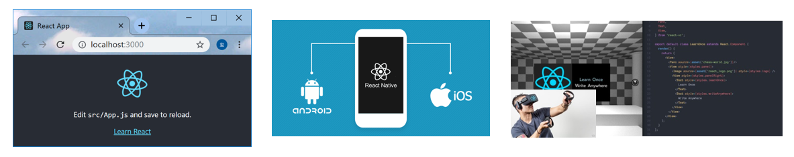

# 学习目标

- 能够说出 react 是什么
- 能够说出 react 的特点
- 能够掌握 react 的基本用法
- 能够使用 react 脚手架

# react 的概述


## 什么是 react

> react 是一个用于构建用户**界面**的 JavaScript 库
>
> react 官网(<https://reactjs.org/>)
>
> react 中文网(<https://react.docschina.org/>)

- 用户界面：对于前端来说 HTML 就是页面
- React 主要就是用来写 HTML 页面的，也就是**构建 Web 应用**
- 如果从 mvc 的角度来看，React 仅仅是视图层（V）的解决方案。也就是只负责视图的渲染，并非提供了完整了 M 和 C 的功能
- react/react-router/redux: 框架
- React 起源与 Faceboook 的内部项目，后来用来架设 Insagram 的网站，并且在 2013 年 5 月开源

## react 特点

### 声明式

你只需要描述 UI（HTML）看起来是什么样的，就跟写 HTML 一样

```js
const jsx = (
  <div className="app">
    <h1>Hello React! 动态数据变化:{count}</h1>
  </div>
)
```

### 组件化

- 组件是 react 中**最重要**的内容
- 组件用于表示页面中的部分内容
- 组合、复用多个组件，就可以实现完整的页面功能


### 学习一次，随处使用

- 使用 react 可以开发 Web 应用
- 使用 react 可以开发移动端原生应用（react-native） RN
- 使用 react 可以开发 VR（虚拟现实）应用（react360）



# react 的基本使用

## react 安装

- 安装命令`yarn add react react-dom`

- `react`包是核心，提供创建元素，组件等功能，只要是 react 开发，就必须导入
- `react-dom`包提供 DOM 相关的功能，只有在`web开发`中才需要 导入

## react 基本步骤

```
- 引入react和react-dom两个js文件
- 创建React元素
- 渲染React元素到页面中
```

- 引入 react 和 react-dom 两个 js 文件

```html
<script src="node_modules/react/umd/react.development.js"></script>
<script src="node_modules/react-dom/umd/react-dom.development.js"></script>
```

- 创建 React 元素

```js
// 2. 创建React元素
// 参数1：创建的元素名
// 参数2：元素的属性，如果没有，可以为null
// 参数3：元素的子节点
// 返回值：React元素
const title = React.createElement('h1', null, 'Hello React')
```

- 渲染 React 元素到页面中

```js
// 参数1：要渲染的react元素
// 参数2：挂载点，需要加react元素渲染到哪儿
ReactDOM.render(title, document.getElementById('#root'))
```

- 页面中准备 html 结构

```html
<div id="root"></div>
```

## react 练习

- 生成结构 1

```html
<p id="box">这是react的一个小练习</p>
`
```

- 生成结构 2

```
<ul id="list">
	<li>香蕉</li>
	<li>橘子</li>
	<li>苹果</li>
</ul>
```

# react 脚手架

## react 脚手架的意义

- 脚手架是开发**现代 web 应用**的必备
- 充分利用`webpack`，`babel`，`eslint`等工具辅助项目开发
- 开箱即用，零配置，无序手动配置繁琐的工具即可使用

## react 脚手架使用

### 通过 yarn 命令初始化

初始化命令

```bash
# 全局安装 create-react-app命令
yarn global add create-react-app       npm i create-react-app -g
# 初始化项目
create-react-app my-app
```

启动项目（项目根目录下）

```bash
yarn start
```

### 通过 npx 命令初始化

- npx 是`npm v5.2.0`版本引入的一条命令
- 目的：提升包内提供的命令行工具的使用体验
- 原先：需要全局安装脚手架命令，才能使用脚手架命令初始化项目
- 现在: **无需安装脚手架命令**，通过 npx 可以直接使用该命令，不用担心版本升级的问题。

初始化命令

```bash
npx create-react-app my-app
```

启动项目

```bash
npm start
```

## react 脚手架-使用 react

```
- 基本结构说明（删除不需要的文件）
- 导入react和react-dom
- 创建react元素
- 渲染react元素到页面中
```

- 导入 react 和 react-dom

```js
// 导入react和react-dom
import React from 'react'
import ReactDOM from 'react-dom'
```

- 创建 react 元素

```js
// 创建元素
const title = React.createElement('h1', null, 'hello react')
```

- 渲染 react 元素到页面

```js
// 渲染react元素
ReactDOM.render(title, document.getElementById('root'))
```
