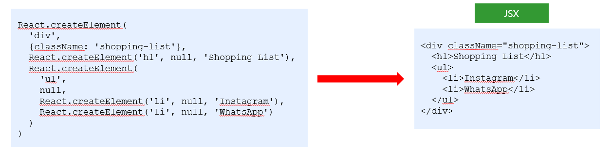

# 学习目标

- 能够知道什么是 jsx
- 能够使用 jsx 创建 react 元素
- 能够在 jsx 中使用 javascript 表达式 `{}`
- 能够使用 jsx 的条件渲染和列表渲染
- 能够给 jsx 添加样式

# JSX 的基本使用

## createElement 的问题

- 繁琐不简洁
- 不直观，无法一眼看出所描述的结构
- 不优雅，开发体验不好



## JSX 简介

`JSX`是`JavaScript XML`的简写，表示了在 Javascript 代码中写 XML(HTML)格式的代码

优势：声明式语法更加直观，与 HTML 结构相同，降低学习成本，提高开发效率。

**JSX 是 react 的核心内容**

## 使用步骤

```
- 导入react和reactDOM包
- 使用jsx语法创建react元素
- 把react元素渲染到页面中
```

- 导入 react 和 reactDOM

```js
// 导入react和react-dom
import React from 'react'
import ReactDOM from 'react-dom'
```

- 创建 react 元素

```js
// 创建元素
const title = <h1 title="哈哈"></h1>
```

- 渲染元素

```js
// 渲染元素
ReactDOM.render(title, document.getElementById('root'))
```

## JSX 注意点

- 只有在脚手架中才能使用 jsx 语法
  - 因为 JSX 需要经过 babel 的编译处理，才能在浏览器中使用。脚手架中已经默认有了这个配置。
  - JSX 语法底层其实也是调用`React.createElement`方法，因此必须导入`React`
- JSX 必须要有一个根节点
- 没有子节点的元素可以使用`/>`结束

- JSX 中语法更接近与 JavaScript
  - `class` =====> `className`
  - `for`========> `htmlFor`
- JSX 可以换行，如果 JSX 有多行，推荐使用`()`包裹 JSX，防止自动插入分号的 bug

# JSX 中嵌入 JavaScript 表达式

> 在 jsx 中可以在`{}`来使用 JavaScript 表达式

- 基本使用

```js
const name = 'zs'
const age = 18
const title = (
  <h1>
    姓名：{name}, 年龄：{age}
  </h1>
)
```

- 可以访问对象的属性

```js
const car = {
  brand: '玛莎拉蒂'
}
const title = <h1>汽车：{car.brand}</h1>
```

- 可以访问数组的下标

```js
const friends = ['张三', '李四']
const title = <h1>汽车：{friends[1]}</h1>
```

- 可以使用三元运算符

```js
const gender = 18
const title = <h1>性别：{age >= 18 ? '是' : '否'}</h1>
```

- 可以调用方法

```js
function sayHi() {
  return '你好'
}
const title = <h1>姓名：{sayHi()}</h1>
```

- JSX 本身

```js
const span = <span>我是一个span</span>
const title = <h1>盒子{span}</h1>
```

- JSX 中的注释

```js
{/* 这是jsx中的注释 */}   推荐快键键 ctrl + /
```

- 不要出现语句，比如`if` `for`

# 条件渲染

> 在 react 中，一切都是 javascript，所以条件渲染完全是通过 js 来控制的

- 通过判断`if/else`控制

```js
const isLoding = false
const loadData = () => {
  if (isLoding) {
    return <div>数据加载中.....</div>
  } else {
    return <div>数据加载完成，此处显示加载后的数据</div>
  }
}

const title = <div>条件渲染：{loadData()}</div>
```

- 通过三元运算符控制

```js
const isLoding = false
const loadData = () => {
  return isLoding ? (
    <div>数据加载中.....</div>
  ) : (
    <div>数据加载完成，此处显示加载后的数据</div>
  )
}
```

- 逻辑运算符

```js
const isLoding = false
const loadData = () => {
  return isLoding && <div>加载中...</div>
}

const title = <div>条件渲染：{loadData()}</div>
```

# 列表渲染

> 我们经常需要遍历一个数组来重复渲染一段结构
>
> 在 react 中，通过 map 方法进行列表的渲染

- 列表的渲染

```js
const songs = ['温柔', '倔强', '私奔到月球']

const list = songs.map(song => <li>{song}</li>)

const dv = (
  <div>
    <ul>{list}</ul>
  </div>
)
```

- 直接在 JSX 中渲染

```js
const songs = ['温柔', '倔强', '私奔到月球']

const dv = (
  <div>
    <ul>
      {songs.map(song => (
        <li>{song}</li>
      ))}
    </ul>
  </div>
)
```

- key 属性的使用

```js
const dv = (
  <div>
    <ul>
      {songs.map(song => (
        <li key={song}>{song}</li>
      ))}
    </ul>
  </div>
)
```

**注意：列表渲染时应该给重复渲染的元素添加 key 属性，key 属性的值要保证唯一**

**注意：key 值避免使用 index 下标，因为下标会发生改变**

# 样式处理

## 行内样式-style

```js
const dv = (
  <div style={{ color: 'red', backgroundColor: 'pink' }}>style样式</div>
)
```

## 类名-className

```js
// 导入样式
import './base.css'
const dv = <div className="title">style样式</div>
```

base.css 样式文件

```css
.title {
  text-align: center;
  color: red;
  background-color: pink;
}
```

# 总结

- JSX 是 React 的核心内容
- JSX 表示在 JS 代码中书写 HTML 结构，是 React 声明式的提现
- 使用 JSX 配合嵌入的 JS 表达式，条件渲染，列表渲染，可以渲染任意的 UI 结构
- 结果使用 className 的方式给 JSX 添加样式

- React 完全利用 JS 的语言自身的能力来编写 UI，而不是造轮子增强 HTML 的功能。（对比 VUE）
