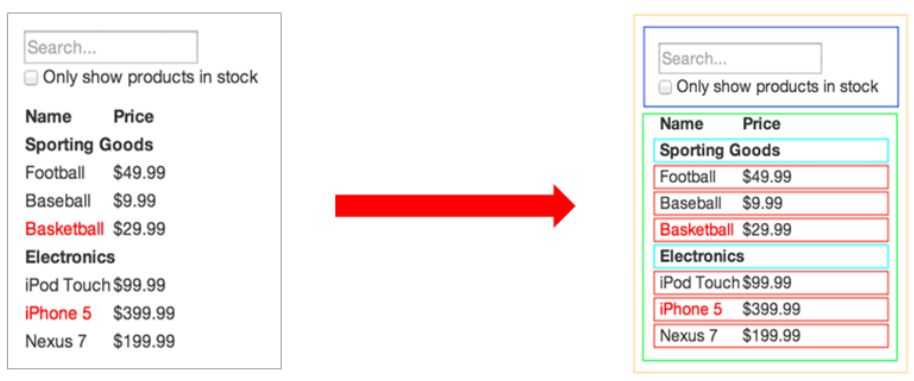
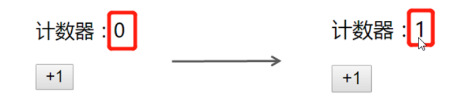
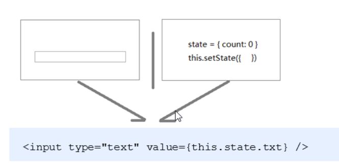

# 学习目标

- 能够使用函数创建组件
- 能够掌握 class 语法 exnted 继承
- 能够使用 class 创建组件
- 能够给 React 元素绑定事件
- 能够使用 state 与 setState
- 能够处理事件中 this 的指向问题
- 能够使用受控组件方式处理表单

# 组件基本介绍

- 组件是 React 中最基本的内容，使用 React 就是在使用组件
- 组件表示页面中的部分功能
- 多个组件可以实现完整的页面功能
- 组件特点：可复用，独立，可组合



# React 创建组件的两种方式

## 函数组件

> 函数组件：使用 JS 的函数或者箭头函数创建的组件

- 为了区分普通标签，函数组件的名称必须`大写字母开头`
- 函数组件`必须有返回值`，表示该组件的结构
- 如果返回值为 null,表示不渲染任何内容

使用函数创建组件

```js
function Hello() {
  return <div>这是我的函数组件</div>
}
```

使用箭头函数创建组件

```js
const Hello = () => <div>这是一个函数组件</div>
```

使用组件

```js
ReactDOM.render(<Hello />, document.getElementById('root'))
```

## 类与继承

### class 基本语法

- 在 ES6 之前通过构造函数创建对象
- 在 ES6 中新增了一个关键字 class, 类 和构造函数类似，用于创建对象
  - 类与对象的区别
  - 类：创建对象，指的是一类的事物，是个概念，比如车 手机 水杯等
  - 对象：一个具体的事物，有具体的特征和行为，比如一个手机，我的手机等， 类可以创建出来对象。
- 类创建对象的基本语法
  - 基本语法`class 类名{}`
  - 构造函数`constructor`的用法，创建对象
  - 在类中提供方法，直接提供即可
  - 在类中不需要使用,分隔

### extends 实现继承

- extends 基本使用
- 类可以使用它继承的类中所有的成员（属性和方法）
- 类中可以提供自己的属性和方法
- 注意：如果想要给类中新增属性，必须先调用 super 方法

## 类组件

> 类组件：使用 ES6 的 class 语法创建组件

约定 1：类组件的名称必须是大写字母开头

约定 2：类组件应该继承`React.Component`父类，从而可以使用父类中提供的方法或者属性

约定 3：类组件必须提供`render`方法

约定 4：render 方法`必须有返回值`,表示该组件的结构

定义组件

```js
class Hello extends React.Component {
  render() {
    return <div>这是一个类组件</div>
  }
}
```

使用组件

```js
ReactDOM.render(<Hello />, document.getElementById('root'))
```

## 将组件提取到单独的 js 文件中

思考：项目中的组件多了之后，该如何组织这些组件呢？

- 选择一：将所有组件放在同一个 JS 文件中
- 选择二：将每个组件放到单独的 JS 文件中
- 组件作为一个独立的个体，一般都会放到一个单独的 JS 文件中

实现方式

1. 创建 Hello.js

2. 在 Hello.js 中导入 React
3. 创建组件（函数 或 类）
4. 在 Hello.js 中导出该组件
5. 在 index.js 中导入 Hello 组件
6. 渲染组件，

## 有状态组件和无状态组件

- 函数组件又叫做**无状态组件** 函数组件是不能自己提供数据的，，，，，**木偶组件，静态组件**
- 类组件又叫做**有状态组件 智能组件** 类组件可以自己提供数据，，，，组件内部的状态（数据如果发生了改变，内容会自动的更新）
- 状态（state）即组件的私有数据，当组件的状态发生了改变，页面结构也就发生了改变。
- 函数组件是没有状态的，只负责页面的展示（静态，不会发生变化）性能比较高
- 类组件又自己的状态，负责**更新 UI**，只要类组件的数据发生了改变，UI 就会发生更新。
- 在复杂的项目中，一般都是由函数组件和类组件共同配合来完成的。

比如计数器案例，点击按钮让数值+1， 0 和 1 就是不同时刻的状态，当状态从 0 变成 1 之后，UI 也要跟着发生变化。React 想要实现这种功能，就需要使用有状态组件来完成。



## 类组件的状态

- 状态`state`即数据，是组件内部的`私有数据`,只有在组件内部可以使用
- `state的值是一个对象`,表示一个组件中可以有多个数据
- state 的基本使用

```js
class Hello extends React.Component {
  constructor() {
    super()
    // 组件通过state提供数据
    this.state = {
      msg: 'hello react'
    }
  }
  render() {
    return <div>state中的数据--{this.state.msg}</div>
  }
}
```

- 简洁的语法

```js
class Hello extends React.Component {
  state = {
    msg: 'hello react'
  }
  render() {
    return <div>state中的数据--{this.state.msg}</div>
  }
}
```

## react 插件的安装

安装谷歌插件`react-devtools`

# 事件处理

## 注册事件

React 注册事件与 DOM 的事件语法非常像

语法`on+事件名=｛事件处理程序｝` 比如`onClick={this.handleClick}`

注意：**React 事件采用驼峰命名法**，比如`onMouseEnter`, `onClick`

```js
class App extends React.Component {
  render() {
    return (
      <div>
        <button onClick={this.handleClick}>点我</button>
      </div>
    )
  }

  handleClick() {
    console.log('点击事件触发了')
  }
}
```

## 事件对象

- 可以通过事件处理程序的参数获取到事件对象

- React 中的事件对象叫做：合成事件（对象）
- 合成事件：兼容所有浏览器，无需担心跨浏览器兼容性问题

```js
function handleClick(e) {
  e.preventDefault()
  console.log('事件对象', e)
}
;<a onClick={handleClick}>点我，不会跳转页面</a>
```

## this 指向问题

> 事件处理程序中的 this 指向的是 undefined
>
> render 方法中的 this 指向的而是当前 react 组件。**只有事件处理程序中的 this 有问题**

```js
class App extends React.Component {
  state = {
    msg: 'hello react'
  }
  handleClick() {
    console.log(this.state.msg)
  }
  render() {
    return (
      <div>
        <button onClick={this.handleClick}>点我</button>
      </div>
    )
  }
}
```

## this 指向问题解决方案

```js
方案1：箭头函数
方案2：bind修改this指向
方案3：类实例方法
```

- 在 render 中使用箭头函数

箭头函数的特点：自身没有 this，访问的是外部的 this

方式 1：

```js
class App extends React.Component {
  state = {
    msg: 'hello react'
  }
  render() {
    return (
      <div>
        <button onClick={() => { console.log(this.state.msg) }>点我</button>
      </div>
    )
  }
}
```

缺点：会把大量的 js 处理逻辑放到 JSX 中，将来不容易维护

方式 2

```js
class App extends React.Component {
  state = {
    msg: 'hello react'
  }
  handleClick() {
    console.log(this.state.msg)
  }
  render() {
    return (
      <div>
        <button
          onClick={() => {
            this.handleClick()
          }}
        >
          点我
        </button>
      </div>
    )
  }
}
```

缺点：把大量的 js 逻辑写在了 JSX 结构中，不好维护

- 解决方案 2：使用 bind

```js
class App extends React.Component {
  state = {
    msg: 'hello react'
  }
  handleClick() {
    console.log(this.state.msg)
  }
  render() {
    return (
      <div>
        <button onClick={this.handleClick.bind(this)}>点我</button>
      </div>
    )
  }
}
```

或者

```js
class App extends React.Component {
  constructor() {
    super()
    this.handleClick = this.handleClick.bind(this)
  }
  state = {
    msg: 'hello react'
  }
  handleClick() {
    console.log(this.state.msg)
  }
  render() {
    return (
      <div>
        <button onClick={this.handleClick}>点我</button>
      </div>
    )
  }
}
```

- 解决方案 3：class 实例方法

```js
class App extends React.Component {
  state = {
    msg: 'hello react'
  }

  handleClick = () => {
    console.log(this.state.msg)
  }
  render() {
    return (
      <div>
        <button onClick={this.handleClick}>点我</button>
      </div>
    )
  }
}
```

**注意：这个语法是试验性的语法，但是有 babel 的转义，所以没有任何问题**

# setState 修改状态

- 组件中的状态是可变的
- 语法`this.setState({要修改的数据})`
- 注意：不要直接修改 state 中的值，必须通过`this.setState()`方法进行修改
- `setState`的作用

  - 修改 state
  - 更新 UI

- 思想：数据驱动视图

```js
class App extends React.Component {
  state = {
    count: 1
  }
  handleClick() {
    this.setState({
      count: this.state.count + 1
    })
  }
  render() {
    return (
      <div>
        <p>次数: {this.state.count}</p>
        <button onClick={this.handleClick.bind(this)}>点我+1</button>
      </div>
    )
  }
}
```

# 表单处理

> 我们在开发过程中，经常需要操作表单元素，比如获取表单的值或者是设置表单的值。

react 中处理表单元素有两种方式：

- 受控组件
- 非受控组件（DOM 操作）

## 受控组件基本概念

- HTML 中表单元素是可输入的，即表单用户并维护着自己的可变状态（value）。

- 但是在 react 中，可变状态通常是保存在 state 中的，并且要求状态只能通过`setState`进行修改。

- React 中将 state 中的数据与表单元素的 value 值绑定到了一起，`由state的值来控制表单元素的值`
- 受控组件：**value 值受到了 react 控制的表单元素**



## 受控组件使用步骤

1. 在 state 中添加一个状态，作为表单元素的 value 值（控制表单元素的值）
2. 给表单元素添加 change 事件，设置 state 的值为表单元素的值（控制值的变化）

```js
class App extends React.Component {
  state = {
    msg: 'hello react'
  }

  handleChange = e => {
    this.setState({
      msg: e.target.value
    })
  }

  render() {
    return (
      <div>
        <input
          type="text"
          value={this.state.msg}
          onChange={this.handleChange}
        />
      </div>
    )
  }
}
```

## 常见的受控组件

- 文本框、文本域、下拉框（操作 value 属性）
- 复选框（操作 checked 属性）

```js
class App extends React.Component {
  state = {
    usernmae: '',
    desc: '',
    city: '2',
    isSingle: true
  }

  handleName = e => {
    this.setState({
      name: e.target.value
    })
  }
  handleDesc = e => {
    this.setState({
      desc: e.target.value
    })
  }
  handleCity = e => {
    this.setState({
      city: e.target.value
    })
  }
  handleSingle = e => {
    this.setState({
      isSingle: e.target.checked
    })
  }

  render() {
    return (
      <div>
        姓名：
        <input
          type="text"
          value={this.state.username}
          onChange={this.handleName}
        />
        <br />
        描述：<textarea
          value={this.state.desc}
          onChange={this.handleDesc}
        ></textarea>
        <br />
        城市：
        <select value={this.state.city} onChange={this.handleCity}>
          <option value="1">北京</option>
          <option value="2">上海</option>
          <option value="3">广州</option>
          <option value="4">深圳</option>
        </select>
        <br />
        是否单身：
        <input
          type="checkbox"
          checked={this.state.isSingle}
          onChange={this.handleSingle}
        />
      </div>
    )
  }
}
```

## 多表单元素的优化

问题：每个表单元素都需要一个单独的事件处理程序，处理太繁琐

优化：使用一个事件处理程序处理多个表单元素

步骤

- 给表单元素添加 name 属性，名称与 state 属性名相同
- 根据表单元素类型获取对应的值
- 在事件处理程序中通过`[name]`修改对应的 state

```js
class App extends React.Component {
  state = {
    username: '',
    desc: '',
    city: '2',
    isSingle: true
  }

  handleChange = e => {
    let { name, type, value, checked } = e.target
    console.log(name, type, value, checked)
    value = type === 'checkbox' ? checked : value
    console.log(name, value)
    this.setState({
      [name]: value
    })
  }
  render() {
    return (
      <div>
        姓名：
        <input
          type="text"
          name="username"
          value={this.state.username}
          onChange={this.handleChange}
        />
        <br />
        描述：<textarea
          name="desc"
          value={this.state.desc}
          onChange={this.handleChange}
        ></textarea>
        <br />
        城市：
        <select
          name="city"
          value={this.state.city}
          onChange={this.handleChange}
        >
          <option value="1">北京</option>
          <option value="2">上海</option>
          <option value="3">广州</option>
          <option value="4">深圳</option>
        </select>
        <br />
        是否单身：
        <input
          type="checkbox"
          name="isSingle"
          checked={this.state.isSingle}
          onChange={this.handleChange}
        />
      </div>
    )
  }
}
```

## 非受控组件

> 非受控组件借助于 ref，使用原生 DOM 的方式来获取表单元素的值

使用步骤

- 调用`React.createRef()`方法创建一个 ref

```js
constructor() {
  super()
  this.txtRef = React.createRef()
}
```

- 将创建好的 ref 对象添加到文本框中

```js
<input type="text" ref={this.txtRef} />
```

- 通过 ref 对象获取文本框的值

```js
handleClick = () => {
  console.log(this.txtRef.current.value)
}
```

非受控组件用的不多，推荐使用受控组件

# 综合案例

评论列表案例

## 列表展示功能

渲染评论列表（列表渲染）

- 在 state 中初始化评论列表数据
- 使用数组的 map 方法遍历列表数据
- 给每个 li 添加 key 属性

## 发表评论功能

获取评论信息，评论人和评论内容（受控组件）

- 使用受控组件的方式获取评论数据

发表评论，更新评论列表（更新状态）

- 给 comments 增加一条数据

边界处理

- 清空内容
- 判断非空

## 清空评论功能

- 给清空评论按钮注册事件

- 清空评论列表
- 没有更多评论的处理
