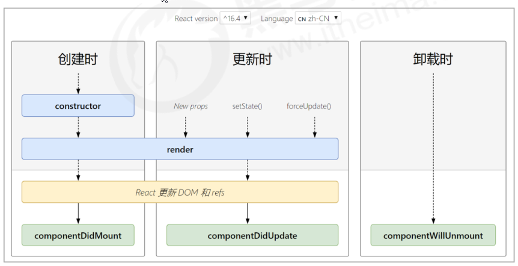

# 组件的生命周期

## 概述

- 意义：组件的生命周期有助于理解组件的运行方式、完成更复杂的组件功能、分析组件错误原因等
- 组件的生命周期：组件从被创建到挂载到页面中运行，再到组件不用时卸载的过程
- 钩子函数的作用：为开发人员在不同阶段操作组件提供了时机。
- **只有 类组件 才有生命周期。**

## 生命周期的整体说明

- 每个阶段的执行时机
- 每个阶段钩子函数的执行顺序
- 每个阶段钩子函数的作用
- <http://projects.wojtekmaj.pl/react-lifecycle-methods-diagram/>



## 挂载阶段

执行时机：组件创建时（页面加载时）

执行顺序：


| 钩子 函数         | 触发时机                    | 作用                                       |
| ----------------- | --------------------------- | ------------------------------------------ |
| constructor       | 创建组件时，最先执行        | 1. 初始化 state 2.为事件处理程序绑定 this  |
| render            | 每次组件渲染都会触发        | 渲染 UI（**注意： 不能调用 setState()** ） |
| componentDidMount | 组件挂载（完成 DOM 渲染）后 | 1. 发送网络请求 2.DOM 操作                 |

## 更新阶段

- 执行时机：1. setState() 2. forceUpdate() 3. 组件接收到新的 props
- 说明：以上三者任意一种变化，组件就会重新渲染
- 执行顺序


| 钩子函数           | 触发时机                    | 作用                                                     |
| ------------------ | --------------------------- | -------------------------------------------------------- |
| render             | 每次组件渲染都会触发        | 渲染 UI（与 挂载阶段 是同一个 render）                   |
| componentDidUpdate | 组件更新（完成 DOM 渲染）后 | DOM 操作，可以获取到更新后的 DOM 内容，不要调用 setState |

## 卸载阶段

- 执行时机：组件从页面中消失

| 钩子函数             | 触发时机                 | 作用                               |
| -------------------- | ------------------------ | ---------------------------------- |
| componentWillUnmount | 组件卸载（从页面中消失） | 执行清理工作（比如：清理定时器等） |

# render-props 技术

## 组件复用的说明

- 思考：如果两个组件中的部分功能相似或相同，该如何处理？
- 处理方式：复用相似的功能（联想函数封装）
- 复用什么？1. state 2. 操作 state 的方法 **复用组件的状态和组件的逻辑，组件的 UI 不一样**
- 两种解决方案

  - render-props
  - HOC（高阶组件）

- 注意：这两种方式不是新的 API，而是利用 React 自身特点的编码技巧，演化而成的固定模式（写法）

## render-props 基本使用

- 思路：将要复用的 state 和操作 state 的方法封装到一个组件中

- 问题：渲染的 UI 内容不一样，该怎么办
- **在使用组件时，添加一个值为函数的 prop，在组件内部调用这个函数。传进来的函数负责渲染 UI**
- 问题 2：如果获取组件内部的状态
- **在组件内部调用方法的时候，把状态当成参数进行传递**

```js
class Mouse extends React.Component {
  // … 省略state和操作state的方法
  render() {
    return this.props.render(this.state)
  }
}
```

```js
<Mouse
  render={mouse => (
    <p>
      鼠标当前位置 {mouse.x}，{mouse.y}
    </p>
  )}
/>
```

## children 代替 render 属性

- 注意：并不是该模式叫 render props 就必须使用名为 render 的 prop，实际上可以使用任意名称的 prop
- 把 prop 是一个函数并且告诉组件要渲染什么内容的技术叫做：render props 模式
- 推荐：使用 children 代替 render 属性

```js
;<Mouse>
  {({ x, y }) => (
    <p>
      鼠标的位置是 {x}，{y}
    </p>
  )}
</Mouse>
// 组件内部：
this.props.children(this.state)
```

```js
// Context 中的用法：
<Consumer>{data => <span>data参数表示接收到的数据 -- {data}</span>}</Consumer>
```

## render-props 优化

- 推荐：给 render props 模式添加 props 校验
- 应该在组件卸载时解除 mousemove 事件绑定

```js
Mouse.propTypes = {
  chidlren: PropTypes.func.isRequired
}
```

```js
componentWillUnmount() {
 window.removeEventListener('mousemove', this.handleMouseMove)
}
```

# 高阶组件

## 概述

- 目的：实现状态逻辑复用 增强一个组件的能力

- 采用 包装（装饰）模式 ，比如说：手机壳
- 手机：获取保护功能
- 手机壳 ：提供保护功能
- 高阶组件就相当于手机壳，通过包装组件，增强组件功能


## 思路分析

- 高阶组件（HOC，Higher-Order Component）是一个函数，接收要包装的组件，返回增强后的组件
- 高阶组件的命名： `withMouse` `withRouter` `withXXX`
- 高阶组件内部创建一个类组件，在这个类组件中提供复用的状态逻辑代码，通过 prop 将复用的状态传递给
  被包装组件

```js
const CatWithMouse = withMouse(Cat)
const PositionWithMOuse = withMouse(Position)
```

```js
// 高阶组件内部创建的类组件：
function WithMouse = (Base) => {
    class Mouse extends React.Component {
        // 处理鼠标的位置等操作
        render() {
            return <Base {...this.state} />
        }
	}
    return Mouse
}
```

## 使用步骤

- 创建一个函数，名称约定以 with 开头
- 指定函数参数（作为要增强的组件） 传入的组件只能渲染基本的 UI
- 在函数内部创建一个类组件，**提供复用的状态逻辑代码**，并返回
- 在内部创建的组件的 render 中，需要渲染传入的基本组件，增强功能，通过 props 的方式给基本组件传值
- 调用该高阶组件，传入要增强的组件，通过返回值拿到增强后的组件，并将其渲染到页面中

```js
// 创建组件
const MousePosition = withMouse(Position)

// 渲染组件
<MousePosition />
```

## 设置 displayName

- 使用高阶组件存在的问题：得到的两个组件名称相同
- 原因：默认情况下，React 使用组件名称作为 displayName
- 解决方式：为 高阶组件 设置 displayName 便于调试时区分不同的组件
- displayName 的作用：用于设置调试信息（React Developer Tools 信息）
- 设置方式：

```js
Mouse.displayName = `WithMouse${getDisplayName(WrappedComponent)}`

function getDisplayName(WrappedComponent) {
  return WrappedComponent.displayName || WrappedComponent.name || 'Component'
}
```

## 传递 props

- 问题：props 丢失
- 原因：高阶组件没有往下传递 props
- 解决方式：渲染 WrappedComponent 时，将 state 和 this.props 一起传递给组件
- 传递方式：

```js
<WrappedComponent {...this.state} {...this.props} />
```
