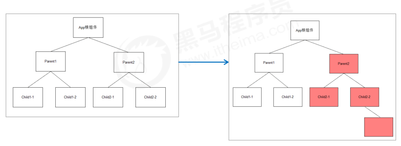

# setState

## 更新数据

- setState() 是异步更新数据的
- 注意：使用该语法时，后面的 setState() 不要依赖于前面的 setState()

```js
1. 当你调用 setState 的时候，React.js 并不会马上修改 state （为什么）
2. 而是把这个对象放到一个更新队列里面
3. 稍后才会从队列当中把新的状态提取出来合并到 state 当中，然后再触发组件更新。
```

- 可以多次调用 setState() ，只会触发一次重新渲染

```js
this.state = { count: 1 }
this.setState({
  count: this.state.count + 1
})
console.log(this.state.count) // 1
```

在使用 React.js 的时候，并不需要担心多次进行 `setState` 会带来性能问题。

## 推荐语法

- 推荐：使用 `setState((preState) => {})` 语法

- 参数 preState: React.js 会把上一个 `setState` 的结果传入这个函数

```js
this.setState(preState => {
  return {
    count: preState.count + 1
  }
})
console.log(this.state.count) // 1
```

**这种语法依旧是异步的，但是 state 可以获取到最新的状态，适用于需要调用多次 setState**

## 第二个参数

- 场景：在状态更新（页面完成重新渲染）后立即执行某个操作
- 语法：`setState(updater[, callback])`

```js
this.setState(
  state => ({}),
  () => {
    console.log('这个回调函数会在状态更新后立即执行')
  }
)
```

```js
this.setState(
  (state, props) => {},
  () => {
    document.title = '更新state后的标题：' + this.state.count
  }
)
```

# JSX 语法转化过程

- JSX 仅仅是 createElement() 方法的语法糖（简化语法）
- JSX 语法被 @babel/preset-react 插件编译为 createElement() 方法
- React 元素：是一个对象，用来描述你希望在屏幕上看到的内容
- **在使用过程中，可以把 JSX 当成一个对象来使用。**


# 组件更新机制

- setState() 的两个作用： 1. 修改 state 2. 更新组件（UI）
- 过程：父组件重新渲染时，也会重新渲染子组件。但只会渲染当前组件子树（当前组件及其所有子组件）



# 组件性能优化

1. 功能第一
2. 性能优化

## 减轻 state

- 减轻 state：只存储跟组件渲染相关的数据（比如：count / 列表数据 / loading 等）
- 注意：不用做渲染的数据不要放在 state 中，比如定时器 id 等
- 对于这种需要在多个方法中用到的数据，应该直接放在 this 中
  - this.xxx = 'bbb'
  - this.xxx

```js
class Hello extends Component {
    componentDidMount() {
        // timerId存储到this中，而不是state中
        this.timerId = setInterval(() => {}, 2000)
    }
    componentWillUnmount() {
    	clearInterval(this.timerId)
    }
    render() { … }
}
```

vue 中不要把和渲染无关的数据放到 data 中

## 避免不必要的重新渲染

- 组件更新机制：父组件更新会引起子组件也被更新，这种思路很清晰
- 问题：子组件没有任何变化时也会重新渲染 （接收到的 props 没有发生任何的改变）
- 如何避免不必要的重新渲染呢？
- 解决方式：使用钩子函数 `shouldComponentUpdate(nextProps, nextState)`

- 作用：通过返回值决定该组件是否重新渲染，返回 true 表示重新渲染，false 表示不重新渲染
- 触发时机：更新阶段的钩子函数，组件重新渲染前执行 （shouldComponentUpdate => render）

```js
class Hello extends Component {
    shouldComponentUpdate() {
        // 根据条件，决定是否重新渲染组件
        return false
    }
    render() {…}
}
```

案例：随机数

## 纯组件

- 纯组件：`React.PureComponent` 与 `React.Component`功能相似
- 区别：PureComponent 内部自动实现了 shouldComponentUpdate 钩子，不需要手动比较
- 原理：纯组件内部通过分别 对比 前后两次 props 和 state 的值，来决定是否重新渲染组件

```js
class Hello extends React.PureComponent {
  render() {
    return <div>纯组件</div>
  }
}
```

**只有在性能优化的时候可能会用到纯组件，不要所有的组件都使用纯组件，因为纯组件需要消耗性能进行对比**

## 纯组件比较-值类型

- 说明：纯组件内部的对比是 shallow compare（浅层对比）

- 对于值类型来说：比较两个值是否相同（直接赋值即可，没有坑）

```js
let number = 0
let newNumber = number
newNumber = 2
console.log(number === newNumber) // false
```

```js
state = { number: 0 }
setState({
  number: Math.floor(Math.random() * 3)
})
// PureComponent内部对比：
最新的state.number === 上一次的state.number // false，重新渲染组件
```

## 纯组件比较-引用类型

- 说明：纯组件内部的对比是 shallow compare（浅层对比）
- 对于引用类型来说：只比较对象的引用（地址）是否相同

```js
const obj = { number: 0 }
const newObj = obj
newObj.number = 2
console.log(newObj === obj) // true
```

```js
state = { obj: { number: 0 } }
// 错误做法
state.obj.number = 2
setState({ obj: state.obj })
// PureComponent内部比较：
最新的state.obj === 上一次的state.obj // true，不重新渲染组件
```

纯组件的最佳实践：

注意：state 或 props 中属性值为引用类型时，应该创建新数据，不要直接修改原数据！

```js
// 正确！创建新数据
const newObj = { ...state.obj, number: 2 }
setState({ obj: newObj })
// 正确！创建新数据
// 不要用数组的push / unshift 等直接修改当前数组的的方法
// 而应该用 concat 或 slice 等这些返回新数组的方法
this.setState({
  list: [...this.state.list, { 新数据 }]
})
```

# 虚拟 DOM 与 diff 算法

- React 更新视图的思想是：只要 state 变化就重新渲染视图
- 问题：组件中只有一个 DOM 元素需要更新时，也得把整个组件的内容重新渲染到页面中？
- 理想状态：部分更新，只更新变化的地方。
- 问题：React 是如何做到部分更新的？虚拟 DOM 配合 Diff 算法

## 虚拟 DOM

> 虚拟 DOM（Virtual DOM）:虚拟 DOM 就是使用 javascript 的对象来描述了 DOM 结构

- 为什么要有虚拟 DOM?
  - 因为操作真实 DOM 的代价是非常昂贵的，随便一个 DOM 对象，都有很多很多的属性
  - DOM 中大部分的属性都不是我们需要关注的
- 虚拟 DOM：
  - 使用 js 对象来描述一个 DOM 结构，在 react 框架中，描述一个 DOM 的对象，使用的一个虚拟 DOM
  - 页面的更新可以先全部反映在 js 对象上，操作内存中的 js 对象的速度显然要快多了，不需要重绘与回流
  - 等更新完后，再将最终的 js 对象映射成真实的 DOM，交由浏览器去绘制。

## DIFF 算法

> react 中通过 diff 算法来决定如何更新视图中的内容

[diff 算法 - 中文文档](https://www.reactjscn.com/docs/reconciliation.html)

[参考资料: 如何实现一个虚拟 DOM](https://github.com/livoras/blog/issues/13)

### diif 算法的举例

- 如果两棵树的根元素类型不同，React 会销毁旧树，创建新树

```js
// 旧树
<div>
  张三
</div>

// 新树
<span>
  张三
</span>
```

- 对于类型相同的 React DOM 元素，如果仅仅是属性不同，只更新不同的属性

```js
// 旧
<div className="before" title="stuff"></div>
// 新
<div className="after" title="stuff"></div>
只更新：className 属性

// 旧
<div style={{color: 'red', fontWeight: 'bold'}}></div>
// 新
<div style={{color: 'green', fontWeight: 'bold'}}></div>
只更新：color属性
```

- 添加节点的情况

```js
// 旧
<ul>
  <li>first</li>
  <li>second</li>
</ul>

// 新
<ul>
  <li>first</li>
  <li>second</li>
  <li>third</li>
</ul>
// 在虚拟DOM中添加 <li>third</li>


// 效率不高
// 旧 [a,b]
<ul>
  <li>a</li>
  <li>b</li>
</ul>
// 新  [c,a,b]
<ul>
  <li>c</li>
  <li>a</li>
  <li>b</li>
</ul>
// React将改变每一个子节点, 不会保证<li>a</li><li>b</li>不变化
```

- 带 key 的情况

```js
// 旧
<ul>
  <li key="2015">a</li>
  <li key="2016">b</li>
</ul>

// 新
<ul>
  <li key="2014">c</li>
  <li key="2015">a</li>
  <li key="2016">b</li>
</ul>

// react会根据唯一的key来移动元素
// 在遍历数据时，推荐在使用 key 属性
```

### react 中 DOM 的更新方式

1. 使用虚拟 DOM(JavaScript)对象结构表示 DOM 树的结构，根据虚拟 DOM 渲染出真正的 DOM 树

2. 当状态变更的时候，重新构造一棵新的对象树。然后用新的树和旧的树进行比较，记录两棵树差异(diff 算法)

3. 把 2 所记录的差异应用到步骤 1 所构建的真正的 DOM 树上，视图就更新了
