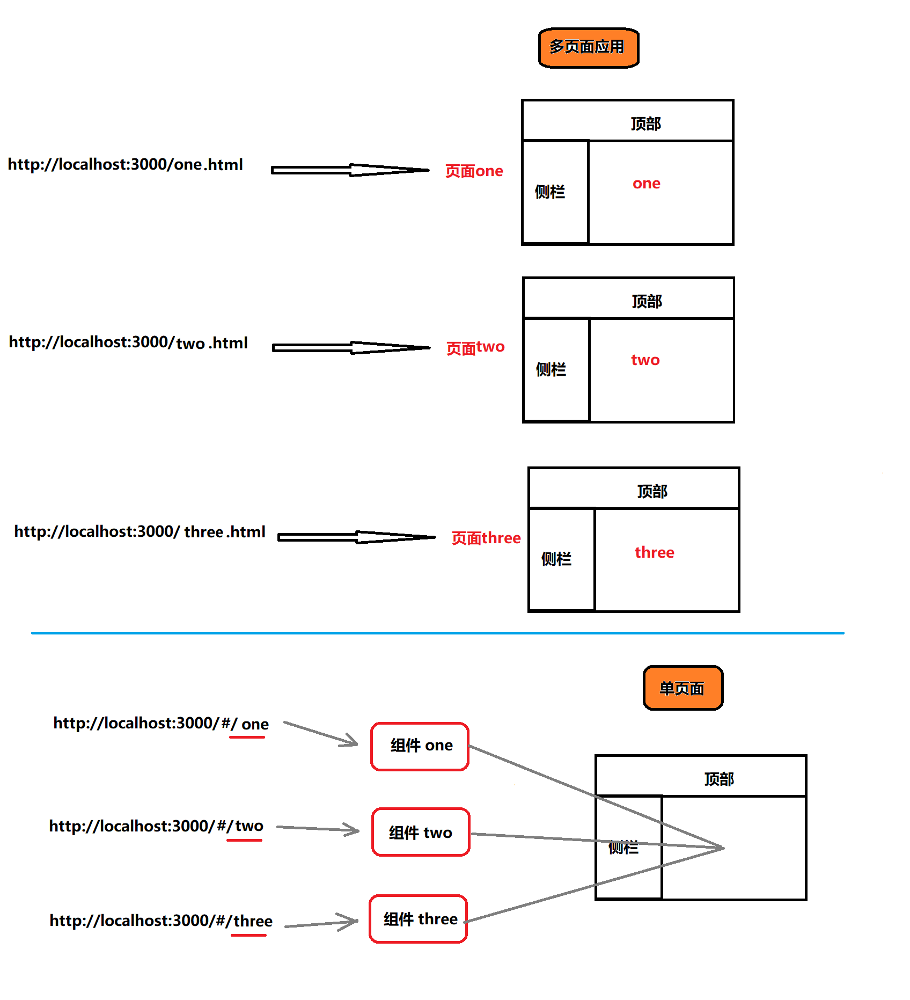

# 路由基本介绍

现代的前端应用大多都是 SPA（单页应用程序），也就是只有一个 HTML 页面的应用程序。因为它的用户体验更好、对服务器的压力更小，所以更受欢迎。为了有效的使用单个页面来管理原来多页面的功能，前端路由应运而生。

- 前端路由的功能：让用户从一个视图（页面）导航到另一个视图（页面）
- 前端路由是一套映射规则，在 React 中，是 URL 路径 与 组件 的对应关系
- 使用 React 路由简单来说，就是配置 路径和组件（配对）`

* 想要实现单页应用程序（SPA），就必须使用到路由 react-router
* 官网：[react-router](https://reacttraining.com/react-router/)



# 路由基本使用

## 基本步骤

- 安装

```js
yarn add react-router-dom
```

- `react-router-dom`这个包提供了三个核心的组件

```js
import { HashRouter, Route, Link } from 'react-router-dom'
```

- 使用`HashRouter`包裹整个应用，一个项目中只会有一个 Router

```js
<Router>
  <div className="App">// … 省略页面内容</div>
</Router>
```

- 使用 Link 指定导航链接

```js
<Link to="/first">页面一</Link>
<Link to="/two">页面二</Link>
```

- 使用`Route`指定路由规则

```js
// 在哪里写的Route,最终匹配到的组件就会渲染到这
<Route path="/first" component={First}></Route>
```

## Router 详细说明

- Router 组件：包裹整个应用，一个 React 应用只需要使用一次
- 两种常用 Router：`HashRouter` 和 `BrowserRouter`
- HashRouter：使用 URL 的哈希值实现（`localhost:3000/#/first`）

- BrowserRouter：使用 H5 的 history API 实现（`localhost:3000/first`）

最佳实践

```js
import { HashRouter as Router, Route, Link } from 'react-router-dom'
```

## Route

- path 的说明
  - 默认情况下，/能够匹配任意/开始的路径
  - 如果 path 的路径匹配上了，那么就可以对应的组件就会被 render
  - 如果 path 没有匹配上，那么会 render null
  - 如果没有指定 path，那么一定会被渲染
- exact 的说明， exact 表示精确匹配某个路径
  - 一般来说，如果路径配置了 /， 都需要配置 exact 属性

## Switch 与 404

- 通常，我们会把`Route`包裹在一个`Switch`组件中

- 在`Switch`组件中，不管有多少个路由规则匹配到了，都只会渲染第一个匹配的组件
- 通过`Switch`组件非常容易的就能实现 404 错误页面的提示

```js
<Switch>
  {/* Redirect: 表示路由的重定向*/}
  {/* <Redirect exact from="/" to="/home" />*/}
  <Route exact path="/" component={Home} />
  <Route path="/about" component={About} />
  <Route path="/user" component={User} />
  <Route component={NoMatch} />
</Switch>
```

## Link 与 NavLink

`Link`组件最终会渲染成 a 标签，用于指定路由导航

- to 属性，将来会渲染成 a 标签的 href 属性
- `Link`组件无法实现导航的高亮效果

`NavLink`组件，一个更特殊的`Link`组件，可以用用于指定当前导航高亮

- to 属性，用于指定地址，会渲染成 a 标签的 href 属性
- activeClass: 用于指定高亮的类名，默认`active`
- exact: 精确匹配，表示必须精确匹配类名才生效

# 编程式导航

- 场景：点击登录按钮，登录成功后，通过代码跳转到后台首页，如何实现？
- 编程式导航：通过 JS 代码来实现页面跳转
- history 是 React 路由提供的，用于获取浏览器历史记录的相关信息
- push(path)：跳转到某个页面，参数 path 表示要跳转的路径
- go(n)： 前进或后退到某个页面，参数 n 表示前进或后退页面数量（比如：-1 表示后退到上一页）

```js
class Login extends Component {
    handleLogin = () => {
        // ...
        this.props.history.push('/home')
    }
    render() {...省略其他代码}
}
```

# 动态路由与路由参数获取

- 可以使用`:id`的方式来配置动态的路由参数

```js
// 可以匹配 /users/1  /users/2  /users/xxx
<Route path="/users/:id" component={Users} />
```

- 在组件中，通过`props`可以接收到路由的参数

```js
render(){
    console.log(this.props.match.params)
}
```

# 嵌套路由的配置

- 在 React 中，配置嵌套路由非常的简单，因为`Route`就是一个组件，可以在任意想配置的地方进行配置

- 但是配置嵌套路由的时候，需要对路径进行处理，必须要先匹配到父级路由，才能匹配到子路由

```js
// 通过/home可以匹配Home父组件  再通过/list匹配子组件
<Route path="/home/list" component={List} />
```
