# 1. 学成在线项目介绍

```
学成在线教育平台，技术上系统采取前后端完全分离式开发
本系统分为两个子系统：
1、数据服务子系统
	使用的是Node.js + Mysql来实现网站数据的相关操作和状态管理，以及支付管理等
2、网站子系统
	网站子系统使用的是React服务端渲染框架Next.js进行架构，再结合Redux实现系统数据流的管控
```

## 1.1. SPA 与服务端渲染的区别

### 1.1.1. SPA 图解

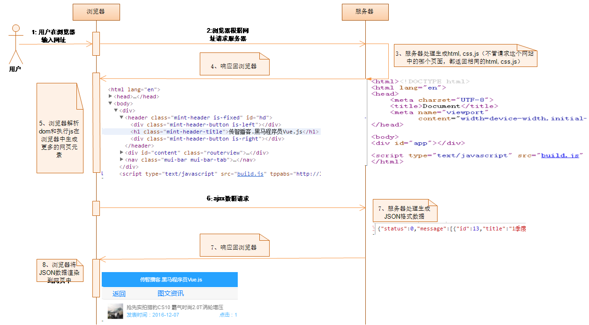

### 1.1.2. 服务端渲染图解

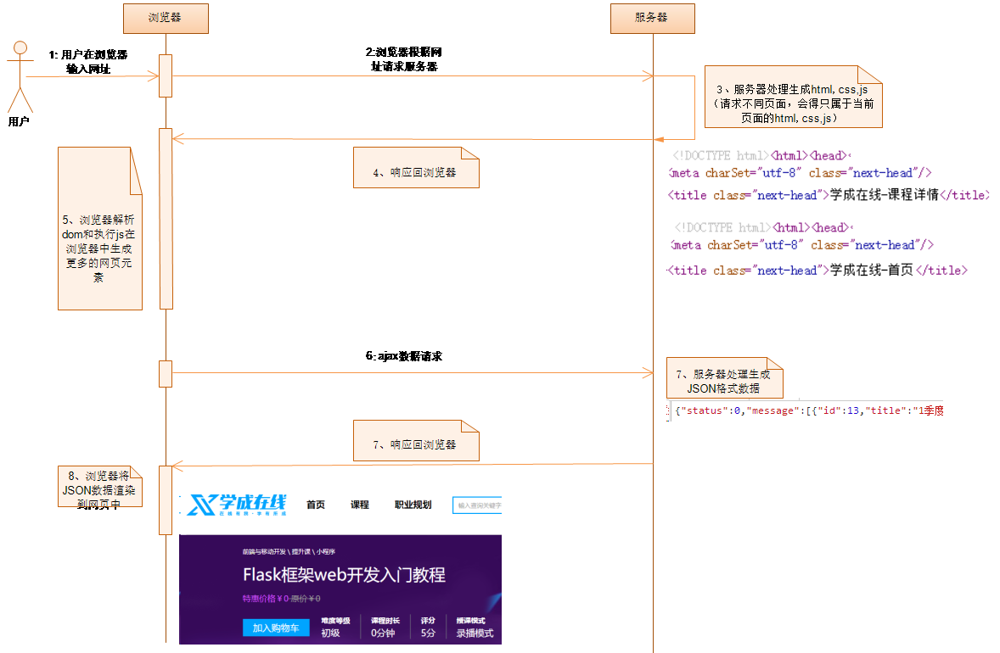

### 1.1.3. 服务端渲染相对于 SPA 的区别

- 更快的响应时间，不用等待所有的 js 都下载完成，浏览器即可显示出比较完整的页面，减少加载首屏时页面泛白的时间
- 可以将 SEO 的关键信息直接在后台就渲染成 html，从而保证搜索引擎的爬虫能爬取到关键数据，使搜索引擎更好的收录每个页面
- 服务端渲染占用更多的服务器 CPU 和内存资源
- 服务端渲染时常用的浏览器的 API 可能无法正常使用，比如 window，开发的时候需要辨别代码的执行环境是在浏览器还是在服务器

## 1.2. 学前需要掌握的基本技术

- React.js 基本开发

- Node.js

- Webpack

- ES6

- Http 和 Session，Cookie 知识

## 1.3. 各子系统交互图

```
系统使用前后端完全分离技术开发：
1、后台数据API即可使用Node.js + Mysql
2、网站子系统使用 Next.js 服务器渲染方式实现
3、网站状态维持采取的是Session + Cookie形式
4、系统使用Cross跨域技术解决AJAX请求跨域问题
```

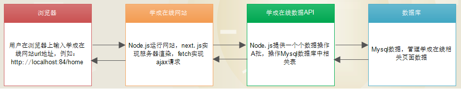

## 1.4. 各子系统使用技术说明

### 1.4.1. 学成在线网站子系统

- React.js 服务端渲染技术 Next.js

- fetch 异步数据请求数据

- Redux 数据流技术

- React.js UI 组件 antd

#### 1.4.1.1. 学生端系统界面

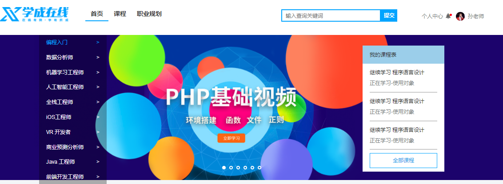

#### 1.4.1.2. 教师端管理系统界面

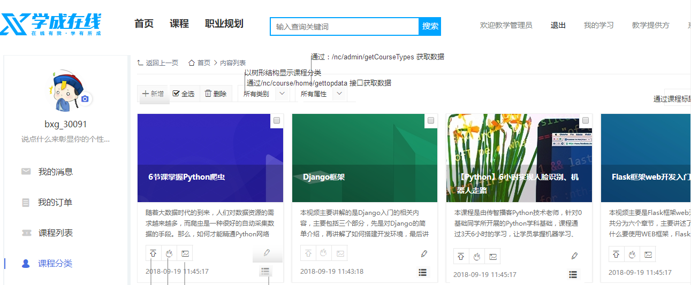

### 1.4.2. 学成在线数据 API

- Node.js + Express

- Mysql

- Cross 跨域

- Session 状态管理

- 数据 API 文档地址 ：http://157.122.54.189:9092/upload/preview/siteapi.html

# 2. 前后端完全分离项目开发协作流程

- 现在企业网站应用开发中，80%的公司采取的是前后端完全分离技术来合作开发

- 前后端可以同时进行开发，不需要互相等待，可以二者同时开发完成后进行对接和联调，或者边开发边对接，较之前的混合式开发能够大大提高开发效率

  ​

## 2.1. 协作流程图解

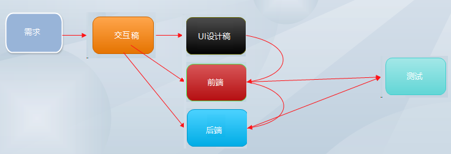

- 需求：通常是由业务部门提出的具体要在系统上实现的功能有哪些
- 交互稿：通常是产品经理根据需求设计出的系统的草图，一般分为整个系统的布局，菜单分类、页面的业务元素构成等
- UI 设计稿：UI 设计工程师根据交互稿原型设计出一个个的漂亮的图片，并标注好每个元素的大小，颜色，间距等
- 前端：前端工程师根据 **交互稿** 和 **UI 设计稿** 产出一份系统的 html 静态页面，在前后端完全分离项目中，还要产出一个前端架构设计（包括：使用的前端技术框架，AJAX 请求技术，跨域（后台 CROSS 跨域还是 JSONP 跨域方案）等），通常还要和后端工程师协调好接口的请求方式（GET/POST/PUT/DELETE）, 数据传输格式（JSON/XML），入参说明，返回值说明
- 后端：后端工程师根据**交互稿** 设计出数据库相关表，开出数据接口，供前端工程师请求，通常要和前端工程师协调好接口的请求方式（GET/POST/PUT/DELETE）, 数据传输格式（JSON/XML），入参说明，返回值说明
- 测试：系统开发好一个版本后，发布到测试环境，交给测试工程师测试系统功能，如果有问题，测试工程师提交 BUG 给相应的前端/后端工程师修复后，回归测试，通过以后可以发布到正式环境

## 2.2. 协作流程中相关技术名词

### 2.2.1. 交互稿

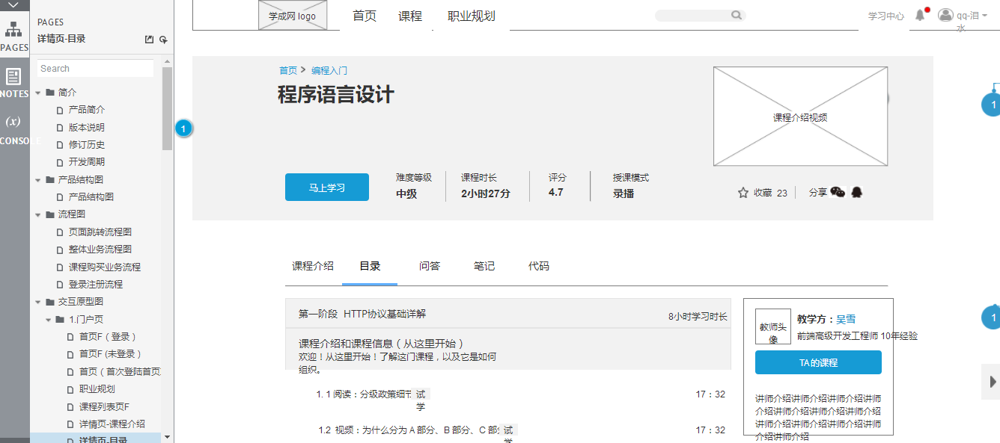

### 2.2.2. UI 设计稿

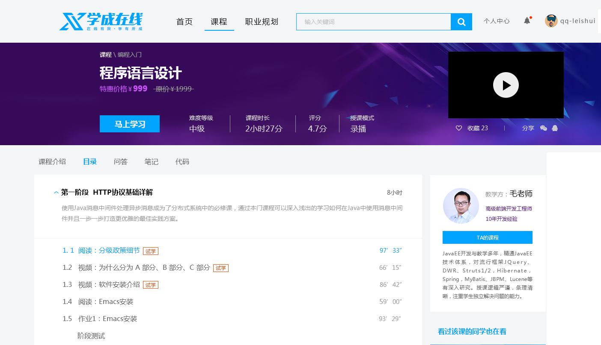

### 2.2.3. 前端

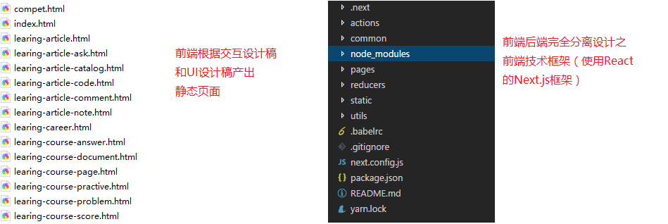

### 2.2.4. 后端

> 数据库关系图

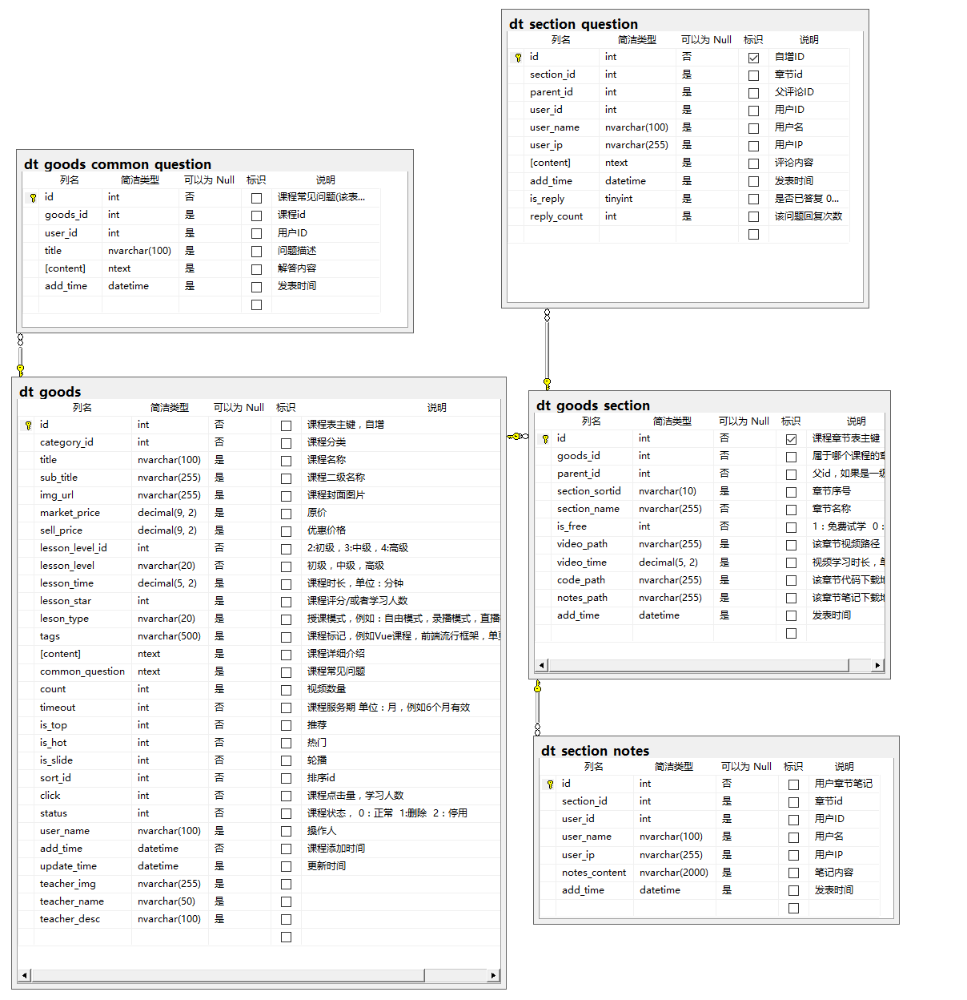

> 数据 API 服务

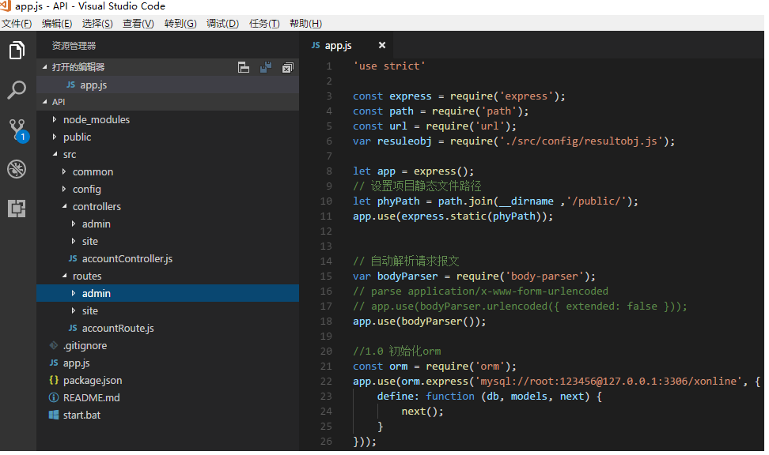

### 2.2.5. 测试

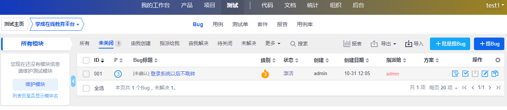

# 3. 系统用到的相关技术备忘

> Next.js 技术文档

- Next.js 英文文档：https://nextjs.org/docs/
- Next.js 中文文档：http://nextjs.frontendx.cn/docs/
- Next.js 的**with-redux-wrapper** 模板：https://github.com/ivanyb/next.js/tree/canary/examples/with-redux-wrapper

> Redux 技术文档

- Redux 中文文档：https://cn.redux.js.org/
- Redux 英文文档：https://redux.js.org/

> React 的 UI 组件库 antd 官网：https://ant.design/index-cn

> Next.js & Redux 包装器 next-redux-wrapper：https://www.npmjs.com/package/next-redux-wrapper

```
正常情况下：在一个Container的js文件中利用 <Provider store={store}></Provider>初始化后，只能在当前Container的js文件中导入并且使用的组件才能使用 connect这个方法，否则会报错，这样的话，如果使用 <Link href={}>跳转到其他页面后，在目标页面中是不能使用connect方法的，并且也没有办法获取到store中的状态树对象

为了解决这个问题：使用next-redux-wrapper 在 _app.js中产生一个全局的<Provider store={store}></Provider>，以使得所有的页面都能使用connect方法，从而达到store状态树对象能够被所有页面访问到
```

> npx 使用说明：https://segmentfault.com/a/1190000012974903

> yarn 使用说明文档：https://yarn.bootcss.com/
