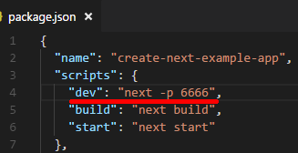
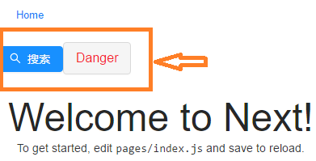
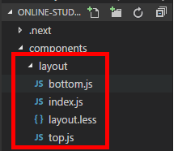
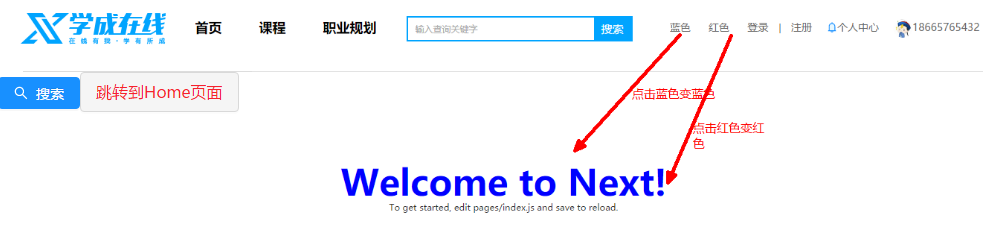
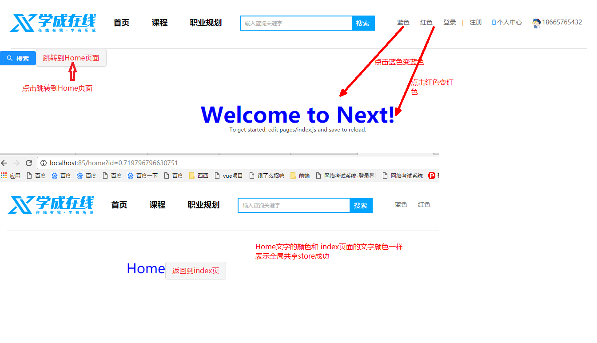

# 2. 项目框架

- 整个项目使用的主要技术

  - react (此项目使用的版本为：react@16.6.0 和 react-dom@16.6.0)
  - next.js (此项目中使用的版本为：next@7.0.2)
  - redux (此项目使用的版本为：redux@4.0.4)
  - react-redux (此项目使用的版本为：react-redux@5.0.7)
  - antd (此项目使用的版本为：antd@3.10.3)

- 使用：create-next-app 创建基本的 Next.js 项目框架，再在此项目框架上增加 Redux，antd

# 2. 项目框架基本步骤

## 2.1. 步骤 1：利用 create-next-app 创建项目

- 第一种创建方式：使用 yarn 创建 (项目讲解使用这种) ：执行 yarn create next-app online-study

  ```
  写法结构：yarn create next-app  填写你的应用名称

  例如（拷贝此条在控制面板执行既可以成功创建咱们的项目结构）：
  	yarn create next-app  online-study

  说明：yarn create next-app online-study 等价于下面两条命令的组合

  	yarn global add create-next-app
  	create-next-app  online-study

  yarn是类似于npm的一个包管理器
  yarn使用说明文档：https://yarn.bootcss.com/
  ```

- 第二种创建方式：使用 npx create-next-app 创建 （自行实践）执行 npx create-next-app online-study

  ```
  写法结构：npx create-next-app  填写你的应用名称

  例如（拷贝此条在控制面板执行既可以成功创建咱们的项目结构）：
  	npx create-next-app  online-study

  说明：
  	npx 命令是 npmv5.2.0引入的一条命令，npx允许我们单次执行命令而不需要安装
  	例如： npx create-next-app 这条命令会临时安装 create-next-app 包，命令完成后 create-next-app 会删掉，不会出现在 		global 中。下次再执行，还是会重新临时安装。

  	npx说明：https://segmentfault.com/a/1190000012974903
  ```

  ​

## 2.2. 步骤 2：启动项目

- 进入 online-study 文件夹

- 执行 yarn dev

- 在浏览器中输入 http://localhost:3000

  ​

\*注意：项目默认端口是 3000，如果端口被其他程序占用了可以修改项目 package.json 中的 scripts 中的 dev 节点为：next -p 自定义端口

例如：其中 6666 端口可以自己从 1 到 65535 之间随便取一个没有占用的



# 3. 完善框架-增加 css，less 演示解析

> 步骤 1：下载 @zeit/next-css 和@zeit/next-less

```
yarn add @zeit/next-css@1.0.1 @zeit/next-less@1.0.1 less@3.8.1 -S
```

> 步骤 2：修改项目中的 next.config.js 文件内容

```javascript
const withCSS = require('@zeit/next-css')
const withLess = require('@zeit/next-less')

// 解决ant/lib/style/index.css 不认识@font-face 异常
if (typeof require !== 'undefined') {
  require.extensions['.css'] = file => {}
}

module.exports = Object.assign(
  {},
  withCSS(
    withLess({
      // 开启Less模块化，但是同时也会开启css的模块化，这样会使得antd的样式加载不成功
      cssModules: true,
      webpack(config, { isServer }) {
        if (!isServer) {
          // 关闭css模块化,使antd样式生效
          config.module.rules[2].use[2].options.modules = false
        }

        // 添加actions和reducers快速引用
        // config.resolve.alias.actions = path.resolve(__dirname, 'actions');
        // config.resolve.alias.reducers = path.resolve(__dirname, 'reducers');
        return config
      }
    })
  )
)
```

# 4. 完善框架-增加 UI 组件 antd

```
整个项目使用antd这套UI组件库
antd官网：https://ant.design/index-cn
如何增加antd到项目中可以参考：https://ant.design/docs/react/use-with-create-react-app-cn 一步步完成
```

> 步骤 1： 利用 yarn 安装并引入 antd

```
yarn add antd@3.10.3 -S
```

> 步骤 2：在页面上使用 antd 组件方式

```javascript
由于使用了babel-plugin-import实现按需加载，在页面上使用button的时候只需要如下即可：
import {Button} from 'antd'  // 这种写法也会按需加载antd中的Button和Button对应的样式，而不是全部加载

使用：
<Button type="primary" icon="search">搜索</Button>
<Button type="danger" size="large">Danger</Button>
```

> 步骤 3：引用 antd.css 样式

```react
/* 导入head，可以在任何react组件中的render函数中
通过<Head></Head>来向html头中的增加内容
*/
import Head from 'next/head'

 <Head>
      <title>首页</title>
	{/* 引入antd组件的样式 */}
      <link rel="stylesheet" href="/static/css/antd.css"/>
 </Head>
```

最终效果:

​



# 5. \_document.js 加载公共样式

## 5.1. 步骤 1:static\css 中新建 base.css 文件

```css
/* reset */
* {
  margin: 0;
  padding: 0;
  box-sizing: border-box;
  font-family: '微软雅黑';
}

header,
footer,
section,
article,
aside,
nav,
hgroup,
address,
figure,
figcaption,
menu,
details {
  display: block;
}

table {
  border-collapse: collapse;
  border-spacing: 0;
}

caption,
th {
  text-align: left;
  font-weight: normal;
}

html,
body,
fieldset,
img,
iframe,
abbr {
  border: 0;
}

i,
cite,
em,
var,
address,
dfn {
  font-style: normal;
}

[hidefocus],
summary {
  outline: 0;
}

li {
  list-style: none;
}

h1,
h2,
h3,
h4,
h5,
h6,
small {
  font-size: 100%;
}

sup,
sub {
  font-size: 83%;
}

pre,
code,
kbd,
samp {
  font-family: inherit;
}

q:before,
q:after {
  content: none;
}

textarea {
  overflow: auto;
  resize: none;
}

label,
summary {
  cursor: default;
}

a,
button {
  cursor: pointer;
}

h1,
h2,
h3,
h4,
h5,
h6,
em,
strong,
b {
  font-weight: bold;
}

del,
ins,
u,
s,
a,
a:hover {
  text-decoration: none;
}

body,
textarea,
input,
button,
select,
keygen,
legend {
  font: 12px/1.14 '微软雅黑', \5b8b\4f53;
  color: #333;
  outline: 0;
}

body {
  background: #fff;
}

a,
a:hover {
  color: #333;
}
.fl {
  float: left;
}
.fr {
  float: right;
}
.pr {
  position: relative;
}
.pa {
  position: absolute;
}
.clearfix::after {
  content: '.';
  clear: both;
  display: block;
  overflow: hidden;
  font-size: 0;
  height: 0;
}
.w {
  width: 1300px;
  margin: 0 auto;
}
.loading {
  position: absolute;
  top: 200px;
  left: 47%;
  z-index: 999;
}
```

## 5.2. 步骤 2： pages 下新建 \_document.js 写入内容如下

```javascript
从 http://nextjs.frontendx.cn/docs/#自定义<document> 中拷贝代码放入_document.js 中
修改Head节点增加全局样式base.css： <link rel="stylesheet" href="/static/css/base.css" />
   // 可以直接将内容拷贝到您的项目_document.js中

 import Document, { Head, Main, NextScript } from 'next/document'
 export default class MyDocument extends Document {
static async getInitialProps(ctx) {
  const initialProps = await Document.getInitialProps(ctx)
  return { ...initialProps }
}

render() {
  return (
    <html>
      <Head>
        <link rel="stylesheet" href="/static/css/base.css" />
        <style>{`body { margin: 0 } /* custom! */`}</style>
      </Head>
      <body className="custom_class">
        <Main />
        <NextScript />
      </body>
    </html>
  )
}
}
```

## 5.3. 步骤 3：yarn dev 重启服务器使 \_document.js 生效

```powershell
项目根目录> yarn dev
```

# 6. 子组件中覆盖 Head 中的 title

```javascript
整个网站的每个页面显示在浏览器tab栏上的标题名称都会不一样，这时可以在组件中通过如下代码实现：

import Head from 'next/head'
export default class 组件名称 extends React.Component {
  render(){
      return (<div>
        <Head>
          <title>首页</title>
       </Head>
       )
     }
 }
```

# 7. 头部和底部公共布局

存放位置：

## 7.1. 布局组件 index.js

- 在项目的 components\layout 下新建一个 index.js 文件，被\_app.js 调用，可以签入到所有页面中

- index.js 内容如下

  ```javascript
  import Top from './top'
  import Bottom from './bottom'

  export default class layout extends React.Component {
    render() {
      const { Component, ...pageProps } = this.props
      return (
        <div>
          <div className='xc_top'>
            <Top />
          </div>
          <div className='xc_mid'>
            <Component {...pageProps} />
          </div>
          <div className='xc_bottom'>
            <Bottom />
          </div>
        </div>
      )
    }
  }
  ```

## 7.2. 头部组件 Top.js

- 控制整个头部样式，被 layout\index.js 引入并调用

```javascript
import css from './layout.less'
import { Icon } from 'antd'

export default class top extends React.Component {
  render() {
    return (
      <header className={css.headtop + ' w'}>
        <a href='' className='fl'>
          
        </a>
        <div className={css.left + ' fl'}>
          <a className={css.a} href=''>
            首页
          </a>
          <a className={css.a} href=''>
            课程
          </a>
          <a className={css.a} href=''>
            职业规划
          </a>
        </div>
        <div className={css.input + ' fl'}>
          <input type='text' className='fl' placeholder='输入查询关键字' />
          <button className='fr'>搜索</button>
        </div>
        <div className={css.right + ' fr'}>
          <div class={css.signin}>
            {/* <!-- 未登录 -->*/}
            <a href='#'>登录 </a> <span> |</span> <a href='#'> 注册</a>
            {/* <!-- 登录 --> */}
            <a href='#'>
              <Icon type='bell' theme='twoTone' />
              个人中心
            </a>
            <a href='#'>
              
              18665765432
            </a>
          </div>
        </div>
      </header>
    )
  }
}
```

## 7.3. 底部组件 bottom.js

- 控制整个底部样式，被 layout\index.js 引入并调用

  ```
  import { Row, Col } from 'antd';
  import css from './layout.less';
  import {Button} from 'antd'

  export default class bottom extends React.Component {
      render(){
          return  (
              <div className={css.footer + " w"}>
              <Row >
                <Col span={12}>
                <div></div>
                      <div>学成网致力于普及中国最好的教育它与中国一流大学和机构合作提供在线课程。</div>
                      <div>© 2018年Inc.保留所有权利。-沪ICP备xxxxx号</div>
                      <Button type="primary" icon="download">下载</Button>
                </Col>
                <Col span={12}>
                  <Row>

                  <Col span={6} offset={6}>
                  <dl class={css.dl}>
                              <dt>关于学成网</dt>
                              <dd>关于</dd>
                              <dd>管理团队</dd>
                              <dd>工作机会</dd>
                              <dd>客户服务</dd>
                              <dd>帮助</dd>
                          </dl>
                  </Col>
                  <Col span={6}>
                  <dl class={css.dl}>
                          <dt>新手指南</dt>
                          <dd>如何注册</dd>
                          <dd>如何选课</dd>
                          <dd>如何拿到毕业证</dd>
                          <dd>学分是什么</dd>
                          <dd>考试未通过怎么办</dd>
                      </dl>
                  </Col>
                  <Col span={6}>
                  <dl class={css.dl}>
                          <dt>合作伙伴</dt>
                          <dd>合作机构</dd>
                          <dd>合作导师</dd>
                      </dl>
                  </Col>
                  </Row>
                </Col>
              </Row>
              </div>
      )
      }
  }
  ```

  ​

## 7.4. 布局组件的 layout.less 文件

- components\layout\layout.less 文件，控制布局组件的头部和底部组件样式

  ```css
  // top.js
  .headtop {
    height: 110px;
    line-height: 100px;
    border-bottom: 1px solid #ddd;
    overflow: hidden;
    .a {
      margin-left: 30px;
    }
    .left {
      font-size: 18px;
      font-weight: bold;
      .a {
        padding: 10px;
        color: #000;
      }
    }
    .input {
      width: 304px;
      height: 34px;
      border: 2px solid #00a4ff;
      margin: 35px 30px 0 30px;
      input {
        width: 250px;
        height: 30px;
        border: 0;
        line-height: 30px;
        padding-left: 10px;
      }
      button {
        width: 50px;
        height: 30px;
        line-height: 30px;
        color: #fff;
        font-size: 15px;
        border: 0;
        background-color: #00a4ff;
      }
    }
    .right {
      a {
        color: #666;
        font-size: 14px;
        margin-left: 25px;
      }
      .signout {
        color: #000;
      }
    }
  }
  // bottom.js

  /*
   * colors variables
   */
  .footer {
    width: 100%;
    background: #fff;
    margin-top: 20px;
    padding: 40px 0;
    line-height: 260%;
    font-size: 14px;

    .dl {
      dt {
        font-size: 16px;
        font-weight: bold;
      }
    }
  }
  ```

## 7.5. \_app.js 文件调用 layout\index.js

- \_app.js 是 Next.js 默认的文件，可以重写它来使得所有页面均套入布局组件

  ```javascript
  import App, { Container } from 'next/app'
  import React from 'react'
  import Layout from '../components/layout'

  export default class MyApp extends App {
    static async getInitialProps({ Component, router, ctx }) {
      let pageProps = {}
      /*判断子组件是否有getInitialProps，如果有则调用子组件的getInitialProps，可以在子组件中getInitialProps返回同一个key
       的不同值，类实现是否加载局部组件*/

      if (Component.getInitialProps) {
        pageProps = await Component.getInitialProps(ctx)
      }

      return { pageProps }
    }

    render() {
      const { Component, pageProps } = this.props
      return (
        <Container>
          {/* 调用Layout布局组件并完成子组件Component内容的显示 */}
          <Layout Component={Component} {...pageProps} />
        </Container>
      )
    }
  }
  ```

# 8. 框架搭建代码文件

```
代码下载地址： v0.1.1完成框架基本功能加载css和less集成antd框架_document实现全局样式和_app实现统一布局加载
http://157.122.54.189:9093/ivanyb/online-study2/archive/v0.1.1%E5%AE%8C%E6%88%90%E6%A1%86%E6%9E%B6%E5%9F%BA%E6%9C%AC%E5%8A%9F%E8%83%BD%E5%8A%A0%E8%BD%BDcss%E5%92%8Cless%E9%9B%86%E6%88%90antd%E6%A1%86%E6%9E%B6_document%E5%AE%9E%E7%8E%B0%E5%85%A8%E5%B1%80%E6%A0%B7%E5%BC%8F%E5%92%8C_app%E5%AE%9E%E7%8E%B0%E7%BB%9F%E4%B8%80%E5%B8%83%E5%B1%80%E5%8A%A0%E8%BD%BD.zip

git版本地址：
http://157.122.54.189:9093/ivanyb/online-study2/commit/4482e6a6b3187bf57f6e53de720610f2d18bb5f7
```

# 9. 项目集成 Redux 步骤

- Redux 英文文档：https://redux.js.org/
- Redux 中文文档：https://cn.redux.js.org/

## 9.1. 第 1 步：安装 react 中 redux 相关的包

```
yarn add redux@4.0.0 react-redux@5.0.7 next-redux-wrapper@2.0.0 -S

- redux : 数据流框架
- react-redux:数据流在react中的实现包装
- next-redux-wrapper：在next.js中对redux进行包装，实现store全局共享，可以跨组件访问
```

## 9.2. 第 2 步：在项目 reducer 文件夹中创建一个 testReducer

```javascript
// 这是一个颜色更改测试reducer，具体如何创建其他reducer请根据具体业务实现

export default function testReducer(state = { color: 'red' }, action) {
  // 判断当前dispatch的类型，如果是CHANGE_COLOR则改变颜色
  switch (action.type) {
    case 'CHANGE_COLOR':
      return {
        ...state,
        color: action.color //改变state中的color属性颜色为action.color的值
      }
    default:
      return state
  }
}
```

## 9.3. 第 3 步：在 store 文件夹中新建 index.js

```javascript
// 将具体的reducer编译成统一的rootReducer,并且提供一个初始化store函数，交给 next-redux-wrapper的withRedux 使用
import { createStore, combineReducers } from 'redux'

// 导入具体的业务reducer
import testReducer from '../reducer/testReducer.js'

// 将多个reducer编译成统一的rootReducer
const rootReducer = combineReducers({
  testReducer //颜色改变测试reducer，无实际意义
})

// 构建初始化Store的函数，交给 next-redux-wrapper的withRedux 使用
const initStore = (initialState, options) => {
  return createStore(rootReducer, initialState)
}
export default initStore
```

## 9.4. 第 3 步：改造\_app.js 文件利用 next-redux-wrapper 的 withRedux 初始化 store

```javascript
修改点1：
// 导入withRedux
import withRedux from 'next-redux-wrapper'
// 导入store
import initStore from '../store'
// 导入Provider
import {Provider} from 'react-redux'

修改点2：
export default class MyApp extends App {}
修改成
class MyApp extends App {}
export default withRedux(initStore)(MyApp)

修改点3：
将：
render () {
    const {Component, pageProps} = this.props
    return <Container>
      {/* 调用Layout布局组件并完成子组件Component内容的显示 */}
        <Layout Component={Component}  {...pageProps}></Layout>
      </Container>
  }

修改成：
 render () {
    // 增加一个store ，通过withRedux后自动会将store添加到props中
    const {Component, pageProps,store} = this.props
    return <Container>
      {/* 调用Layout布局组件并完成子组件Component内容的显示
      	增加： <Provider store = {store}>
      */}
      <Provider store = {store}>
        <Layout Component={Component}  {...pageProps}></Layout>
        </Provider>
    </Container>
  }
```

## 9.5. 第 4 步：改造 components\layout\top.js 文件

```javascript
1、增加
import {connect} from 'react-redux'

2、export default class top extends React.Component {} 修改成 class top extends React.Component {}

3、增加如下代码：
const mapDispatchToProps = (dispatch)=>{
    return {
        onSwitchColor: (color) => {
            dispatch({ type: 'CHANGE_COLOR', color: color })
        }
    }
}

export default connect(null,mapDispatchToProps)(top)

4、在top.js中的render()中增加：
 <a href="#" onClick={()=>this.props.onSwitchColor('blue')}>蓝色 </a>
 <a href="#" onClick={()=>this.props.onSwitchColor('red')}>红色 </a>

```

## 9.6. 第 5 步：改造 pages\index.js 文件

```javascript
1、增加
import {connect} from 'react-redux'

2、export default class Index extends React.Component {} 修改成 class Index extends React.Component {}

3、增加如下代码：
const mapStateToProps = (state) =>{
  return {
      ...state
  }
}

export default connect(mapStateToProps,null)(Index)

4、在render()中增加
<h1 className="title" style={{color:this.props.testReducer.color}}>Welcome to Next!</h1>

点击top.js中，红色和蓝色a标签就可以修改Welcome to Next!为对应的颜色
```

效果：



## 9.7. 第 6 步：改造 pages\home.js 文件

```javascript
import Router from 'next/router'
import Head from 'next/head'
import Link from 'next/link'
import { connect } from 'react-redux'
import { Button } from 'antd'

class home extends React.Component {
  render() {
    return (
      <div
        style={{
          height: '300px',
          width: '1024px',
          margin: '100px auto',
          fontSize: '30px'
        }}
        onClick={() => {
          Router.push({ pathname: '/index' })
        }}
      >
        <Head>
          <title>Home页面</title>
        </Head>
        <span style={{ color: this.props.testReducer.color }}>Home</span>
        <Link href={{ pathname: '/index' }}>
          <Button type='danger' size='large'>
            返回到index页
          </Button>
        </Link>
      </div>
    )
  }
}

const mappStateToProps = state => {
  return {
    ...state
  }
}

export default connect(
  mappStateToProps,
  null
)(home)
```

效果：



# 10. 集成 Redux 代下载

```
代码下载地址：v0.1.2完成redux集成
http://157.122.54.189:9093/ivanyb/online-study2/archive/v0.1.2%e5%ae%8c%e6%88%90redux%e9%9b%86%e6%88%90.zip

git版本：
http://157.122.54.189:9093/ivanyb/online-study2/commit/0ce052a2d1e77b2f691343ac0a28c586c58c6963
```

# 11. fetch 实现数据服务请求

## 11.1. 步骤 1：安装 isomorphic-fetch

```javascript
yarn add isomorphic-fetch@2.2.1 es6-promise -S

isomorphic-fetch是基于Fetch语法封装好的用于同构应用开发库
基于标准 Promise 实现，支持 async/await
注：同构就是使前后端运行同一套代码的意思，后端一般是指 NodeJS 环境。
isomorphic-fetch的github网址：https://github.com/matthew-andrews/isomorphic-fetch
```

## 11.2. 步骤 2：在\_app.js 中导入 isomorphic-fetch 全局都可以使用 featch

```javascript
require('es6-promise').polyfill() //保证使低版本浏览器（IE<9）中可以正常使用promise
import 'isomorphic-fetch'
```

isomorphic-fetch 使用方式：

```javascript
fetch(url,{ // url: 请求地址
        method: "GET", // 请求的方法POST/GET等
        headers : { // 请求头（可以是Headers对象，也可是JSON对象）
            'Content-Type': 'application/json;charset=UTF-8',  //application/x-www-form-urlencoded; charset=UTF-8
            'Accept': 'application/json'
        },
        body: , // 请求发送的数据 blob、BufferSource、FormData、URLSearchParams（get或head方法中不能包含body）
        cache : 'default', // 是否缓存这个请求
        credentials : 'include', //要不要携带 cookie 默认不携带 omit、same-origin(同源带cookie) 或者 include（跨域带cookie）
        mode : "",
        /*
            mode,给请求定义一个模式确保请求有效
            same-origin:只在请求同域中资源时成功，其他请求将被拒绝（同源策略）
            cors : 允许请求同域及返回CORS响应头的域中的资源，通常用作跨域请求来从第三方提供的API获取数据
            cors-with-forced-preflight:在发出实际请求前执行preflight检查
            no-cors : 目前不起作用（默认）

        */
    }).then(resp => {
        /*
            Response 实现了 Body, 可以使用 Body 的 属性和方法:

            resp.type // 包含Response的类型 (例如, basic, cors).

            resp.url // 包含Response的URL.

            resp.status // 状态码

            resp.ok // 表示 Response 的成功还是失败

            resp.headers // 包含此Response所关联的 Headers 对象 可以使用

            resp.clone() // 创建一个Response对象的克隆

            resp.arrayBuffer() // 返回一个被解析为 ArrayBuffer 格式的promise对象

            resp.blob() // 返回一个被解析为 Blob 格式的promise对象

            resp.formData() // 返回一个被解析为 FormData 格式的promise对象

            resp.json() // 返回一个被解析为 Json 格式的promise对象

            resp.text() // 返回一个被解析为 Text 格式的promise对象
        */
        if(resp.status === 200) return resp.json();
        // 注： 这里的 resp.json() 返回值不是 js对象，通过 then 后才会得到 js 对象
        throw New Error ('false of json');
    }).then(json => {
        console.log(json);
    }).catch(error => {
        consolr.log(error);
    })
```

## 11.3. 步骤 3：封装 fetch

```javascript
// fetchHelper.url = 'http://157.122.54.189:9092'
fetchHelper.url = 'http://127.0.0.1:9092'

// 自定义请求参数请求
export default function fetchHelper(url, option) {
  return fetch(fetchHelper.url + url, option)
}

// 封装get请求
fetchHelper.get = url => {
  return (
    fetch(fetchHelper.url + url, {
      method: 'GET',
      credentials: 'include' //允许跨域带cookie到服务器
    })
      .then(response => {
        if (response.status == 200) {
          return response.json()
        } else {
          throw new Error(
            'get request error in fetchHelper：response.status not eq 200'
          )
        }
      })
      //.then(res => res)
      .catch(error => {
        console.log('get request error in fetchHelper')
      })
  )
}

// 封装post请求
fetchHelper.post = (url, body) => {
  return (
    fetch(fetchHelper.url + url, {
      method: 'POST',
      headers: {
        // 要求请求报文题以json格式传输
        'Content-Type': 'application/json;charset=UTF-8' //application/x-www-form-urlencoded; charset=UTF-8
      },
      credentials: 'include', //允许跨域带cookie到服务器
      body: JSON.stringify(body) //请求报文体数据，body:传入js对象即可
    })
      .then(response => {
        if (response.status == 200) {
          return response.json()
        } else {
          throw new Error(
            'get request error in fetchHelper：response.status not eq 200'
          )
        }
      })
      //  .then(res => res)
      .catch(error => {
        console.log('get request error in fetchHelper')
      })
  )
}
```
