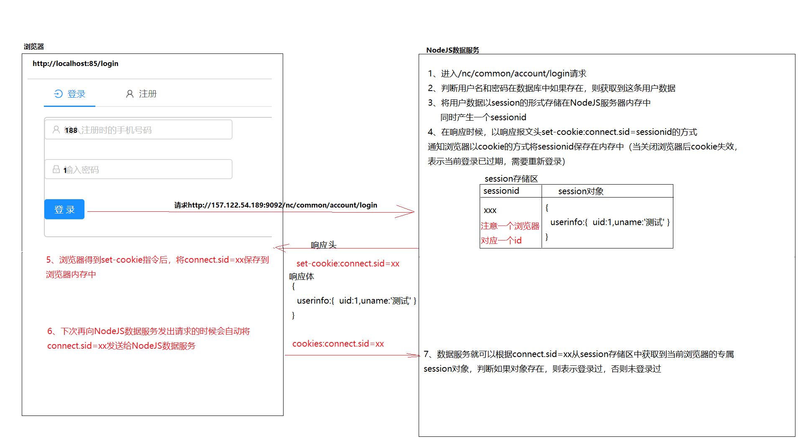

# 3. 登录

- 目标
  - 充分了解后台登录接口的业务登录过程
    - sessionID 会通过 set-cookie 保存到浏览器中
    - 浏览器关闭以后 session 和 sessionID 失效
  - 能够利用 sessionStorage 保存登录以后的用户数据到浏览器内存中
  - 学会 antd 中的表单组件使用 https://ant.design/components/form-cn/

## 登录处理过程



## 样式文件 login.less

```less
.login_form {
  border: 1px solid rgba(0, 0, 0, 0.1);
  border-radius: 5px;
}
```

## Storage 帮助类

```javascript
// 负责操作sessionStorage的曾，查，删三个操作

const KEY = 'USER_INFO'

// 1.0 增加数据到sessionStorage
// userinfo:就是一个js对象，在此方法中会通过JSON.stringify方法将其转换成json字符串保存
export function setUser(userinfo) {
  sessionStorage.setItem(KEY, JSON.stringify(userinfo || {}))
}

// 2.0 从sessionStorage中查询数据
export function getUser() {
  var userinfoJsonString = sessionStorage.getItem(KEY)
  return JSON.parse(userinfoJsonString || '{}')
}

// 3.0 从sessionStorage中删除数据
export function removeUser() {
  sessionStorage.removeItem(KEY)
}
```

## 登录&注册基本结构

```react
render() {
        return (<div style={{ minHeight: 800 }}>
        <Head><title>学成在线-用户登录</title></Head>

            <Row>
                <Col span="10" offset="7">
                  {/* 3.0.1 利用Tabs去做一个注册和登录的切换功能 */}
                    <Tabs defaultActiveKey="1">
                       <TabPane tab={<span><Icon type="vertical-left" />登录</span>} key="1">
                         编写登录界面代码
                   	  </TabPane>
                        <TabPane tab={<span><Icon type="android" />注册</span>} key="2">
                          编写注册界面代码
                        </TabPane>
                    </Tabs>
                </Col>
            </Row>
        </div>)
    }
```

## 登录表单结构和实现逻辑

```react
// 负责执行登录请求的
    login = (e) => {
        e.preventDefault();
        this.props.form.validateFields((err, values) => {
            if (!err) {
                console.log('Received values of form: ', values);
                // 将values数据通过post请求，发送给/nc/common/account/login
                fetchHelper.post('/nc/common/account/login',values)
                .then(json=>{
                    if(json.status == 1){
                        // 表示服务器处理异常或者用户名和密码错误
                        message.error(json.message)
                    }else{
                        // 登录成功以后
                        //  1、将用户信息保存到sessionStorage中
                        setUser(json.message.user)
                        //  2、跳转到首页  /index
                        message.success(json.message.text,1,()=>{
                            window.location = '/index'
                        })
                    }
                })
            }
        });
    }


const { getFieldDecorator } = this.props.form;
<Form onSubmit={this.login} className={css.login_form}>
  <FormItem>
    {getFieldDecorator('user_name', {
      rules: [
        { required: true, message: '请输入用户名!' },
        { pattern: /^1(3|4|5|7|8)\d{9}$/, message: '用户名必须符合手机格式!' }
      ],
    })(
      <Input prefix={<Icon type="user" style={{ color: 'rgba(0,0,0,.25)' }} />} placeholder="请输入用户名或者手机号" />
    )}
  </FormItem>
  <FormItem>
    {getFieldDecorator('password', {
      rules: [{ required: true, message: '请输入密码!' }],
    })(
      <Input prefix={<Icon type="lock" style={{ color: 'rgba(0,0,0,.25)' }} />} type="password" placeholder="请输入密码" />
    )}
  </FormItem>
  <FormItem>

    <Button type="primary" htmlType="submit" className="login-form-button">
      登录
    </Button>

  </FormItem>
</Form>
```

- antd Form 表单使用文档：https://ant.design/components/form-cn/

## 完整代码 login.js

```react
// 1.0 导入样式
import css from './login.less'

import fetchHelper from '../../kits/fetchHelper.js'

// 2.0 导入antd这个ui组件中的  Tabs, Icon,Form,, Input, Button
import { Form, Icon, Input, Button, Tabs, Row, Col,message } from 'antd';
const FormItem = Form.Item;
const TabPane = Tabs.TabPane;

// 将用户对象存储到sessionStroage中
import {setUser} from '../../kits/storageHelper.js'


class login extends React.Component {

    // 负责执行登录请求的
    login = (e) => {
        e.preventDefault();
        this.props.form.validateFields((err, values) => {
            if (!err) {
                console.log('Received values of form: ', values);
                // 将values数据通过post请求，发送给/nc/common/account/login
                fetchHelper.post('/nc/common/account/login',values)
                .then(json=>{
                    if(json.status == 1){
                        // 表示服务器处理异常或者用户名和密码错误
                        message.error(json.message)
                    }else{
                        // 登录成功以后
                        //  1、将用户信息保存到sessionStorage中
                        setUser(json.message.user)
                        //  2、跳转到首页  /index
                        message.success(json.message.text,1,()=>{
                            window.location = '/index'
                        })
                    }
                })
            }
        });
    }


    render() {
        const { getFieldDecorator } = this.props.form;

        //3.0 布局整个登录页面的样式
        return (<div style={{ minHeight: '800px' }}>
            <Row>
                <Col span="10" offset="7">
                    {/* 3.0.1 利用Tabs去做一个注册和登录的切换功能 */}
                    <Tabs defaultActiveKey="1">

                        <TabPane tab={<span><Icon type="vertical-left" />登录</span>} key="1">
                            <Form onSubmit={this.login} className={css.login_form}>
                                <FormItem>
                                    {getFieldDecorator('user_name', {
                                        rules: [
                                            { required: true, message: '请输入用户名!' },
                                            { pattern: /^1(3|4|5|7|8)\d{9}$/, message: '用户名必须符合手机格式!' }
                                    ],
                                    })(
                                        <Input prefix={<Icon type="user" style={{ color: 'rgba(0,0,0,.25)' }} />} placeholder="请输入用户名或者手机号" />
                                    )}
                                </FormItem>
                                <FormItem>
                                    {getFieldDecorator('password', {
                                        rules: [{ required: true, message: '请输入密码!' }],
                                    })(
                                        <Input prefix={<Icon type="lock" style={{ color: 'rgba(0,0,0,.25)' }} />} type="password" placeholder="请输入密码" />
                                    )}
                                </FormItem>
                                <FormItem>

                                    <Button type="primary" htmlType="submit" className="login-form-button">
                                        登录
                                    </Button>

                                </FormItem>
                            </Form>
                        </TabPane>
                        <TabPane tab={<span><Icon type="android" />注册</span>} key="2">
                        </TabPane>
                    </Tabs>
                </Col>
            </Row>
        <style>{
            `
            .ant-form-item{
                margin:10px 10px;
            }

            `
        }
        </style>
        </div>)
    }
}

// 利用Form.create高阶函数将form对象附加到login组件中的props中
const WrappedNormalLoginForm = Form.create()(login);

// export default WrappedNormalLoginForm
export default  WrappedNormalLoginForm
```

# 学生端-首页

## 首页样式文件 index.less

```less
/*首页轮播和分类*/
.banner_roll {
  width: 100%;
  height: 410px;
  img {
    height: 410px;
    width: 100%;
  }
  h3,
  slick-dots {
    position: relative;
    bottom: 20px;
    color: #fff;
  }
}
.catelist {
  position: absolute;
  left: 70px;
  top: 130px;
}
.toplesson {
  width: 1300px;
  margin: 10px auto;
  padding: 0px 40px 0px 40px;
  ul {
    padding: 0px;
    margin: 0px;
  }
  h2 {
    font-size: 24px;
    // padding-left:80px;
  }
}

.recom_item {
  position: relative;
  background: #fff;
  margin: 10px 11px 0px 0px;
  width: 18.8%;
  display: inline-block;
  &:hover {
    box-shadow: 0px 0px 4px #999;
  }
  .lab {
    font-size: 12px;
    text-align: center;
    width: 41px;
    height: 24px;
    line-height: 22px;
    color: #f07700;
    position: absolute;
    right: -5px;
    top: 10px;
    background: url(/static/img/widget-hotIco.png) no-repeat;
  }
  ul {
    padding: 25px;
    font-size: 14px;
    background-color: rgba(0, 0, 0, 0.1);
    .li2 {
      span {
        color: #ff7c2d;
      }
      em {
        font-weight: bold;
      }
    }
    li {
      list-style: none;
      margin: 10px 0 0 0;
    }
  }
}

.typesli {
  ul {
    text-align: center;
  }
  li {
    list-style: none;
    display: inline-block;
  }
  a {
    font-size: 16px;
    margin-left: 20px;
    &:hover {
      color: #0094ff;
    }
  }
}

.active {
  color: #0094ff;
  font-weight: bold;
}
```

## 页面所需包

```javascript
import css from '../components/index/index.less'
import fetchHelper from '../kits/fetchHelper.js'
import Router from 'next/router'
// antd轮播图组件
import { Carousel } from 'antd'

// antd菜单组件
import { Menu, Icon } from 'antd'
const SubMenu = Menu.SubMenu
const MenuItemGroup = Menu.ItemGroup

// 加载中
import { Spin } from 'antd'
// antd格栅
import { Row, Col } from 'antd'
```

## 首页基本结构和静态数据

### 首页 render 基本 jsx 结构

```react
render(){
  return  (<div>
    {/* 0.0 加载中提示图片-begin 使用antd组件中的Spin */}
       <Spin className="loading" tip="正在努力加载中..." spinning={this.state.isloading}></Spin>
    {/* 0.0 加载中提示图片-eng */}

    <div className={css.banner_roll}>
    	 {/* 1.0实现轮播图-begin 使用antd中的走马灯组件：Carousel */}
             此处编写Carousel 组件相关代码：使用参照走马灯自动切换：https://ant.design/components/carousel-cn/#components-carousel-demo-autoplay
      		具体代码请看 实现轮播图静态布局 目录
         {/* 1.0实现轮播图-end */}

        {/* 2.0 左边分类菜单数据-begin 使用antd中的Menu组件 */}
        <div className={css.catelist}>
       		此处编写antd中的Menu组件代码，使用参照垂直菜单：https://ant.design/components/menu-cn/#components-menu-demo-vertical
      		具体代码请看 左边分类菜单静态布局目录
      </div>
        {/* 2.0 左边分类菜单数据-end */}

     </div>
   	<br />
  <div className={css.toplesson}>
     {/* 3.0 精品课程布局-begin */}
        此处实现精品课程布局，具体代码请看 精品课程布局静态布局目录
      {/* 3.0 精品课程布局-end */}

     {/* 4.0 分类分组课程数据-begin */}
     <br /> <br />
     此处分类分组课程数据布局，具体代码请看 分类分组课程数据静态布局目录
     {/* 4.0 分类分组课程数据-end */}
  </div>
  <style>{`
            /*首页轮播和分类begin*/
                 /*覆盖antd轮播图小图标的位置，只有在当前组件有效*/
                .slick-dots {
                    position: relative !important;
                    bottom:40px !important;
                }
                /*重写antd一级菜单样式*/
                .ant-menu{
                    background: rgba(0, 0, 0, 0.2) !important;
                    color:#fff;
                }
                /*重写二级菜单样式*/
                .ant-menu-sub{
                    background: #fff !important;
                    color:#000;
                }
                .ant-menu-submenu-arrow{
                    color:#fff !important;
                }
                .ant-menu-submenu-arrow::after, .ant-menu-submenu-arrow::before{
                    background-image:none !important;
                }
                .ant-menu-inline, .ant-menu-vertical, .ant-menu-vertical-left{
                    border-right:none !important;
                }
                .ant-menu-item-group-list{
                    width:500px
                }
                .ant-menu-item-group-list li{
                    display:inline-block !important;
                }
                /*首页轮播和分类end*/
            `}</style>
  </div> )
}
```

### 实现轮播图静态布局

```react
 {/* 1.0实现轮播图-begin */}
<Carousel autoplay>
  <div>
    
  </div>
  <div>
    
  </div>
</Carousel>
{/* 1.0实现轮播图-end */}
```

### 左边分类菜单静态布局

```react
 {/* 2.0 左边分类菜单数据-begin */}
  <Menu style={{ width: 256 }} mode="vertical">
    <SubMenu  title="前端与移动开发">
      <MenuItemGroup title="提升课">
        <Menu.Item>Next.js</Menu.Item>
      </MenuItemGroup>
    </SubMenu>
    <SubMenu  title="Python与人工智能">
      <MenuItemGroup title="提升课">
        <Menu.Item>机器学习</Menu.Item>
      </MenuItemGroup>
    </SubMenu>
  </Menu>
{/* 2.0 左边分类菜单数据-end */}
```

### 精品课程布局静态布局

```react
{/* 3.0 精品课程布局-begin */}
<Row type="flex" align="bottom">
  <Col span="12"><h2>精品课程</h2></Col>
  <Col className={css.typesli} span="2" offset="10"><a href="#">查看全部</a></Col>
</Row>
<br />
<ul>
  <li className={css.recom_item}>
    <a href="#">
      <p>
        <span className={css.lab}>HOT</span>
      </p>
      <ul>
        <li style={{height:36}}>6节课掌握Next.js</li>
        <li className={css.li2}><span>高级</span> <em> · </em> 8888人在学习</li>
      </ul>
    </a>
  </li>
  <li className={css.recom_item}>
    <a href="#">
      <p>
        <span className={css.lab}>HOT</span>
      </p>
      <ul>
        <li style={{height:36}}>6节课掌握Next.js</li>
        <li className={css.li2}><span>高级</span> <em> · </em> 8888人在学习</li>
      </ul>
    </a>
  </li>
</ul>
{/* 3.0 精品课程布局-end */}
```

### 分类分组课程数据静态布局

```react
{/* 4.0 分类分组课程数据-begin */}
<div>
<Row type="flex" align="bottom">
  <Col span="8"><h2>前端与移动开发</h2></Col>
  <Col span="8" className={css.typesli}>
    <ul>
      <li><a className={css.active} href="#">热门</a></li>
      <li><a href="#">初级</a></li>
      <li><a href="#">中级</a></li>
      <li><a href="#">高级</a></li>
    </ul>
  </Col>
  <Col className={css.typesli} span="2" offset="6"><a href="#">查看全部</a></Col>
</Row>
  <br /><br />
<Row type="flex" align="top">
  <Col span="5">
    {/* 左边图片 */}
    
  </Col>
  <Col span="19">
    <Row>
      {/* 上边图片 */}
      <Col span="24">
        
      </Col>
    </Row>
    <Row>
      <Col  span="24">
        <ul>
          <li className={css.recom_item}>
            <a href="#">
              <p>
                <span className={css.lab}>HOT</span>
              </p>
              <ul>
                <li style={{height:36}}>快应用 </li>
                <li className={css.li2}><span>中级</span> <em> · </em> 4000人在学习</li>
              </ul>
            </a>
          </li>

        </ul>
      </Col>
    </Row>
  </Col>
</Row>
</div>
{/* 4.0 分类分组课程数据-end */}
```

## 初始化 state 和 componentDidMount 中请求数据

```javascript
class Index extends React.Component {
  state = {
    catelist: null, // 分类数据
    sliderlist: null, // 轮播图数据
    toplist: null, //精品课程数组
    types: null, //课程分类，热门，初级，中级，高级
    cateCourseList: null, // 分类课程数据
    isloading: false //是否加载中
  }

  componentDidMount() {
    //1.0 获取轮播数据和分类菜单数据(fetch发出请求获取数据)
    this.getCateAndSlidImg()
    //2.0 获取首页精品课程数据(fetch发出请求获取数据)
    this.getTopLessonList()
    //3.0 按照分类分组获取课程数据(fetch发出请求获取数据)
    this.getCourseList()
  }

  getTopLessonList() {
    //1.0 获取首页精品课程数据
    fetchHelper
      .get(`${fetchHelper.url}/nc/course/home/getTopCourseList`)
      .then(res => {
        // console.log(res)
        this.setState({
          toplist: res.message
        })
      })
  }

  getCateAndSlidImg() {
    //1.0 获取轮播数据和分类菜单数据
    this.setState({ isloading: true })
    fetchHelper
      .get(`${fetchHelper.url}/nc/course/home/gettopdata`)
      .then(res => {
        // console.log(res)
        this.setState({
          sliderlist: res.message.sliderlist,
          catelist: res.message.catelist,
          isloading: false
        })
      })
  }

  getCourseList() {
    //1.0 按照分类分组获取课程数据
    fetchHelper
      .get(`${fetchHelper.url}/nc/course/home/getcourselist`)
      .then(res => {
        // console.log(res)
        this.setState({
          types: res.message.types,
          cateCourseList: res.message.datas
        })
      })
  }

  render() {}
}
```

## 学生端-首页完整逻辑代码（供参考）

```react
import { connect } from 'react-redux'

import css from '../components/index/index.less'
import fetchHelper from '../kits/fetchHelper.js'
import Router from 'next/router'
// antd轮播图组件
import { Carousel } from 'antd';

// antd菜单组件
import { Menu, Icon } from 'antd';
const SubMenu = Menu.SubMenu;
const MenuItemGroup = Menu.ItemGroup;

// 加载中
import { Spin } from 'antd';
// 格栅
import {Row,Col} from 'antd';

class Index extends React.Component {
    // static async getInitialProps({store}) {
    //     return {

    //     }
    //   }

    state = {
        catelist:null,  // 分类数据
        sliderlist:null, // 轮播图数据
        toplist:null, //精品课程数组
        types:null, //课程分类，热门，初级，中级，高级
        cateCourseList:null, // 分类课程数据
        isloading:false //是否加载中
    }

    componentDidMount() {
      //1.0 获取轮播数据和分类菜单数据
       this.getCateAndSlidImg();
     //2.0 获取首页精品课程数据
       this.getTopLessonList();
    //3.0 按照分类分组获取课程数据
       this.getCourseList();
    }

    getTopLessonList(){
          //1.0 获取首页精品课程数据
        fetchHelper.get(`${fetchHelper.url}/nc/course/home/getTopCourseList`)
        .then(res => {
            // console.log(res)
            this.setState({
                toplist : res.message
            })
        });
    }

    getCateAndSlidImg() {
          //1.0 获取轮播数据和分类菜单数据
        this.setState({isloading:true})
        fetchHelper.get(`${fetchHelper.url}/nc/course/home/gettopdata`)
        .then(res => {
            // console.log(res)
            this.setState({
                sliderlist : res.message.sliderlist,
                catelist :res.message.catelist,
                isloading:false
            })
        });
    }

    getCourseList(){
         //1.0 按照分类分组获取课程数据
         fetchHelper.get(`${fetchHelper.url}/nc/course/home/getcourselist`)
         .then(res => {
             // console.log(res)
             this.setState({
                types : res.message.types,
                cateCourseList :res.message.datas
             })
         });
    }

    render() {
        return (<div>
            <Spin className="loading" tip="正在努力加载中..." spinning={this.state.isloading}></Spin>

            <div className={css.banner_roll}>
                {/* 1.0实现轮播图-begin */}
                <Carousel autoplay>
                    {
                    this.state.sliderlist && this.state.sliderlist.map((item,i)=>(
                            <div key={i}>
                                
                                {/* <h3>{item.title}</h3> */}
                            </div>
                        ))
                    }
                </Carousel>
                {/* 1.0实现轮播图-end */}

                {/* 2.0 左边分类菜单数据-begin */}
                    <div className={css.catelist}>
                        <Menu style={{ width: 256 }} mode="vertical">
                        {
                            this.state.catelist && this.state.catelist.map((item,i)=>(
                                <SubMenu key={item.id} title={item.title}>
                                {item.subcates.map((item2,i2)=>(
                                <MenuItemGroup key={item2.id} title={item2.title}>
                                    {item2.subcates.map((item3,i3)=>(
                                    <Menu.Item key={item3.id} onClick={()=>{Router.push({pathname:'/default',query:{id:item3.id}})}} key={item3.id}>{item3.title}</Menu.Item>
                                    )) }
                                </MenuItemGroup>
                                ))}

                            </SubMenu>
                            ))
                        }
                        </Menu>
                    </div>
            </div>
             {/* 2.0 左边分类菜单数据-end */}
             <br />

            <div className={css.toplesson}>
                {/* 3.0 精品课程布局-begin */}
                <Row type="flex" align="bottom">
                    <Col span="12"><h2>精品课程</h2></Col>
                    <Col className={css.typesli} span="2" offset="10"><a href="#">查看全部</a></Col>
                </Row>
                <br />
                <ul>
                {this.state.toplist && this.state.toplist.map((item,i)=>(
                        <li key={item.id} className={css.recom_item}>
                            <a href="#">
                                <p>
                                <span className={css.lab}>HOT</span>
                                </p>
                                <ul>
                                    <li style={{height:36}}>{item.title} </li>
                                    <li className={css.li2}><span>{item.lesson_level}</span> <em> · </em> {item.click}人在学习</li>
                                </ul>
                            </a>
                    </li>
                    ))}
                </ul>
                {/* 3.0 精品课程布局-end */}

                {/* 4.0 分类分组课程数据-begin */}
                <br /> <br />
                {this.state.cateCourseList && this.state.cateCourseList.map((item,i)=>(
                    <div>
                    <Row type="flex" align="bottom">
                    <Col span="8"><h2>{item.title}</h2></Col>
                    <Col span="8" className={css.typesli}>
                      <ul>
                        <li><a className={css.active} href="#">热门</a></li>
                        <li><a href="#">初级</a></li>
                        <li><a href="#">中级</a></li>
                        <li><a href="#">高级</a></li>
                      </ul>
                    </Col>
                    <Col className={css.typesli} span="2" offset="6"><a href="#">查看全部</a></Col>
                  </Row>

                  <br /><br />
                <Row type="flex" align="top">
                <Col span="5">
                    {/* 左边图片 */}
                    
                </Col>

                <Col span="19">
                    <Row>
                    {/* 上边图片 */}
                    <Col span="24">
                        
                    </Col>
                    </Row>
                    <Row>
                    <Col  span="24">
                        <ul>
                        {
                         item.courseList.map((item1,i)=>(

                            <li className={css.recom_item}>
                            <a href="#">
                            <p>
                                <span className={css.lab}>HOT</span>
                            </p>
                            <ul>
                                <li style={{height:36}}>{item1.title} </li>
                                <li className={css.li2}><span>{item1.lesson_level}</span> <em> · </em> {item1.click}人在学习</li>
                            </ul>
                            </a>
                            </li>
                        ))}

                        </ul>
                    </Col>
                    </Row>
                </Col>
                </Row>
                </div>
                ))}
                {/* 4.0 分类分组课程数据-end */}

            </div>
            <style>{`
            /*首页轮播和分类begin*/
                 /*覆盖antd轮播图小图标的位置，只有在当前组件有效*/
                .slick-dots {
                    position: relative !important;
                    bottom:40px !important;
                }
                /*重写antd一级菜单样式*/
                .ant-menu{
                    background: rgba(0, 0, 0, 0.2) !important;
                    color:#fff;
                }
                /*重写二级菜单样式*/
                .ant-menu-sub{
                    background: #fff !important;
                    color:#000;
                }
                .ant-menu-submenu-arrow{
                    color:#fff !important;
                }
                .ant-menu-submenu-arrow::after, .ant-menu-submenu-arrow::before{
                    background-image:none !important;
                }
                .ant-menu-inline, .ant-menu-vertical, .ant-menu-vertical-left{
                    border-right:none !important;
                }
                .ant-menu-item-group-list{
                    width:500px
                }
                .ant-menu-item-group-list li{
                    display:inline-block !important;
                }
                /*首页轮播和分类end*/
            `}</style>
        </div>

    )
    }
}

const mapStateToProps = (state) => {
    return {
        ...state
    }
}
const mapDispatchToProps = (dispatch) => {
    return {
        onSwitchColor: (color) => {
            dispatch({ type: 'CHANGE_COLOR', color: color })
        }
    }
}
export default connect(mapStateToProps, mapDispatchToProps)(Index)
```

# 代码下载

```
学生端-首页完整代码下载地址：

http://157.122.54.189:9093/ivanyb/online-study2/archive/v0.1.3%e5%ad%a6%e7%94%9f%e7%ab%af%e9%a6%96%e9%a1%b5%e9%9d%99%e6%80%81%e7%bb%93%e6%9e%84%e5%92%8c%e5%8a%a8%e6%80%81%e9%80%bb%e8%be%91%e5%ae%9e%e7%8e%b0.zip

git版本:
http://157.122.54.189:9093/ivanyb/online-study2/commit/5af1dfacb9e3cb973154d63213dae074ef637dc9


```

# 学生端-课程详情页 detail.js

- 学习如何利用 withRouter 实现路由参数的获取
- 学习 getInitialProps 方法的作用

## detail.js 基本结构-获取传入的 query 参数

```react
//获取全局store
import {connect} from 'react-redux'
// 将 <Link> Router.push()等跳转过来的路由对象保存到当前的props中
import { withRouter } from 'next/router'
// 当前页面less样式
import css from './detail.less'

class detail  extends React.Component {
    static async getInitialProps({query}) {
    // 在服务器端获取课程详情数据，节省一次请求，此方法中获取到的数据会存放于props中，并且最终随着页面一起响应给浏览器，会存在于响应报文体中，如果数据量太大会导致页面过大导致响应缓慢并且由于props是只读属性，所以此方法不易获取大数据和经常变化的数据
    let urlPath = `/nc/course/courseDetial/getCourseDetial/${query.cid}`;
    let courseInfo = await fetchHelper.get(urlPath);

    return {
      courseInfo:courseInfo.message
    }
  }

  componentDidMount(){

    }

    render() {
        return (<div>
            detail - id  {this.props.router.query.cid}
        </div>)
    }
}


const mapStateToProps = (state) => {
    return {
        ...state
    }
}
const mapDispatchToProps = (dispatch) => {
    return {
        onSwitchColor: (color) => {
            dispatch({ type: 'CHANGE_COLOR', color: color })
        }
    }
}
//withRouter(detail):将 <Link> Router.push()等跳转过来的路由对象保存到当前的props中,通过this.props.router.query.cid可以获取传入的参数
export default connect(mapStateToProps,mapDispatchToProps)(withRouter(detail))
```

## 页面所需包

```react
//获取全局store
import { connect } from 'react-redux'
// 将 <Link> Router.push()等跳转过来的路由对象保存到当前的props中
import { withRouter } from 'next/router'

import fetchHelper from '../../kits/fetchHelper.js'

// 当前页面less样式
import css from './detail.less'
import { Icon, Row, Col, Tabs } from 'antd'
const TabPane = Tabs.TabPane;

import { Collapse } from 'antd';
const Panel = Collapse.Panel;
```

## less 样式代码 detail.less

```less
/*
 * 课程详情banner部分样式
 */
.article_banner {
  position: relative;
  .banner_bg {
    width: 100%;
    height: 240px;
    background: url(/static/img/widget-bannerBg.png) top center no-repeat;
    background-size: cover;
  }
  .banner_info {
    margin: 20px 0;
    position: absolute;
    width: 80%;
    max-width: 1170px;
    color: #fff;
    top: 0px;
    left: 50%;
    transform: translateX(-50%);
    .banner_left {
      float: left;
      .tit {
        font-size: 32px;
      }
      .pic {
        font-size: 16px;
        .new_pic {
          color: #ca50f8;
        }
        .old_pic {
          color: #999;
          text-decoration: line-through;
        }
      }
      .info {
        margin-top: 15px;
        a {
          background: #00a4ff;
          color: #fff;
          font-size: 18px;
          display: inline-block;
          padding: 5px 20px;
          position: relative;
          top: -10px;
        }
        span {
          display: inline-block;
          padding: 0px 20px;
          font-size: 18px;
          border-right: solid 1px #787d82;
          em {
            font-size: 14px;
            display: block;
          }
          &:last-child {
            border: none;
          }
        }
      }
    }
    .banner_rit {
      float: right;
      .vid_act {
        color: #dadada;
        cursor: pointer;
        .active {
          color: #00a4ff;
        }
        span {
          display: inline-block;
          width: 49%;
          line-height: 15px;
          text-align: center;
          margin: 15px 0;
          &:nth-child(1) {
            border-right: solid 1px #787d82;
          }
        }
      }

      .vid_act i {
        margin: 0 5px;
        position: relative;
        top: 1px;
      }
    }
  }
}

.active {
  color: #00a4ff;
}

h1,
h2,
h3,
h4,
h5,
h6,
p {
  padding: 0px;
  margin: 0;
  line-height: 200%;
}

/*
* 课程详情、课程大纲、授课老师、常见问题 布局 
*/

.article_cont {
  position: relative;
  width: 100%;
  max-width: 1170px;
  margin: 0 auto;
  overflow: hidden;
}

.tit_list {
  font-size: 16px;
  margin: 20px 0;
}

.tabp {
  padding: 0px 10px;
}

/*课程大纲*/
.sesionUl {
  div {
    margin-top: 10px;
  }
  a {
    color: #0094ff;
    &:hover {
      color: yellowgreen;
    }
  }
}
```

## render 函数基本 jsx 结构

```react
render() {
        return (<div style={{minHeight:800}}>
            {/* 1.0 课程详情banner部分-begin */}
            	静态jsx结构请参照：页面顶部banner结构 目录
            {/* 1.0 课程详情banner部分-end */}

            {/* 2.0 课程详情、课程大纲、授课老师、常见问题-begin */}
            	静态jsx结构请参照：课程详情、课程大纲、授课老师、常见问题 目录
            {/* 2.0 课程详情、课程大纲、授课老师、常见问题-end */}
            </div>)
    }
```

### 页面顶部 banner 静态结构

```react
{/* 1.0 课程详情banner部分-begin */}
            <div className={css.article_banner}>
                <div className={css.banner_bg}></div>
                <div className={css.banner_info}>
                    <div className={css.banner_left}>
                        <p>课程 <span>\ 编程入门</span></p>
                        <p className={css.tit}>程序语言设计</p>
                        <p className={css.pic}><span className={css.new_pic}>特惠价格￥999</span>
                         <span className={css.old_pic}>原价￥1999</span></p>
                        <p className={css.info}>
                            <a href="#">加入购物车</a>
                            <span><em>难度等级</em>中级</span>
                            <span><em>课程时长</em>2小时27分</span>
                            <span><em>评分</em>4.7分</span>
                            <span><em>授课模式</em>录播</span>
                        </p>
                    </div>
                    <div className={css.banner_rit}>
                        <p> </p>
                        <p className={css.vid_act}><span>
                        <Icon type="plus-square" theme="outlined" />收藏 23 </span>
                             <span>分享 <Icon type="share-alt" theme="outlined" /></span></p>
                     </div>
                    </div>
                </div>

  {/* 1.0 课程详情banner部分-end */}
```

### 课程详情、课程大纲、授课老师、常见问题静态结构

```react
{/* 2.0 课程详情、课程大纲、授课老师、常见问题-begin */}
<div className={css.article_cont}>
  <Row>
    <Col span="20">
      <div className={css.tit_list}>
        <Tabs defaultActiveKey="1">
          <TabPane tab={<span><Icon type="file-text" />课程详情</span>} key="1">
          {/*
            dangerouslySetInnerHTML = {{ __html:this.props.courseInfo.CourseDetial.content }}
            可以实现html代码的渲染
          */}
            <div className={css.tabp} dangerouslySetInnerHTML = {{ __html:"<h1>课程详情</h1>"}}>

            </div>

          </TabPane>
          <TabPane tab={<span><Icon type="bars" />课程大纲</span>} key="2">
            <div className={css.tabp}> 课程大纲 </div>
          </TabPane>
          <TabPane tab={<span><Icon type="usergroup-add" />授课老师</span>} key="3">
            <div className={css.tabp}> 授课老师 </div>
          </TabPane>
          <TabPane tab={<span><Icon type="question-circle" />常见问题</span>} key="4">
            <div className={css.tabp} dangerouslySetInnerHTML = {{ __html:"<h1>常见问题</h1>"}}> </div>
          </TabPane>
        </Tabs>
      </div>
    </Col>

    <Col span="4">
      <div className={css.tit_list}>
        <Tabs defaultActiveKey="1">
          <TabPane tab={<span><Icon type="book" />学成在线云课堂</span>} key="1">
            <p className={css.tabp}>
              学成在线整合线下优质课程和纯熟的教学经验，开展在线教育，突破空间、地域、时间、费用的限制，让优质教育资源平等化。
            </p>
          </TabPane>
        </Tabs>
      </div>
    </Col>
  </Row>
</div>

{/* 2.0 课程详情、课程大纲、授课老师、常见问题-end */}
```

<!-- - dangerouslySetInnerHTML = {{ __html:带有html标签的字符串 }} 可以渲染带有 html 标签的字符串到 dom 元素中
- 注意，这个 dom 元素可以是 div，span，但不能是 p -->

## shopcarReducer.js

```javascript
import { getCarInfo } from '../kits/storageHelper.js'

export default function shopcarReducer(state = { count: 0 }, action) {
  // 判断当前dispatch的类型，如果是CHANGE_COLOR则改变颜色
  switch (action.type) {
    case 'CHANGE_COUNT':
      // carData格式：ids:[1,2]
      var carData = getCarInfo()
      return {
        ...state,
        count: carData.ids.length
      }
    default:
      return state
  }
}
```

## storagehelper

```javascript
const SHOPPING_CAR_KEY = 'SHOPPING_CAR'

function setItem(key, obj) {
  localStorage.setItem(key, JSON.stringify(obj || {}))
}

function getItem(key) {
  var jsonstring = localStorage.getItem(key) || '{}'
  // console.log(jsonstring)
  return JSON.parse(jsonstring)
}

function remoteItem(key) {
  localStorage.removeItem(key)
}

// 保存购物车商品信息
export function setCarInfo(courseid) {
  var carList = getCarInfo()
  if (carList.ids) {
    var arr = carList.ids
    var index = arr.findIndex(item => item == courseid)
    if (index >= 0) {
      //  外部可以判断，如果为-1则此课程已添加到购物车
      return -1
    }

    arr.push(courseid)
    setItem(SHOPPING_CAR_KEY, { ids: arr })
    return 0
  } else {
    setItem(SHOPPING_CAR_KEY, { ids: [courseid] })
    return 0
  }
}

// 获取购物车商品信息
export function getCarInfo() {
  return getItem(SHOPPING_CAR_KEY)
}

// 移除购物车商品
export function removeCarInfo(courseid) {
  // 格式:{ids:[1,2,3]}
  var carList = getCarInfo()
  if (carList.ids) {
    var arr = carList.ids
    var lng = arr.length
    var index = arr.findIndex(item => item == courseid)
    if (index > 0) {
      var newArr = carList.slice(0, index).concat(carList.slice(index + 1, lng))
      setCarInfo({ ids: newArr })
    }
  }
}
```

## detail.js 完整代码

```react
//获取全局store
import { connect } from 'react-redux'
// 将 <Link> Router.push()等跳转过来的路由对象保存到当前的props中
import { withRouter } from 'next/router'
import Router from 'next/router'

import fetchHelper from '../../kits/fetchHelper.js'
import Head from 'next/head'
// 当前页面less样式
import css from './detail.less'
import { Icon, Row, Col, Tabs,Button,message } from 'antd'
const TabPane = Tabs.TabPane;

import { Collapse } from 'antd';
const Panel = Collapse.Panel;

import {setCarInfo} from '../../kits/storageHelper.js'

class detail extends React.Component {

    static async getInitialProps({ query }) {
        // console.log('getInitialProps');
        // console.log(query)
        let urlPath = `/nc/course/courseDetial/getCourseDetial/${query.cid}`;
        let courseInfo = await fetchHelper.get(urlPath);

        return {
            courseInfo: courseInfo.message
        }
    }

    state = {
        topsections: null,
        sections:null,
        sids : []
    }

    // 获取大纲数据
    getSection() {
        let url = `/nc/course/courseDetial/getOutline/${this.props.router.query.cid}`;
        fetchHelper.get(url)
            .then(res => {
                this.setState({
                    topsections: res.message.filter(item=>item.parent_id == 0), //一级大纲
                    sections:res.message,
                    sids: res.message.filter(item=>item.parent_id == 0).map((item,i)=> ""+i)
                })
            })
    }

    // 根据1级大纲获取章节
    getSectionByParentID(pid){
        return this.state.sections.filter(item=>item.parent_id == pid).sort((p,n)=>p.section_sortid - n.section_sortid);
    }

    componentDidMount() {
        this.getSection();
    }

    render() {
        return (<div style={{ minHeight: 800 }}>
        <Head>
            <title>学成在线-课程详情</title>
        </Head>
            {/* 课程详情banner部分-begin */}
            <div className={css.article_banner}>
                <div className={css.banner_bg}></div>
                <div className={css.banner_info}>
                    <div className={css.banner_left}>
                        <p>{this.props.courseInfo.BreadCrumbs.map((item, i) => (
                            <span key={item.id}>{i > 0 ? ' \\ ' + item.title : item.title}</span>
                        ))} </p>
                        <p className={css.tit}>{this.props.courseInfo.CourseDetial.title}</p>
                        <p className={css.pic}><span className={css.new_pic}>特惠价格￥{this.props.courseInfo.CourseDetial.sell_price}</span>
                            <span className={css.old_pic}> 原价￥{this.props.courseInfo.CourseDetial.market_price}</span></p>
                        <p className={css.info}>
                            <a href="#" onClick={()=>{this.props.onAddCar(this.props.courseInfo.CourseDetial.id)}}>加入购物车</a>&nbsp;

                            <span><em>难度等级</em>{this.props.courseInfo.CourseDetial.lesson_level}</span>
                            <span><em>课程时长</em>{this.props.courseInfo.CourseDetial.lesson_time}分钟</span>
                            <span><em>评分</em>{this.props.courseInfo.CourseDetial.lesson_star}分</span>
                            <span><em>授课模式</em>{this.props.courseInfo.CourseDetial.leson_type}</span>
                        </p>
                    </div>
                    <div className={css.banner_rit}>
                        <p> </p>
                        <p className={css.vid_act}><span>
                            <Icon type="plus-square" theme="outlined" />收藏 23 </span>
                            <span>分享 <Icon type="share-alt" theme="outlined" /></span></p>
                    </div>
                </div>
            </div>

            {/* 课程详情banner部分-end */}

            {/* 2.0 课程详情、课程大纲、授课老师、常见问题-begin */}
            <div className={css.article_cont}>
                <Row>
                    <Col span="20">
                        <div className={css.tit_list}>
                            <Tabs defaultActiveKey="1">
                                <TabPane tab={<span><Icon type="file-text" />课程详情</span>} key="1">
                                    <div className={css.tabp} dangerouslySetInnerHTML={{ __html: this.props.courseInfo.CourseDetial.content }}>

                                    </div>
                                </TabPane>
                                <TabPane tab={<span><Icon type="bars" />课程大纲</span>} key="2">
                                    <div className={css.tabp}>
                                        {/* 折叠面板 */}
                                        <Collapse defaultActiveKey={this.state.sids} >
                                        { this.state.topsections && this.state.topsections.map((item,i)=>(
                                            <Panel key={item.id} header={item.section_name} key={i}>
                                                <Row className={css.sesionUl} type="flex">
                                                { this.getSectionByParentID(item.id).map((item1,i1) => (
                                                     <Col span="11" offset="1">
                                                      <a onClick={()=>{Router.push({pathname:'/course/show',query:{sid:item1.id,cid:this.props.router.query.cid}})}}> {item1.section_name}</a>

                                                     </Col>
                                                )) }
                                                </Row>
                                            </Panel>
                                        ))}
                                         </Collapse>
                                        {/* 折叠面板 */}
                                    </div>
                                </TabPane>
                                <TabPane tab={<span><Icon type="usergroup-add" />授课老师</span>} key="3">
                                    <div className={css.tabp} class="teacher">
                                        <Row>
                                            <Col span="3"> </Col>
                                            <Col span="21">
                                                <strong>{this.props.courseInfo.CourseDetial.teacher_name}</strong>
                                                <div>{this.props.courseInfo.CourseDetial.teacher_desc}</div>
                                            </Col>
                                        </Row>
                                    </div>
                                </TabPane>
                                <TabPane tab={<span><Icon type="question-circle" />常见问题</span>} key="4">
                                    <div className={css.tabp} dangerouslySetInnerHTML={{ __html: this.props.courseInfo.CourseDetial.common_question }}></div>
                                </TabPane>
                            </Tabs>
                        </div>
                    </Col>

                    <Col span="4">
                        <div className={css.tit_list}>
                            <Tabs defaultActiveKey="1">
                                <TabPane tab={<span><Icon type="book" />学成在线云课堂</span>} key="1">
                                    <p className={css.tabp}>
                                        学成在线整合线下优质课程和纯熟的教学经验，开展在线教育，突破空间、地域、时间、费用的限制，让优质教育资源平等化。
                            </p>
                                </TabPane>
                            </Tabs>
                        </div>
                    </Col>
                </Row>

            </div>

            {/* 2.0 课程详情、课程大纲、授课老师、常见问题-end */}


        </div>)
    }
}


const mapStateToProps = (state) => {
    return {
        ...state
    }
}
const mapDispatchToProps = (dispatch) => {
    return {
        onSwitchColor: (color) => {
            dispatch({ type: 'CHANGE_COLOR', color: color })
        },
        onAddCar: (courseid) => {
            var res = setCarInfo(courseid);
            if(res == -1){
                message.warning('该课程已经添加到购物车',1);
                return;
            }

            fetchHelper.post('/ch/shop/postshopcar',{goods_id:courseid});


            // 添加
            dispatch({ type: 'CHANGE_COUNT',courseid:courseid  })
            message.success('商品已添加到购物车',1)
        }
    }
}
export default connect(mapStateToProps, mapDispatchToProps)(withRouter(detail))
```

# 学生端-章节播放页 show.js

- 进入此页面需要登录验证

  - 登录检查 api 文档：http://157.122.54.189:9092/upload/preview/siteapi.html#203

    ​

## 样式文件 show.less

```less
/*
* 播放区
*/
.article_banner {
  height: 500px;
  background: #000;
}
.video_box {
  width: 100%;
  min-height: 500px;
  text-align: center;
  video {
    width: 800px;
    height: 490px;
  }
}

.section {
  max-height: 500px;
  overflow: auto;
}

/*
* 问答，笔记，章节资源
*/

.article_cont {
  position: relative;
  width: 100%;
  max-width: 1170px;
  margin: 0 auto;
  overflow: hidden;
}

.tit_list {
  font-size: 16px;
  margin: 20px 0;
}

.tabp {
  padding: 0px 10px;
  a {
    color: #0094ff;
    padding: 0px 20px;
    &:hover {
      color: red;
    }
  }
}

/*课程大纲*/
.sesionUl {
  div {
    margin-top: 10px;
  }
  a {
    color: rgba(255, 255, 255, 0.7);
    font-size: 12px;
    &:hover {
      color: yellowgreen;
    }
  }
}
.active {
  color: yellowgreen !important;
}

/*问答，笔记*/
.content_title {
  margin-bottom: 10px;
  padding: 20px 30px 20px 30px;
  color: #787d82;
  background-color: #f4f4f4;
}

.item {
  background-color: #f4f4f4;
  margin-bottom: 10px;
  font-size: 16px;
  color: #050505;
  padding: 30px;
  overflow: hidden;
  .item_left {
    float: left;
    width: 15%;
    max-width: 170px;
    color: #0077cc;
    text-align: center;
  }
  .item_right {
    width: 80%;
    float: left;
  }
  .title {
    font-weight: bold;
  }
  .content {
    color: #787d82;
    font-size: 14px;
  }
  .action_box {
    position: absolute;
    right: 0px;
    top: 0px;
    color: #0094ff;
  }
}

.replay {
  .title {
    background: #f4f4f4;
    padding-left: 10px;
    padding: 5px;
  }
  .content {
    padding: 10px;
  }

  span {
    &:nth-child(2) {
      margin: 0 10px;
    }
  }
}
```

## 页面所需包

```react
//获取全局store
import { connect } from 'react-redux'
// 将 <Link> Router.push()等跳转过来的路由对象保存到当前的props中
import { withRouter } from 'next/router'
import Router from 'next/router'
// fetch请求工具类
import fetchHelper from '../../kits/fetchHelper.js'
//重写页面头部信息，通常放<title></title>
import Head from 'next/head'
// 当前页面less样式
import css from './show.less'
import { Icon, Row, Col, Tabs,Button,Badge,Modal ,message} from 'antd'
const TabPane = Tabs.TabPane;

import { Collapse } from 'antd';
const Panel = Collapse.Panel;
```

## 页面静态结构

```react
 render() {
        return (<div style={{ minHeight: 800 }}>
            <Head>
                <title>学成在线-课程播放</title>
            </Head>

            {/* 1.0 视频播放区-begin */}
            <div className={css.article_banner}>
				静态结构代码见大纲 《视频播放区》
            </div>
            {/* 1.0 视频播放区-end */}

            {/* 2.0 章节问答，章节资源-begin */}
            <div className={css.article_cont}>
                静态结构代码见大纲 《章节问答和章节资源区》
            </div>
            {/* 2.0 章节问答，章节资源-end */}
            <style>{`
               .section .ant-collapse,.section .ant-collapse-content {
                    background-color:#000;
                    color:#fff;
                    border:none;
                }
                .section .ant-collapse > .ant-collapse-item > .ant-collapse-header,.section .ant-collapse-content {
                    color:#fff;
                }
                .section .ant-collapse > .ant-collapse-item{
                    border-bottom:none;
                }
                .section .ant-collapse-content > .ant-collapse-content-box {
                    padding:0 0 0 26px;
                }
                `}
            </style>
        </div>)
    }
```

### 视频播放区

```react
  <Row>
    <Col span="19">
      <div className={css.video_box}>
        <video src="http://157.122.54.189:9092/upload/201809/19/201809191620139216.mp4"
          controls="controls" autoplay="autoplay"
          ></video>
      </div>
    </Col>
    <Col span="5">
      <div className={css.section + " section"}>
        {/* 折叠面板 */}
        <Collapse defaultActiveKey={["0"]} >

          <Panel header="一级目录" key="0">
            <Row className={css.sesionUl} type="flex">
              <Col span="24">
                <a className="active或者空">
                  <Icon type="play-circle" /> 二级目录
                </a>
              </Col>
            </Row>
          </Panel>
        </Collapse>
        {/* 折叠面板 */}
      </div>
    </Col>
  </Row>
```

> 此业务数据 API：

- 章节明细数据 API：http://157.122.54.189:9092/upload/preview/siteapi.html#503

- 课程大纲数据 API：http://157.122.54.189:9092/upload/preview/siteapi.html#502

  ​

### 章节问答和章节资源区

```react
<Row>
  <Col span="20">
    <div className={css.tit_list}>
      <Tabs defaultActiveKey="1">
        <TabPane tab={<span><Icon type="file-text" />章节问答</span>} key="1">
          {/*
            dangerouslySetInnerHTML = {{ __html:this.props.courseInfo.CourseDetial.content }}
            可以实现html代码的渲染
          */}
          <div  className={css.tabp}>
            <div className={css.content_title}>
              <textarea ref="questionContent" placeholder="请输入你的问题" style={{height:100,width:600,padding:5}}></textarea>
              <br /> <Button type="primary">提交</Button> <Button onClick={()=>{this.refs.questionContent.value=""}} type="primary">重置</Button>
            </div>

            <div className={css.item}>
              <div className={css.item_left}>
                <p>毛老师</p>
              </div>
              <div className={css.item_right}>
                <p className={css.title}>如何用微服务重构应用程序?</p>
                <p className={css.content}>在讨论如何将重构转化为微服务之前，退后一步，仔细观察微服务的内容和时间是很重要的。以下两个要点将会对任何微服务重构策略产生重大影响。</p>
                <Button type="primary" ghost  onClick={this.showModal}>我来回答</Button>
                <Modal
                  title="问题回复"
                  visible={this.state.visible}
                  onOk={this.handleOk}
                  onCancel={this.handleCancel}
                  >
                  <textarea ref="replayContent" placeholder="请输入你的答案" style={{height:100,width:480,padding:5}}></textarea>

                </Modal>
                <Collapse className={css.replay}  bordered={false}>
                  <Panel showArrow={false} header={<Row><Col span="20">2017-3-20</Col><Col className={css.action_box} span="4"><Icon type="message" /> 回答 2</Col></Row>} key="1">
                    <p className={css.title}> <Badge count={1} style={{ backgroundColor: '#52c41a', boxShadow: '0 0 0 1px #d9d9d9 inset' }} /><span>超子超</span><span >2018-10-03</span></p>
                    <p className={css.content}>在讨论如何将重构转化为微服务之前，退后一步，仔细观察微服务的内容和时间是很重要的。以下两个要点将会对任何微服务重构策略产生重大影响。</p>

                  </Panel>
                </Collapse>
              </div>
            </div>

          </div>

        </TabPane>

        <TabPane tab={<span><Icon type="usergroup-add" />章节资源</span>} key="2">
          <div className={css.tabp}>
            <a href={this.state.sectionInfo && this.state.sectionInfo.code_path}>章节代码下载</a> |
            <a href={this.state.sectionInfo && this.state.sectionInfo.notes_path}>章节文档下载</a>
          </div>
        </TabPane>

      </Tabs>
    </div>
  </Col>

  <Col span="4">
    <div className={css.tit_list}>
      <Tabs defaultActiveKey="1">
        <TabPane tab={<span><Icon type="book" />学成在线云课堂</span>} key="1">
          <p className={css.tabp}>
            学成在线整合线下优质课程和纯熟的教学经验，开展在线教育，突破空间、地域、时间、费用的限制，让优质教育资源平等化。
          </p>
        </TabPane>
      </Tabs>
    </div>
  </Col>
</Row>
```

> 此业务数据 API：

- 分页获取章节问题数据：http://157.122.54.189:9092/upload/preview/siteapi.html#504

- 提交问题数据：http://157.122.54.189:9092/upload/preview/siteapi.html#505

- 回复章节问题：http://157.122.54.189:9092/upload/preview/siteapi.html#506

  ​

- antd 分页组件：https://ant.design/components/pagination-cn/

## 完整代码

```react
//获取全局store
import { connect } from 'react-redux'
// 将 <Link> Router.push()等跳转过来的路由对象保存到当前的props中
import { withRouter } from 'next/router'
import Router from 'next/router'

import fetchHelper from '../../kits/fetchHelper.js'
import Head from 'next/head'
// 当前页面less样式
import css from './show.less'
import { Icon, Row, Col, Tabs,Button,Badge,Modal ,message,Pagination} from 'antd'
const TabPane = Tabs.TabPane;

import { Collapse } from 'antd';
const Panel = Collapse.Panel;

class detail extends React.Component {

    static async getInitialProps({ query }) {
        // let urlPath = `/nc/course/courseDetial/getCourseDetial/${query.cid}`;
        // let courseInfo = await fetchHelper.get(urlPath);

        // return {
        //     courseInfo: courseInfo.message
        // }
    }

    state = {
        topsections: null,
        sections:null,
        sectionInfo:null,
        visible:false,
        qlist:null, //问题分页数据
        pageIndex:1,
        pageSize:1,
        totalCount:0,
        questionid:0  //问题id
    }
    showModal = (questionid) => {
        this.setState({
          visible: true,
          questionid:questionid
        });
      }

      handleOk = (e) => {
        // console.log(this.refs.replayContent.value)
        // console.log(this.state.questionid);
        var body = {
            section_id:this.props.router.query.sid,
            parent_id:this.state.questionid,
            content:this.refs.replayContent.value
        }
        fetchHelper.post('/ch/course/courseDetial/PostSectionResult',body)
        .then(res=>{
            message.success(res.message,1,()=>{
                this.setState({
                    visible: false
                  });

                  this.refs.replayContent.value = '';

                  this.getQuestionListByPage(this.state.pageIndex,this.state.pageSize);
            })
        })
      }

      handleCancel = (e) => {

        this.setState({
          visible: false,
        });
      }

     // 获取大纲数据
     getSection(cid) {
        let url = `/nc/course/courseDetial/getOutline/${cid}`;
        fetchHelper.get(url)
            .then(res => {
                this.setState({
                    topsections: res.message.filter(item=>item.parent_id == 0), //一级大纲
                    sections:res.message
                })
            })
    }

    getInfo(sid){
        let url = `/nc/course/courseDetial/getSectionInfo/${sid}`;
        // console.log(url)
        fetchHelper.get(url)
            .then(res => {
                this.setState({
                    sectionInfo: res.message
                })
            })
    }

    reload(sid){
        Router.push({pathname:'/course/show',query:{sid:sid,cid:this.props.router.query.cid}})
        this.getInfo(sid);
        this.getQuestionListByPage(this.state.pageIndex,this.state.pageSize,sid);
    }

    // 根据1级大纲获取章节
    getSectionByParentID(pid){
        return this.state.sections.filter(item=>item.parent_id == pid).sort((p,n)=>p.section_sortid - n.section_sortid);
    }

    /*
    connect(mapStateToProps, mapDispatchToProps,null,{pure:false}) 中增加{pure:false}后
    当url中的query参数变化时，会触发shouldComponentUpdate方法
    */
    // shouldComponentUpdate(nextProps,nextState){
    //     console.log(nextProps,nextState)
    //     return true;
    // }

    // 问题提交
    submitQuestion(refs){
      var content =  refs.questionContent.value;
      fetchHelper.post('/ch/course/courseDetial/PostSectionQuestion',{section_id:this.props.router.query.sid,content:content})
      .then(res=>{
          if(res.status == 2){
              message.error('请先登录',1,()=>{
                window.location=`/account/login?url=${Router.asPath.replace(/&/g,'$')}`
              })
          }else{
              message.success(res.message,1,()=>{
                refs.questionContent.value = ''
              });
          }
      })
    }

    // 分页获取问题列表
    getQuestionListByPage(pageIndex,pageSize,sid){

        fetchHelper.get(`/nc/course/courseDetial/getSectionQAByPage/${sid}?pageIndex=${pageIndex}&pageSize=${pageSize}`)
        .then(res=>{
            if(res.status != 0){
                message.error(res.message);
                return;
            }

            this.setState({
                qlist:res.message,
                pageIndex:res.pageIndex,
                pageSize:res.pageSize,
                totalCount:res.totalCount
            });
        })
    }

    componentDidMount() {

        fetchHelper.get('/nc/common/account/islogin')
        .then(res=>{
            if(res.status == 2){
                message.error('请先登录',1,()=>{
                    window.location=`/account/login?url=${Router.asPath.replace(/&/g,'$')}`
                })
            }else{
                this.getSection(this.props.router.query.cid);
                this.getInfo(this.props.router.query.sid);
                this.getQuestionListByPage(this.state.pageIndex,this.state.pageSize,this.props.router.query.sid);
            }
        });
    }

    onShowSizeChange(current, pageSize) {
        // console.log(current, pageSize);
        this.getQuestionListByPage(current, pageSize,this.props.router.query.sid)
    }

    onPageChange(pageIndex,pageSize){
        // console.log(pageIndex, pageSize);
        this.getQuestionListByPage(pageIndex, pageSize,this.props.router.query.sid)
    }

    render() {
        return (<div style={{ minHeight: 800 }}>
            <Head>
                <title>学成在线-课程播放</title>
            </Head>

            {/* 1.0 视频播放区-begin */}
            <div className={css.article_banner}>
                <Row>
                    <Col span="19">
                        <div className={css.video_box}>
                            <video src={this.state.sectionInfo && this.state.sectionInfo.video_path}
                                controls="controls" autoPlay="autoPlay"
                            ></video>
                        </div>
                    </Col>
                    <Col span="5">
                        <div className={css.section + " section"}>
                            {/* 折叠面板 */}
                            <Collapse defaultActiveKey={["0"]} >
                            { this.state.topsections && this.state.topsections.map((item,i)=>(
                                <Panel key={item.id} header={item.section_name} key={i}>
                                    <Row className={css.sesionUl} type="flex">
                                    { this.getSectionByParentID(item.id).map((item1,i1) => (
                                         <Col span="24">
                                        <a className={item1.id==this.props.router.query.sid?css.active:""}
                                        onClick={()=>this.reload(item1.id)}
                                        >
                                            <Icon type="play-circle" /> {item1.section_name}
                                         </a>
                                         </Col>
                                    )) }
                                    </Row>
                                </Panel>
                            ))}
                             </Collapse>
                            {/* 折叠面板 */}
                        </div>
                    </Col>
                </Row>
            </div>
            {/* 1.0 视频播放区-end */}

            {/* 2.0 章节问答，章节笔记，章节资源-begin */}
            <div className={css.article_cont}>
                <Row>
                    <Col span="20">
                        <div className={css.tit_list}>
                            <Tabs defaultActiveKey="1">
                                <TabPane tab={<span><Icon type="file-text" />章节问答</span>} key="1">
                                    {/*
            dangerouslySetInnerHTML = {{ __html:this.props.courseInfo.CourseDetial.content }}
            可以实现html代码的渲染
          */}
                                    <div className={css.tabp}>
                                        <div className={css.content_title}>
                                            <textarea ref="questionContent" placeholder="请输入你的问题" style={{height:100,width:600,padding:5}}></textarea>
                                            <br /> <Button type="primary" onClick={()=>this.submitQuestion(this.refs)}>提交</Button> <Button onClick={()=>{this.refs.questionContent.value=""}} type="primary">重置</Button>
                                        </div>

                                        <div className={css.item}>
                                            <Modal
                                                title="问题回复"
                                                visible={this.state.visible}
                                                onOk={this.handleOk}
                                                onCancel={this.handleCancel}
                                                >
                                                <textarea ref="replayContent" placeholder="请输入你的答案" style={{height:100,width:480,padding:5}}></textarea>

                                            </Modal>
                                                {this.state.qlist && this.state.qlist.map((item,i)=>(
                                                    <div>
                                                     <div className={css.item_left}>
                                                         <p>{item.user_name}</p>
                                                    </div>

                                                    <div className={css.item_right}>
                                                    <p className={css.title} ><span dangerouslySetInnerHTML = {{ __html:item.content}}></span></p>
                                                    <p className={css.content}><span dangerouslySetInnerHTML = {{ __html:item.reply_count>0?item.replyList[0].content:""}}></span></p>
                                                   { item.reply_count<=0?
                                                   <Button type="primary" ghost  onClick={this.showModal.bind(this,item.id)}>我来回答</Button>
                                                    :
                                                    <Collapse className={css.replay}  bordered={false}>
                                                        <Panel showArrow={false} header={<Row><Col span="20">{item.add_time}</Col><Col className={css.action_box} span="4"><Icon type="message" /> 回答 {item.reply_count}</Col></Row>} key="1">
                                                      {item.replyList.map((item1,i1)=>(
                                                           <span>
                                                           <p className={css.title}> <Badge count={1} style={{ backgroundColor: '#52c41a', boxShadow: '0 0 0 1px #d9d9d9 inset' }} />
                                                           <span>{item1.user_name}</span><span >{item1.add_time}</span></p>
                                                           <p className={css.content}>{item1.content}</p>
                                                        </span>
                                                      ))}

                                                        </Panel>
                                                    </Collapse>
                                                }

                                                </div>
                                                </div>
                                                ))}

                                        </div>
                                        <Row><Col span="16" offset="4">
                                            <Pagination showSizeChanger
                                                    onChange={this.onPageChange.bind(this)}
                                                    onShowSizeChange={this.onShowSizeChange.bind(this)}
                                                    defaultPageSize={this.state.pageSize}
                                                    pageSizeOptions={['1','10','20','30','40']}
                                                    defaultCurrent={this.state.pageIndex}
                                                    total={this.state.totalCount} />
                                        </Col></Row>
                                     </div>

                                </TabPane>

                                <TabPane tab={<span><Icon type="usergroup-add" />章节资源</span>} key="2">
                                    <div className={css.tabp}>
                                    <a href={this.state.sectionInfo && this.state.sectionInfo.code_path}>章节代码下载</a> |
                                    <a href={this.state.sectionInfo && this.state.sectionInfo.notes_path}>章节文档下载</a>
                                     </div>
                                </TabPane>

                            </Tabs>
                        </div>
                    </Col>

                    <Col span="4">
                        <div className={css.tit_list}>
                            <Tabs defaultActiveKey="1">
                                <TabPane tab={<span><Icon type="book" />学成在线云课堂</span>} key="1">
                                    <p className={css.tabp}>
                                        学成在线整合线下优质课程和纯熟的教学经验，开展在线教育，突破空间、地域、时间、费用的限制，让优质教育资源平等化。
            </p>
                                </TabPane>
                            </Tabs>
                        </div>
                    </Col>
                </Row>
            </div>
            {/* 2.0 章节问答，章节笔记，章节资源-end */}
            <style>{`
               .section .ant-collapse,.section .ant-collapse-content {
                    background-color:#000;
                    color:#fff;
                    border:none;
                }
                .section .ant-collapse > .ant-collapse-item > .ant-collapse-header,.section .ant-collapse-content {
                    color:#fff;
                }
                .section .ant-collapse > .ant-collapse-item{
                    border-bottom:none;
                }
                .section .ant-collapse-content > .ant-collapse-content-box {
                    padding:0 0 0 26px;
                }
                `}
            </style>
        </div>)
    }
}

const mapStateToProps = (state) => {
    return {
        ...state
    }
}
const mapDispatchToProps = (dispatch) => {
    return {
        onSwitchColor: (color) => {
            dispatch({ type: 'CHANGE_COLOR', color: color })
        }
    }
}
export default connect(mapStateToProps, mapDispatchToProps,null,{pure:false})(withRouter(detail))
```

# 课程列表页面

## 页面样式

```less
.bg {
  background-color: #fff;
}
.clist {
  width: 90%;
  margin: 1px auto;
  font-size: 14px;
  .bold {
    font-weight: bold;
  }
  .row {
    height: auto;
    line-height: 65px;
    border-bottom: 1px solid rgba(0, 0, 0, 0.1);
    &:last-child {
      border-bottom: none;
    }
    li {
      list-style: none;
      display: inline-block;
      margin: 10px 0px 0px 10px;
      a {
        padding: 3px 10px 3px 10px !important;
        &:hover {
          background-color: #0094ff;
          color: #fff;
        }
      }
    }
  }
  .page {
    padding: 10px;
  }
  .title {
    font-size: 16px;
    color: #0094ff;
  }
}

.recom_item {
  position: relative;
  background: #fff;
  margin: 10px 11px 0px 0px;
  width: 18.8%;
  display: inline-block;
  &:hover {
    box-shadow: 0px 0px 4px #999;
  }
  .lab {
    font-size: 12px;
    text-align: center;
    width: 41px;
    height: 24px;
    line-height: 22px;
    color: #f07700;
    position: absolute;
    right: -5px;
    top: 10px;
    background: url(/static/img/widget-hotIco.png) no-repeat;
  }
  ul {
    padding: 25px;
    font-size: 14px;
    width: 100%;
    background-color: rgba(0, 0, 0, 0.1);
    .li2 {
      span {
        color: #ff7c2d;
      }
      em {
        font-weight: bold;
      }
    }
    li {
      list-style: none;
      margin: 10px 0 0 0;
    }
  }
}

.topitem {
  position: relative;
  background: #fff;
  margin: 5px 11px 0px 0px;
  width: 100%;
  max-height: 91px;
  overflow: hidden;
  display: inline-block;
  &:hover {
    box-shadow: 0px 0px 4px #999;
    a {
      p {
        padding: 5px;
        font-size: 10px;
        line-height: 15px;
        min-height: 91px;
        position: absolute;
        background-image: url('/static/img/widget-topBg.png');
        color: #fff;
        z-index: 999;
        animation: mymove 1s;
        animation-fill-mode: forwards;
        -webkit-animation: mymove 1s; /*Safari and Chrome*/
        -webkit-animation-fill-mode: forwards; /*使得动画停留在最后一帧*/
      }
    }
  }

  ul {
    padding: 10px;
    font-size: 14px;
    width: 100%;
    background-color: rgba(0, 0, 0, 0.05);
    border-radius: 5px;
    .li2 {
      span {
        color: #ff7c2d;
      }
      em {
        font-weight: bold;
      }
    }
    li {
      list-style: none;
      margin: 10px 0 0 0;
    }
  }
}

@keyframes mymove {
  from {
    top: 91px;
  }
  to {
    top: 0px;
  }
}

@-webkit-keyframes mymove /*Safari and Chrome*/ {
  from {
    top: 91px;
  }
  to {
    top: 0px;
  }
}
```

## 页面结构

```react
render() {
        return (<div style={{ minHeight: 800 }}>
            {/* 搜索分类 */}
            <div className={css.bg}>
                <div className={css.clist}>
                    <Row className={css.row}>
                        <Col className={css.bold} span="2">一级分类：</Col>
                        <Col span="22">
                            <ul ref="clist1">
                            <li><a>前端移动开发</a></li>
                            <li><a>前端移动开发</a></li>
                            </ul>
                        </Col>
                    </Row>
                    <Row className={css.row}>
                        <Col className={css.bold} span="2">二级分类：</Col>
                        <Col span="22">
                            <ul ref="clist2">
                            <li><a>前端移动开发</a></li>
                            <li><a>前端移动开发</a></li>
                            </ul>
                        </Col>
                    </Row>
                    <Row className={css.row}>
                        <Col className={css.bold} span="2">难度等级：</Col>
                        <Col span="22">
                            <ul ref="clist3">
                            <li><a>前端移动开发</a></li>
                            <li><a>前端移动开发</a></li>
                            </ul>
                        </Col>
                    </Row>
                    <div class="clearfix"></div>
                </div>
                {/* 搜索分类-end */}
                {/* 课程列表-begin */}
                <div className={css.clist}>

                <Row>
                    <Col span="19">
                    <Row className={css.page}>
                    <Col span="6" offset="18">
                        <Pagination size="small" total={100} />
                    </Col>
                    </Row>
                    <ul>
                        <li className={css.recom_item}>
                            <a href="#">
                                <p>
                                    <span className={css.lab}>HOT</span>
                                </p>
                                <ul>
                                    <li style={{ height: 36 }}>6节课掌握Next.js</li>
                                    <li className={css.li2}><span>高级</span> <em> · </em> 8888人在学习</li>
                                </ul>
                            </a>
                        </li>
                    </ul>
                    </Col>
                    <Col span="5">
                    <Row className={css.page}>
                    <Col span="24">
                        <span className={css.title}>精品TOP榜</span>
                    </Col>
                    </Row>
                   <ul>
                         <li className={css.topitem}>
                            <a href="#">
                                <ul>
                                    <li style={{ height: 36 }}>6节课掌握Next.js</li>
                                    <li className={css.li2}><span>高级</span> <em> · </em> 8888人在学习</li>
                                </ul>
                                <p>
                                    随着大数据时代的到来，人们对数据资源的需求越来越多，而爬虫是一种很好的自动采集数据的手段。那么，如何才能精通Python网络爬虫呢？学习Python网络爬虫的路线应该如何进行呢？就让本视频来为你讲述吧
                                </p>
                            </a>
                        </li>
                   </ul>

                    </Col>
                </Row>

                </div>
                {/* 课程列表-end */}
            </div>


            <style>{`

          .ant-collapse > .ant-collapse-item > .ant-collapse-header{
            padding:12px 0 12px 0px;
          }
          .ant-collapse-borderless > .ant-collapse-item{
              border-bottom:none;
          }

          .ant-collapse > .ant-collapse-item > .ant-collapse-header i {
            position: absolute !important;
            left:1080px !important;
            top:65% !important ;
            width:10px !important;
          }
          `}</style>
        </div>)
    }
```

# 购物车

## 静态结构代码

```react
import { connect } from 'react-redux'
import css from './car.less'
import { Table,Row,Col,Button } from 'antd';

class car extends React.Component {

    state = {
        data : [{
            shop_car_id: 5,
            goods_id: 103,
            title: "【前端】快应用实战开发 - 快速上手",
            timeout: 12,
            sell_price: 0,
            img_url: "http://157.122.54.189:9092/upload/201809/19/201809191054524297.jpg"
          }
        ]
    }

    columns = [{
        title: '课程图片',
        dataIndex: 'img_url',
        render: text => ,
      }, {
        title: '课程名称',
        dataIndex: 'title',
      },{
        title: '服务周期',
        dataIndex: 'timeout',
        render: text => <span>{text}个月</span>
      }, {
        title: '销售价格',
        dataIndex: 'sell_price',
        render: text => <span style={{color:"red"}}>￥{text}</span>
      },
      {
        title: '操作',
        dataIndex: 'opt',
        render: () => <a href="#">删除</a>
      }];


    rowSelection = {
        onChange: (selectedRowKeys, selectedRows) => {
          console.log(`selectedRowKeys: ${selectedRowKeys}`, 'selectedRows: ', selectedRows);
        }
      };

    render() {
        return (<div style={{ minHeight: 800 }}>
            <div className={css.shoppingCart}>
                <div className={css.shoppingTitle}>
                    <span className={css.cartitle}>我的购物车</span><span className="numenber">共</span><span id="shoppingNumber">2</span>个课程
                </div>
                <div className={css.shoppingTableTitle}>
                 <Table  bordered rowSelection={this.rowSelection} columns={this.columns} dataSource={this.state.data} />
                </div>
                <div className={css.shoppingTitle}>
                <Row>
                    <Col offset="11" span="8">若购买享有满减等优惠，相应金额将在订单结算页面减扣</Col>
                    <Col span="3">合计: <span style={{color:"red",fontSize:'20px'}}>￥0</span>

                    </Col>
                    <Col span="2"> <Button type="primary" size="large" disabled={true}>结算</Button></Col>
                </Row>
                </div>
            </div>
            <style>{`
            .ant-pagination.ant-table-pagination{
                display:none;
            }
            `}
            </style>
 </div>)
    }
}


const mapStateToProps = (state) => {
    return {
            ...state
        }
}
const mapDispatchToProps = (dispatch) => {
    return {
            onSwitchColor: (color) => {
            dispatch({ type: 'CHANGE_COLOR', color: color })
        }
        }
}
export default connect(mapStateToProps,mapDispatchToProps)(car)
```

## 样式

```less
.shoppingCart {
  width: 1190px;
  margin: 0 auto;
  margin-top: 20px;
  padding: 20px 40px;
  .shoppingTableTitle {
    margin: 20px 0px;
    width: 100%;
    overflow: hidden;
    background-color: #f5f5f5;
    padding: 15px 20px;
    a {
      color: #0094ff;
    }
  }
  .shoppingTitle {
    height: 50px;
    background-color: #f5f5f5;
    line-height: 50px;
    padding-left: 10px;
  }
}

.cartitle {
  font-size: 16px;
}
```

# 扫码支付页面

## 静态结构

```
render() {

        return (<div style={{ minHeight: 800 }}>
        {/* 订单信息 */}
        <div className={css.CashierBodyTop}>
            <div className={css.CashierLeft}>
                <p className={css.cashierTitle}>产品名称：<span id="bookName"> Vue.js实战
                </span></p>
                <p>业务订单：<span>BD000001</span></p>
            </div>
            <div className={css.CashierRight}>
                <p className={css.org}>应付金额：<span>￥100</span></p>

            </div>
        </div>
        {/* 订单信息 -end */}
        {/* 扫码支付 */}
        <div className={css.CashierBodyTop}>
        <span style={{fontSize:20}}>
            扫码支付</span>
        <div>
        </div>
        </div>
        {/* 扫码支付 */}

        </div>)
    }
```

# 我的课程

## 左边菜单组件静态结构 left.js

```react
import css from './left.less'
import {Affix,Menu,Icon} from 'antd'

export default class mycenterleft extends React.Component {

    render() {
        return (

        <div className={css.personal_nav +" "+css.pull_left}>

            <div className={css.nav + " " +css.text_left }>
                <div className={css.title}>个人中心</div>
                <div className={css.my_ico}>
                    
                    <p>梦醒时分</p>
                </div>
                <div className={css.item}>
                <Menu
                    style={{ width: 200 }}
                    defaultSelectedKeys={['1']}
                    mode="vertical"
                >
                <Menu.Item key="1">
                    <Icon type="mail" />
                    我的课程
                </Menu.Item>
                <Menu.Item key="2">
                    <Icon type="calendar" />
                    我的订单
                </Menu.Item>
                <Menu.Item key="3">
                    <Icon type="appstore" />
                   退出系统
                </Menu.Item>

                </Menu>
                </div>
            </div>
            <style>{
                `
                body{
                    background: #f3f5f7;
                }

                `
            }</style>
        </div>

        )
    }
}

```

### 左边菜单组件静态结构 less

```less
.personal_nav {
  height: 550px;
  width: 200px;
  position: relative;
  z-index: 11;
  top: -70px;
  left: 80px;
  padding: 0px !important;
  background: #fff;
  .title {
    font-size: 18px;
    text-align: center;
    line-height: 60px;
    font-weight: bold;
    color: #00a4ff;
  }
  .my_ico {
    width: 100%;
    text-align: center;
    img {
      box-shadow: 2px 2px 4px #000;
      width: 70%;
      margin: 0px auto;
      border-radius: 50%;
    }
    p {
      text-align: center;
      line-height: 50px;
    }
  }
  .item {
    background: #fff;
    padding-top: 0px;
    a {
      display: block;
      text-decoration: none;
    }
  }
  li {
    color: #333;
  }
  .active {
    a {
      color: #00a4ff;
      &:before {
        position: relative;
        top: 0px;
        font-size: 12px;
      }
    }
  }
}
.pull_left {
  position: relative;
  top: -70px;
  // float: left !important;
}

.nav {
  padding-left: 0;
  margin-bottom: 0;
  list-style: none;
}

.text_left {
  text-align: left;
}

.glyphicon {
  position: relative;
  top: 1px;
  display: inline-block;
  font-family: 'Glyphicons Halflings';
  font-style: normal;
  font-weight: normal;
  line-height: 1;
  -webkit-font-smoothing: antialiased;
}
```

## 课程列表静态结构 courselist.js

```react
import {connect} from 'react-redux'
import css from './courselist.less'
import {Row,Col,message,Affix,Menu,Icon} from 'antd'
import Head from 'next/head'
import MyLeft from '../left'

class courselist extends React.Component {

    state = {
        top: 80
      }

    render() {
        return (<div style={{ minHeight: 800 }}>
        <Head>
            <title>学成在线-我的课程</title>

        </Head>
            {/* 顶部banner */}
            <div className={css.personal_header}></div>
            {/* 顶部banner */}

            {/* 内容布局 */}
            <div className={css.container}>
                {/* 左边菜单 */}
               <Row>
                   <Col span="6">
                <Affix offsetTop={this.state.top}>
                    <MyLeft></MyLeft>
                 </Affix>
                 </Col>
                {/* 左边菜单 */}

                {/* 右边内容 */}
                <Col span="18">
                <div className={css.personal_content + " " + css.pull_right}>
            <div className={css.personal_cont}>
                <div class="top">
                    <div className={css.tit}><span>我的课程</span></div>

                    <div className={css.top_cont}>
                        <div className={css.col_lg_8}>
                            <div className={css.imgIco}></div>
                            <div className={css.title}><span className={css.lab}>继续学习</span> 程序语言设计 <span className={css.status}>学习中</span></div>
                            <div className={css.about}><span className={css.lab}>正在学习</span> 使用对象 </div>
                            <div className={css.about}> <span className={css.status}>有效日期: 2017.06.05 - 2018.06.05</span></div>

                        </div>
                        <div className={css.division}></div>
                        <div className={css.col_lg_4}>
                            <a href="#" className={css.goLear}> 继续学习</a>
                            {/* <a href="#" className={css.evalu}> 课程评价</a> */}
                            <div className={css.aft}>● ● ●
                            </div>
                        </div>
                        <div className={css.clearfix}></div>
                    </div>


                </div>
            </div>
        </div>
        </Col>
                {/* 右边内容 */}
                </Row>
            </div>
            {/* 内容布局 */}
        </div>)
    }
}


const mapStateToProps = (state) => {
    return {
        ...state
    }
}
const mapDispatchToProps = (dispatch) => {
    return {
        onSwitchColor: (color) => {
            dispatch({ type: 'CHANGE_COLOR', color: color })
        }
    }
}
export default connect(mapStateToProps,mapDispatchToProps)(courselist)
```

### 课程列表静态结构 less 样式

```less
.personal_header {
  background: top center no-repeat #000000;
  background-image: url(/static/img/asset-banner.png);
  background-size: cover;
  position: relative;
  top: -10px;
  padding: 20px 0;
  height: 200px;
}

.container {
  padding-right: 15px;
  padding-left: 15px;
  margin-right: auto;
  margin-left: auto;
  &:before {
    box-sizing: border-box;
  }
}

//   右边内容
.personal_content {
  width: 930px;
}

.pull_right {
  // float: right !important;
}

.personal_cont {
  padding: 0px 10px 10px 25px;
  .my_course {
    padding: 0px;
    .title {
      padding: 10px 0;
      font-size: 18px;
      line-height: 45px;
      font-weight: bold;
      .tit_Item {
        background: #fff;
        padding: 0 10px;
        line-height: 15px;
        color: #333;
        span {
          padding: 10px 0;
          display: inline-block;
          font-size: 14px;
          em {
            display: inline-block;
            padding: 0 20px;
            border-right: solid 1px #999;
          }
        }
      }
      .lab_title {
        font-size: 18px;
        color: #00a4ff;
      }
    }
  }
  .tit {
    padding: 10px 0;
    font-size: 18px;
    line-height: 45px;
    font-weight: bold;
    color: #00a4ff;
  }
  .top_cont {
    position: relative;
    padding: 15px 15px 15px 51px;
    background: #fff;
    margin-top: 5px;
    .text_right {
      text-align: center;
    }
    .evalu {
      display: inline-block;
      font-weight: bold;
      text-align: center;
      width: 160px;
      color: #ff7c2d !important;
      line-height: 36px;
      color: #000;
      background: #fff;
      border: solid 1px #ff7c2d;
    }
    .division {
      width: 2px;
      height: 180px;
      position: absolute;
      top: 0px;
      right: 33%;
      background: #f3f5f7;
      &:after {
        content: ' ';
        display: inline-block;
        position: relative;
        top: -10px;
        left: -5px;
        background: #f3f5f7;
        width: 12px;
        height: 12px;
        border-radius: 50%;
        top: 154px;
      }
      &:before {
        content: ' ';
        display: inline-block;
        position: relative;
        top: -10px;
        left: -5px;
        background: #f3f5f7;
        width: 12px;
        height: 12px;
        border-radius: 50%;
      }
    }

    .goLear {
      display: inline-block;
      font-weight: bold;
      margin-top: 30px;
      margin-bottom: 10px;
      text-align: center;
      width: 160px;
      line-height: 36px;
      color: #fff;
      background: #ff7c2d;
      border: solid 1px #ff7c2d;
    }
    .rate {
      margin-top: 20px;
      margin-bottom: 20px;
      li {
        display: inline-block;
        list-style: none;
        width: 15px;
        height: 15px;
        margin-right: 10px;
        border-radius: 50%;
        border: solid 1px rgba(0, 164, 255, 0.5);
      }
      .active {
        background: rgba(0, 164, 255, 0.5);
        border: solid 0px rgba(0, 164, 255, 0.5);
      }
    }
    .about {
      font-size: 18px;
      color: #00a4ff;
      line-height: 40px;
      &:before {
        content: ' ';
        display: inline-block;
        position: relative;
        margin-right: 10px;
        top: 2px;
        width: 16px;
        height: 16px;
        background: url(/static/img/asset-play.png) center center no-repeat;
      }
      .lab {
        font-size: 16px;
        color: #000;
      }
      .data {
        font-size: 18px;
        color: #999;
      }
    }
    .imgIco {
      position: absolute;
      left: -55px;
      top: 10px;
    }
    .title {
      font-size: 26px;
      margin-top: 10px;
      margin-bottom: 20px;
      .lab {
        position: relative;
        top: -3px;
        margin-right: 10px;
        font-size: 18px;
        color: #333;
      }
      .status {
        margin-left: 10px;
        border: solid 1px #ff7c2d;
        display: inline-block;
        position: relative;
        top: -3px;
        padding: 3px 10px;
        color: #ff7c2d;
        font-size: 15px;
      }
    }
  }
}

.col_lg_8 {
  width: 552px;
  float: left;
}
.aft {
  font-size: 15px;
  position: absolute;
  line-height: 10px;
  right: 10px;
  cursor: pointer;
  color: #999;
  top: 10px;
  font-weight: bold;
  text-align: right;
  &:hover {
    color: #00a4ff;
  }
}

.col_lg_4 {
  width: 270px;
  float: left;
  text-align: center;
}
.clearfix {
  clear: both;
  &:before {
    display: table;
    content: ' ';
  }
}
```

# 我的订单

## 静态页面结构

```react
import {connect} from 'react-redux'
import Head from 'next/head'
import {Row,Col,message,Affix,Menu,Icon,Collapse } from 'antd'
const Panel = Collapse.Panel;
import MyLeft from '../left'
import css1 from '../course/courselist.less'
import css from './orderlist.less'


class myorderlist extends React.Component {
    state = {
        top: 80
      }

    render() {
        return (<div style={{ minHeight: 800 }}>
             <Head>
                 <title>学成在线-我的课程</title>
            </Head>
            {/* 顶部banner */}
            <div className={css1.personal_header}></div>
            {/* 顶部banner */}

            <div className={css.container}>
                {/* 左边菜单 */}
               <Row>
                   <Col span="6">
                <Affix offsetTop={this.state.top}>
                    <MyLeft mid="2"></MyLeft>
                 </Affix>
                 </Col>
                {/* 左边菜单 */}

                {/* 右边内容 */}
                <Col span="18">
                <div className={css.allclass_content}>
                    {/* 筛选条件 */}
                    <div className={css.top_title}>
                        <span className={css.active} id="all">全部课程</span>
                        <span id="wait">待付款</span>
                        <span id="succ">已完成</span>
                        <span id="outs">已关闭</span>
                    </div>
                    {/* 筛选条件-end */}
                    {/* 表头 */}
                    <div className={css.nav}>
                         <div>
                            <span className={css.col_md_6 + " "+css.fleft}>课程信息</span>
                            <span className={css.col_md_4 + " "+css.fleft}><em>订单金额</em><em>实付款</em><em>交易状态</em></span>
                            <span className={css.col_md_2 + " "+css.fleft}>交易操作</span>
                        </div>
                        <div class="clearfix"></div>
                    </div>
                    {/* 表头end */}

                    {/* 表内容 */}
                    <div className={css.allclass_cont}>

                        <div className={css.content}>

                            <div className={css.item}>
                                <div className={css.time_orderid}><span>2017-06-23</span> 订单号：889890269027</div>
                                <div className={css.item_content}>
                                <Row><Col span="12">
                                <Row>
                                    <Col span="8">
                                        <div className={css.col_md_2}>
                                            
                                        </div>
                                    </Col>
                                    <Col span="16">
                                        <div className={css.item_cent+" "+css.col_md_6}>
                                            <div className={css.title}>程序设计语言</div>
                                            <div className={css.star_show}>
                                                <div className={css.score}><i></i></div>
                                            </div>
                                            <div className={css.text}>课程打分 <em>4.9星</em></div>
                                            <div className={css.cont}>有效日期：2016.12.13-2016.09.15</div>
                                        </div>
                                    </Col>
                                    </Row>
                                    <Collapse bordered={false} defaultActiveKey={['0']}>
                                        <Panel header="查看此订单更多课程" key="1">
                                        <Row>
                                            <Col span="8">
                                            <div className={css.col_md_2}>
                                                
                                            </div>
                                        </Col>
                                        <Col span="15" offset="1">
                                            <div className={css.item_cent+" "+css.col_md_6}>
                                                <div className={css.title}>程序设计语言</div>
                                                <div className={css.star_show}>
                                                    <div className={css.score}><i></i></div>
                                                </div>
                                                <div className={css.text}>课程打分 <em>4.9星</em></div>
                                                <div className={css.cont}>有效日期：2016.12.13-2016.09.15</div>
                                            </div>
                                        </Col>
                                        </Row>
                                        <Row>
                                            <Col span="8">
                                            <div className={css.col_md_2}>
                                                
                                            </div>
                                        </Col>
                                        <Col span="15" offset="1">
                                            <div className={css.item_cent+" "+css.col_md_6}>
                                                <div className={css.title}>程序设计语言</div>
                                                <div className={css.star_show}>
                                                    <div className={css.score}><i></i></div>
                                                </div>
                                                <div className={css.text}>课程打分 <em>4.9星</em></div>
                                                <div className={css.cont}>有效日期：2016.12.13-2016.09.15</div>
                                            </div>
                                        </Col>
                                        </Row>
                                        </Panel>

                                    </Collapse>

                                 </Col>

                                <Col span="7">
                                    <div className={css.col_md_4+" "+css.lab_info}>
                                        <span>$1000</span><span>$1000</span><span>待支付</span>
                                    </div>
                                </Col>
                                <Col span="5">
                                    <div className={css.item_rit+" "+css.col_md_2}>
                                        <a href="#" class="">去 支 付 </a>
                                        <a href="#">取消订单</a>
                                    </div>
                                </Col>
                            </Row>
                                </div>
                            </div>

                        </div>


                        <div className={css.content}>

                            <div className={css.item}>
                                <div className={css.time_orderid}><span>2017-06-23</span> 订单号：889890269027</div>
                                <div className={css.item_content}>
                                <Row><Col span="12">
                                <Row>
                                    <Col span="8">
                                        <div className={css.col_md_2}>
                                            
                                        </div>
                                    </Col>
                                    <Col span="16">
                                        <div className={css.item_cent+" "+css.col_md_6}>
                                            <div className={css.title}>程序设计语言</div>
                                            <div className={css.star_show}>
                                                <div className={css.score}><i></i></div>
                                            </div>
                                            <div className={css.text}>课程打分 <em>4.9星</em></div>
                                            <div className={css.cont}>有效日期：2016.12.13-2016.09.15</div>
                                        </div>
                                    </Col>
                                    </Row>

                                 </Col>

                                <Col span="7">
                                    <div className={css.col_md_4+" "+css.lab_info}>
                                        <span>$1000</span><span>$1000</span><span>待支付</span>
                                    </div>
                                </Col>
                                <Col span="5">
                                    <div className={css.item_rit+" "+css.col_md_2}>
                                        <a href="#" class="">去 支 付 </a>
                                        <a href="#">取消订单</a>
                                    </div>
                                </Col>
                            </Row>
                                </div>
                            </div>

                        </div>


                    </div>
                    {/* 表内容 */}
                </div>
                </Col>
                {/* 右边内容 */}

                </Row>
            </div>

        </div>)
    }
}


const mapStateToProps = (state) => {
    return {
        ...state
    }
}
const mapDispatchToProps = (dispatch) => {
    return {
        onSwitchColor: (color) => {
            dispatch({ type: 'CHANGE_COLOR', color: color })
        }
    }
}
export default connect(mapStateToProps,mapDispatchToProps)(myorderlist)
```

### 静态结构样式

```less
.allclass_content {
  width: 930px;
  position: relative;
  left: -30px;
}

// 筛选条件
.top_title {
  padding: 20px 0 20px 30px;
  span {
    display: inline-block;
    cursor: pointer;
    margin-right: 20px;
    padding-right: 20px;
    font-size: 16px;
    line-height: 16px;
    color: #787d82;
    border-right: solid 1px #787d82;
    &:last-child {
      border: none;
    }
  }
  .active {
    color: #00a4ff;
  }
}

// 表头
.nav {
  background: #fff;
  padding: 10px;
  text-align: center;
  margin: 10px 10px 10px 25px;
  &:before {
    display: table;
    content: ' ';
  }
  &:after {
    clear: both;
  }
  span {
    em {
      display: inline-block;
      text-align: left;
      width: 33%;
      font-weight: normal;
    }
  }
}

.col_md_6 {
  width: 437px;
}

.col_md_4 {
  width: 281px;
}

.col_md_2 {
  width: 145px;
}

.fleft {
  float: left;
}

.allclass_cont {
  padding: 0px 10px 10px 25px;
  .item {
    overflow: hidden;
    margin-bottom: 10px;
    background: #fff;
    .item_content {
      padding: 15px;
      overflow: hidden;
      .item_cent {
        position: relative;
        left: 10px;
        .cont {
          color: #999;
        }
        .title {
          font-size: 20px;
          .out {
            color: #fff;
            background: #787d82;
          }
          .Invalid {
            color: #fff;
            background: #999;
          }
          .success {
            color: #fff;
            background: #50b400;
          }
          span {
            background: #ff7c2d;
            color: #fff;
            display: inline-block;
            position: relative;
            top: -2px;
            font-size: 14px;
            padding: 2px 7px;
            margin-left: 10px;
          }
        }
      }
      .item_left {
        text-align: left;
        padding: 0px;
      }
    }
    .time_orderid {
      color: #787d82;
      border-bottom: solid 1px #787d82;
      padding: 15px 20px 5px 20px;
      span {
        display: inline-block;
        margin-right: 40px;
      }
    }
  }
}

.star_show {
  width: 109px;
  height: 19px;
  margin: 8px 0px;
  display: inline-block;
  background: url(/static/img/asset-star-show.png) no-repeat;
  background-size: contain;
}

.score {
  display: inline-block;
}

.text {
  display: inline-block;
  color: #787d82;
  margin: 0 10px;
  em {
    color: #ff7c2d;
  }
}

.cont {
  color: #999;
}

.lab_info {
  padding-top: 30px;
  font-size: 14px;
  color: #333;
  span {
    display: inline-block;
    width: 33%;
  }
}

.item_rit {
  text-align: right;
  a {
    font-size: 14px;
    color: #ff7c2d;
    border: solid 1px #ff7c2d;
    display: inline-block;
    width: 90px;
    text-align: center;
    padding: 3px 0;
    margin: 5px 0;
  }
  .go_pay {
    background: #ff7c2d;
    color: #fff;
  }
  .class_com {
    border: solid 1px #00a4ff;
    background: #fff;
    color: #00a4ff;
  }
}
```
