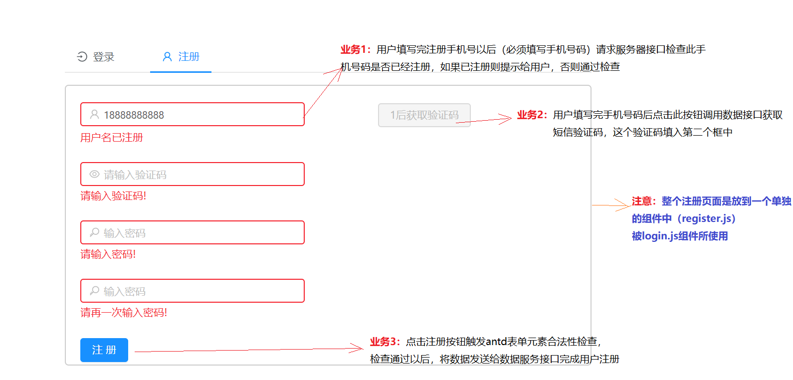
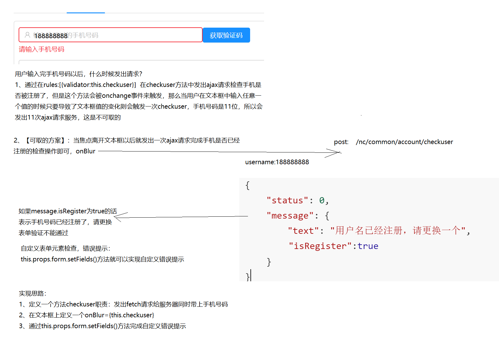

# 5. 注册功能

## 目标

- 一个页面上两个Form表单的缺陷和正确做法
- antd中用户名是否已注册检查写法缺陷和正确做法

## 1.1. 注册业务分析




## 1.2. 样式文件共用login.less

```less
.login_form{
    border:1px solid rgba(0,0,0,0.1);
    border-radius: 5px;
}
```

## 1.3. 注册页面基本结构

- 注册页面文件名：register.js   

- 存储路径：/components/account/register.js

- 导入相关包

  ```react
  import fetchHelper from '../kits/fetchHelper.js'
  import css from '../pages/account/login.less'
  import { Icon, Row, Col, Form, Input, Button,message } from 'antd'

  const FormItem = Form.Item;
  ```

- 注册表单结构

  ```react

  render() {
          const { getFieldDecorator } = this.props.form;
          return (
              <Form ref="register" onSubmit={this.register} className={css.login_form}>
                  <FormItem>
                      {getFieldDecorator('user_name', {
                          rules: [{ required: true,message:'请输入手机号码' },
                                  { pattern: /^1(3|4|5|7|8)\d{9}$/, message: '用户名必须符合手机格式!' }
                          ],
                          // validateTrigger:'onBlur'
                      })(
                          <Row>
                              <Col span="14">
                                   <Input ref="user_name" prefix={<Icon type="user" style={{ color: 'rgba(0,0,0,.25)' }} />} placeholder="输入注册时的手机号码" />
                              </Col>
                              <Col span="1">
                                  <Button disabled={false} type="primary" onClick={this.processsns.bind(this)}>获取验证码</Button>
                              </Col>
                          </Row>
                          )}
                  </FormItem>
                  <FormItem>
                      {getFieldDecorator('sns_code', {
                          rules: [{ required: true, message: '请输入验证码!' }
                          ],
                      })(
                          <Input prefix={<Icon type="eye" style={{ color: 'rgba(0,0,0,.25)' }} />} placeholder="请输入验证码" />
                          )}
                  </FormItem>
                  <FormItem>
                      {getFieldDecorator('password', {
                          rules: [{ required: true, message: '请输入密码!' }],
                      })(
                          <Input prefix={<Icon type="key" style={{ color: 'rgba(0,0,0,.25)' }} />} type="password" placeholder="输入密码" />
                          )}
                  </FormItem>
                  <FormItem>
                      {getFieldDecorator('password1', {
                          rules: [{ required: true, message: '请再一次输入密码!' }
                     ],
                      })(
                          <Input prefix={<Icon type="key" style={{ color: 'rgba(0,0,0,.25)' }} />} type="password" placeholder="输入密码" />
                          )}
                  </FormItem>
                  <FormItem>
                      <Button type="primary" htmlType="submit" className="login-form-button">
                          注册
                      </Button>
                  </FormItem>
              </Form>

          )
      }
  ```


## 1.4. 检查手机号码是否已经注册

- 功能分析

  

- 代码

```react
//   检查手机号码是否注册逻辑
    checkname = () => {
        let tel = this.props.form.getFieldValue('user_name');
        fetchHelper.post('/nc/common/account/checkuser',{username:tel})
        .then(json=>{
            if(json.status == 1){
                message.error(json.message.text || json.message);
                return;
            }
            if(json.message.isRegister){
                // 自定义错误提示
                this.props.form.setFields({
                  // 定义在user_name这个文本框后面显示提示信息
                    'user_name': {value: tel, errors: [new Error('用户名已注册')] }
                })
            }
        });
    }
    
    //在onBlur事件中调用checkname
     <Input  onBlur={this.checkname.bind(this)} prefix={<Icon type="user" style={{ color: 'rgba(0,0,0,.25)' }} />} placeholder="输入手机号码" />
```

## 1.5. 每隔60秒后点击一次获取短信验证码

- 功能分析

  

- 功能代码

```react
// 用户setInterval的对象，将来可以clearInterval
let intervalHander = null
// 倒计时60秒
let timeout = 60

state = {
        bttxt : '获取验证码',  // 获取验证码按钮的文字
        isdisabled:false  // 控制获取验证码按钮是否可用
    }

   // 点击获取验证码按钮后触发的事件
    processsns(){      
        intervalHander = setInterval(()=>{
            timeout--;
            if(timeout<=0){
                clearInterval(intervalHander);
                timeout = 5;
                this.setState({
                    snsbttxt : '获取验证码',
                    isdisabled:false
                })
            }else{
                this.setState({
                    snsbttxt : timeout+'后获取验证码',
                    isdisabled:true
                })
        }
        },1000);
    
        // ajax请求获取验证码
        this.getsnscode();
    }

    // ajax请求获取验证码
    getsnscode() {
        // 获取用户在表单中输入的手机号码
        let tel = this.props.form.getFieldValue('user_name'); 
      //调用接口获取验证码
        fetchHelper.post('/nc/common/account/snscode',{username:tel})
        .then(json=>{
            if(json.status == 1){
                message.error(json.message.reason || json.message);
                return;
            }

            message.success(json.message.reason);
        })
    }

// 调用
<Button disabled={this.state.isdisabled} type="primary" onClick={this.processsns.bind(this)}>{this.state.bttxt}</Button>
```

## 1.6. 两次密码一致性检查

- 通过antd中的表单验证方法中的自定义验证validator来完成

```react
// 定义检查密码是否一致的逻辑方法
checkpwd(rule,value,callback){
  const form = this.props.form;
  if(value && value != form.getFieldValue('password')){
    callback('两次输入密码不一致');
    return;
  }
  callback();
}
   
// 使用{validator:this.checkpwd.bind(this)} 完成自定义验证检查方法的调用
 <FormItem>
  {getFieldDecorator('password1', {
    rules: [{ required: true, message: '请再一次输入密码!' },
            {validator:this.checkpwd.bind(this)}],
  })(
    <Input prefix={<Icon type="key" style={{ color: 'rgba(0,0,0,.25)' }} />} type="password" placeholder="输入密码" />
  )}
</FormItem>
    
```


## 1.7. 注册用户逻辑

```react
 // 注册
    register = (e) => {
        e.preventDefault();
        this.props.form.validateFields((err, values) => {
            if (!err) {
                values.role = 0;
                fetchHelper.post('/nc/common/account/register',values)
                .then(json=>{
                    if(json.status == 1){
                        message.error(json.message);
                        return;
                    }
                  
                    message.success(json.message.text)
                })
            }
        })
    }
    //调用
   <Form  onSubmit={this.register} className={css.login_form}></Form>
```

## 1.8. 在登录组件login.js使用注册页面组件

```react
import Register from '../../components/register.js'

<TabPane tab={<span><Icon type="user" />注册</span>} key="2">
 	<Register></Register>
</TabPane>
```

## 1.9. 注册页面功能小结

- 检查手机号码是否已经注册是在手机号码文本框中注册一个onBlur事件后Featch请求数据接口完成检查过程
- 点击获取验证码按钮后出现60秒计时功能：通过 setInterval()和state来控制
- 注册用户逻辑是通过一个Submit按钮触发Form表单上的onSubmit事件完成
- 注册页面单独封装成一个组件(register.js)被登录组件(login.js)调用，这样能解决同时提交两个form表单 onSubmit事件bug


## 1.10. 注册页面完整代码

```react

import fetchHelper from '../kits/fetchHelper.js'
import css from '../pages/account/login.less'
import { Tabs, Icon, Row, Col, Form, Input, Button,message, Select } from 'antd'
// const TabPane = Tabs.TabPane;
const FormItem = Form.Item;
// const Option = Select.Option;

let intervalHander = null
let timeout = 60
// 注册组件
/**
 * 坑：
 * 1、在做ajax检查用户名是否存在的时候，不能直接将formitem中的onChange事件改为onBlur而是应该直接在
 * 文本框上使用onBlur事件，在利用:
 *  this.props.form.setFields({
                    'user_name': {value: tel, errors: [new Error('用户名已注册')] }
                })
    实现自定义错误
 */ 
class Register extends React.Component {

    // 注册
    register = (e) => {
        e.preventDefault();
        this.props.form.validateFields((err, values) => {
            if (!err) {
                values.role = 0;
                fetchHelper.post('/nc/common/account/register',values)
                .then(json=>{
                    if(json.status == 1){
                        message.error(json.message);
                        return;
                    }
                  
                    message.success(json.message.text)
                })
            }
        })
    }

    //   检查用户名
    checkname = () => {
        let tel = this.props.form.getFieldValue('user_name');
        fetchHelper.post('/nc/common/account/checkuser',{username:tel})
        .then(json=>{
            if(json.status == 1){
                message.error(json.message.text || json.message);
                return;
            }
            if(json.message.isRegister){
                // 自定义错误提示
                this.props.form.setFields({
                    'user_name': {value: tel, errors: [new Error('用户名已注册')] }
                })
            }
        });
    }

    state = {
        snsbttxt : '获取验证码',
        isdisabled:false
    }

    processsns(){      
        intervalHander = setInterval(()=>{
            timeout--;
            if(timeout<=0){
                clearInterval(intervalHander);
                timeout = 5;
                this.setState({
                    snsbttxt : '获取验证码',
                    isdisabled:false
                })
            }else{
                this.setState({
                    snsbttxt : timeout+'后获取验证码',
                    isdisabled:true
                })
        }
        },1000);
    
        this.getsnscode();
    }

    // ajax请求获取验证码
    getsnscode() {
        let tel = this.props.form.getFieldValue('user_name'); 
    
        fetchHelper.post('/nc/common/account/snscode',{username:tel})
        .then(json=>{
            if(json.status == 1){
                message.error(json.message.reason || json.message);
                return;
            }

            message.success(json.message.reason);
        })
    }

    // 检查密码是否一致
    checkpwd(rule,value,callback){
        const form = this.props.form;
        if(value && value != form.getFieldValue('password')){
            callback('两次输入密码不一致');
            return;
        }
        callback();
    }

    render() {
        const { getFieldDecorator } = this.props.form;
        return (
            <Form ref="register" onSubmit={this.register} className={css.login_form}>
                <FormItem>
                    {getFieldDecorator('user_name', {
                        rules: [{ required: true, whitespace: true,message:'请输入手机号码' },
                        { pattern: /^1(3|4|5|7|8)\d{9}$/, message: '用户名必须符合手机格式!' }
                        ],
                        // validateTrigger:'onBlur'
                    })(
                        <Row>
                            <Col span="14">
                                 <Input ref="user_name" onBlur={this.checkname.bind(this)} prefix={<Icon type="user" style={{ color: 'rgba(0,0,0,.25)' }} />} placeholder="输入注册时的手机号码" />
                            </Col>
                            <Col span="1">
                                <Button disabled={this.state.isdisabled} type="primary" onClick={this.processsns.bind(this)}>{this.state.snsbttxt}</Button>
                            </Col>
                        </Row>
                        )}
                </FormItem>
                <FormItem>
                    {getFieldDecorator('sns_code', {
                        rules: [{ required: true, message: '请输入验证码!' }
                        ],
                    })(
                        <Input prefix={<Icon type="eye" style={{ color: 'rgba(0,0,0,.25)' }} />} placeholder="请输入验证码" />
                        )}
                </FormItem>
                <FormItem>
                    {getFieldDecorator('password', {
                        rules: [{ required: true, message: '请输入密码!' }],
                    })(
                        <Input prefix={<Icon type="key" style={{ color: 'rgba(0,0,0,.25)' }} />} type="password" placeholder="输入密码" />
                        )}
                </FormItem>
                <FormItem>
                    {getFieldDecorator('password1', {
                        rules: [{ required: true, message: '请再一次输入密码!' },
                    {validator:this.checkpwd.bind(this)}],
                    })(
                        <Input prefix={<Icon type="key" style={{ color: 'rgba(0,0,0,.25)' }} />} type="password" placeholder="输入密码" />
                        )}
                </FormItem>
               
                <FormItem>
                    <Button type="primary" htmlType="submit" className="login-form-button">
                        注册
                    </Button>
                </FormItem>
            </Form>

        )
    }
}

Register = Form.create()(Register);

export default Register
```


